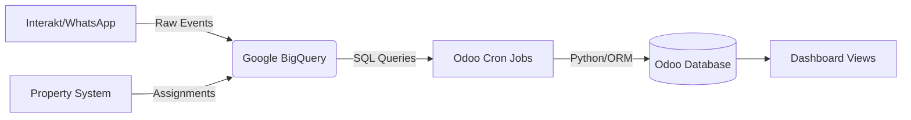

# ClearDeals Dashboards (`cleardeals_dashboards`)

**Version:** 1.0.0
**Dependencies:** `base`, `google_spreadsheet` (or external `google-cloud-bigquery` lib)
**Maintainers:** Engineering Team

---

## 📖 Overview

The `cleardeals_dashboards` module serves as the **Data Bridge and Visualization Layer** between the organization's Data Lake (Google BigQuery) and the Operational ERP (Odoo).

It is designed to ingest high-volume event logs, lead assignments, and engagement metrics (WhatsApp/Interakt) from BigQuery, process them into Odoo native models, and present actionable dashboards for Sales and Management teams.

### Core Responsibilities

1.  **Data Ingestion:** Fetches data from specific BigQuery datasets (`active_to_active`, `lead_scoring`, `Property_Matching`, etc.).
2.  **Metric Computation:** Calculates delivery rates, read rates, and click-through rates (CTR) for WhatsApp templates.
3.  **Workflow Visualization:** Tracks the lifecycle of leads across specific campaigns (Active, New Leads, Renewals).
4.  **Property Intelligence:** Monitors daily property assignment eligibility and "starvation" (unassigned days).

---

## 🏗 System Architecture

The data flows uni-directionally from BigQuery to Odoo via scheduled Cron Jobs.



### Technical Stack

*   **Language:** Python 3.x
*   **Client Library:** `google.cloud.bigquery`
*   **Authentication:** Server-side Service Account (Key file or Environment Auth).
*   **Data Format:** JSON (Raw payloads stored in BigQuery are parsed dynamically).

---

## 📂 Module Structure & Domain Logic

The module is divided into logical sub-components based on business workflows. Below is the mapping of the provided code snippets to their functional domains.

### 1. Active Lead Assignment

**File:** `models/active_lead.py` (Assumed)

*   **Purpose:** Tracks leads moving through the "Active-to-Active" pipeline.
*   **BigQuery Source:** `active_to_active.lead_assignments`, `active_to_active.nurture_event_log`.
*   **Key Models:**
    *   `active.lead.assignment`: Links a lead phone to a property tag.
    *   `active.template.stats`: Aggregated daily performance of templates used in this workflow.
*   **Logic:**
    *   Fetches assignments from the last 7 days to keep the table light.
    *   Enforces uniqueness on `(lead_phone, assigned_property_tag)`.

### 2. Lead Scoring

**File:** `models/lead_scoring.py` (Assumed)

*   **Purpose:** Detailed tracking of high-velocity leads and granular template responses (e.g., "Ringing", "Site Visit").
*   **BigQuery Source:** `lead_scoring.interakt_events`, `lead_scoring.daily_scored_leads_final`.
*   **Key Models:**
    *   `lead.scoring.lead`: The main profile of a lead including their score and current stage.
    *   `lead.scoring.event`: Individual message logs (Outbound/Inbound).
*   **Granular Tracking:**
    *   Unlike other modules, this model uses `cnt_` integer fields (e.g., `cnt_ringing`, `cnt_resp_going_visit`) to count specific template interactions for rapid KPI reporting.

### 3. New Leads (Portal)

**File:** `models/new_leads.py` (Assumed)

*   **Purpose:** Monitors leads originating from portals (99acres, MagicBricks, etc.) and their initial engagement.
*   **BigQuery Source:** `New_Lead_Workflow.lead_event_log`.
*   **Key Models:**
    *   `leads.new.dashboard`: The aggregation layer linked to the `leads.new` operational model.
    *   `leads.new.template.stats`: Template performance specific to new leads.
*   **Logic:**
    *   Computes `is_unassigned` flags based on Relationship Manager (RM) assignment (e.g., ID 1 usually denotes 'System' or 'Unassigned').

### 4. Property Daily Stats

**File:** `models/property_stats.py` (Assumed)

*   **Purpose:** A daily snapshot of property health.
*   **BigQuery Source:** `active_to_active.daily_eligibility_log`, `active_to_active.lead_assignments`.
*   **Key Logic - The Join:**
    *   The sync performs a `LEFT JOIN` between the **Eligibility Log** (all properties available) and **Assignments** (actual leads sent).
    *   **KPI:** `assignment_status` ('unassigned' vs 'assigned') allows the business to find properties that are eligible but not getting leads ("Starvation").

### 5. Renewal Campaign

**File:** `models/renewal.py` (Assumed)

*   **Purpose:** Re-engaging owners of expired property listings.
*   **BigQuery Source:** `Property_Matching.Routed_Lead_Assignments`, `Property_Matching.Interakt_Event_Log`, `cleardeals_dataset.Customer_Data`.
*   **Complex Logic - Canonical Tags:**
    *   The code strips suffixes from property tags (e.g., `PROP123_1` -> `PROP123`) to ensure data consistency across assignments and customer data.
*   **Complex Logic - Double JSON Parsing:**
    *   *Note for Devs:* The raw payload in Interakt logs often contains a stringified JSON inside a JSON object. The SQL queries use nested `JSON_VALUE` or `JSON_EXTRACT_SCALAR` to retrieve the template name correctly.
*   **Admin Actions:** Includes `action_full_backfill_renewal_data` and `action_purge_all_renewal_data` for database maintenance.

---

## ⚙️ Configuration & Setup

### 1. Library Dependencies

Ensure the Google Cloud BigQuery client is installed in the Odoo environment:

```bash
pip3 install google-cloud-bigquery
```

### 2. Service Account Authentication

The module assumes the server environment is authenticated.

*   **Local Dev:** Set `GOOGLE_APPLICATION_CREDENTIALS` env var pointing to your `.json` key.
*   **Production:** Typically handled via instance metadata or the Odoo service environment variables.

### 3. BigQuery Constants

These are hardcoded at the top of the Python files. If the GCP Project changes, update these variables:

| Variable | Current Value | File Location |
| :------- | :------------ | :------------ |
| `BIGQUERY_PROJECT_ID` | `cleardeals-459513` | All files |
| `ASSIGNMENT_TABLE_ID` | (Various per module) | All files |
| `EVENT_LOG_TABLE_ID` | (Various per module) | All files |

---

## 🔄 Synchronization & Cron Jobs

The module relies on **Idempotency**. You can run the crons multiple times; they check for existing IDs (`event_id`, `assignment_id`, or `unique(date, tag)`) before creating records.

| Model | Method | Frequency | Type |
| :-------------------- | :------------------------------ | :-------- | :------------------ |
| `active.lead.assignment` | `_cron_fetch_bigquery_data` | Daily | Incremental (7 days) |
| `active.template.stats` | `_cron_fetch_active_template_stats` | Daily | Incremental (27 days) |
| `lead.scoring.lead` | `_cron_sync_lead_scoring` | Daily | Incremental (60 days) |
| `leads.new.dashboard` | `_cron_sync_new_leads_dashboard` | Daily | Incremental (60 days) |
| `property.daily.stat` | `_cron_sync_daily_stats` | Daily | Incremental (90 days) |
| `renewal.property.owner` | `_cron_fetch_renewal_data` | Daily | Incremental (30 days) |

> **Note:** The "Days" Lookback is configured in the python code (e.g., `days=30`). This ensures that if a Cron fails for a day or two, the next run will catch up on missing data.

---

## 🛠️ Developer Guide: How to Extend

### Adding a New Metric to `renewal.property.owner`

1.  **Modify Model:** Add the new field in `renewal.property.owner`.
2.  **Update Compute:** Update `_compute_metrics`.
3.  **Check SQL:** If the metric relies on a specific template name or event type, ensure the BigQuery SQL in `_fetch_events_base` is selecting the `raw_payload` or the specific column needed.

### Handling Schema Changes in BigQuery

If a column name changes in BigQuery:

1.  Update the SQL Query string inside the `_cron...` method.
2.  **Do not** rely on `SELECT *`. The code explicitly lists columns to map them to Odoo fields.

### Idempotency Pattern

When writing new sync logic, always follow this pattern to prevent duplicates:

```python
# 1. Fetch from BQ
results = client.query(query).result()

# 2. Iterate
for row in results:
    # 3. Check Existence
    exists = self.search_count([('external_id', '=', row.id)])

    # 4. Create only if not exists (or Update if needed)
    if not exists:
        self.create({...})
```

---

## ⚠️ Troubleshooting & Runbook

### Issue: "Failed to create BigQuery client"

*   **Cause:** The Odoo server cannot find the GCP credentials.
*   **Fix:** Check `GOOGLE_APPLICATION_CREDENTIALS` environment variable or ensure the `google-cloud-bigquery` library is installed.

### Issue: Stats > 100% (e.g., 105% Delivery Rate)

*   **Cause:** Time zone overlaps or re-sending of messages.
*   **Fix:** The SQL queries currently use `COUNT(DISTINCT correlation_id)` which usually fixes this. Ensure `SAFE_DIVIDE` is used in SQL or check for `min(val, 100.0)` in Python compute methods (implemented in `NewLeadTemplateStats`).

### Issue: Missing Template Names

*   **Cause:** Interakt changes payload structure, or the JSON parsing in SQL fails.
*   **Fix:** Check `EVENT_LOG_TABLE_ID` in BigQuery console. Look at `raw_payload`.
    *   *Note:* The code handles double-encoded JSON. If they switch to single-encoded, the SQL logic `JSON_EXTRACT_SCALAR(JSON_EXTRACT_SCALAR(...))` might return NULL.

### Issue: Renewal "Not Filled" Tags appearing

*   **Logic:** The code specifically filters `LOWER(canonical_tag) NOT LIKE '%not filled%'`.
*   **Fix:** If new variations appear (e.g., "Not\_Filled"), update the SQL `WHERE` clause in `_fetch_assignments_base`.

---

## 📊 Data Dictionary (Key Fields)

| Odoo Field | BQ Column / Logic | Description |
| :---------------- | :-------------------------------------- | :---------------------------------------------------------------------- |
| `correlation_id` | `correlation_id` OR `message.id` | Unique ID linking a sent message to its delivery/read receipts. |
| `canonical_tag` | `REGEXP_REPLACE(tag, r'_\d+$', '')` | Used in Renewal module. Merges `PROP_1` and `PROP_2` into `PROP`. |
| `delivery_rate` | `(Delivered / Sent) * 100` | Percentage of messages successfully delivered. |
| `assignment_status` | Computed (Odoo) | 'Unassigned' if count is 0, 'Assigned' otherwise. Used for starvation KPI. |