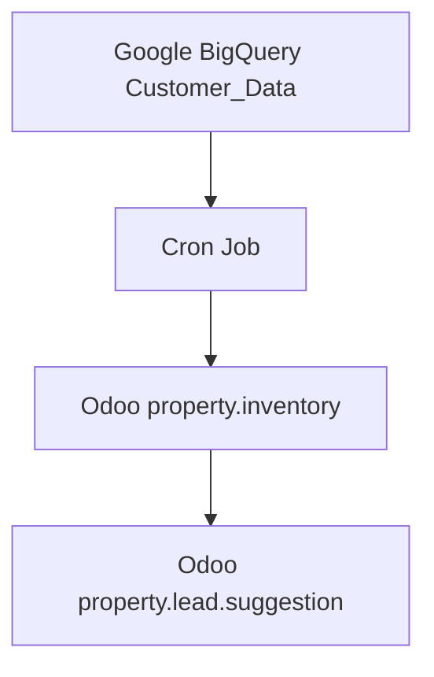

# Lead Suggestor Module (Odoo 19)

**Module Name**: `lead_suggestor`
**Version**: 1.0 (Odoo 19.0 Migration)
**License**: LGPL-3
**Maintainer**: Cleardeals Engineering Team

## 1. Overview

The Lead Suggestor module is an intelligent property-to-lead matching engine designed for Relationship Managers (RMs). It bridges the gap between Odoo CRM and the Data Warehouse (BigQuery) by automatically syncing high-probability lead matches ("Suggestions") for active property inventory.

Unlike standard CRM matching, this module leverages external data processing (BigQuery) to perform complex similarity algorithms, syncing only the results back to Odoo for actionable RM workflows.

## 2. Key Features

*   **Automated Sync (Cron)**: Daily synchronization of active properties and new lead suggestions from Google BigQuery.
*   **Smart Deduplication**: Implements "Upsert" logic to prevent duplicate suggestions and handle property status changes (Active/Sold/Expired) automatically.
*   **Mobile-First UI**: Custom Kanban view using the Odoo 19 card architecture for RMs on the go.
*   **One-Click Action**: WhatsApp integration with deep linking to open the desktop app directly with a pre-filled, context-aware message.
*   **Feedback Loop**: RMs can log status updates (e.g., "Interested", "Converted") which are preserved even during re-syncs.

## 3. Architecture

### Data Flow



*   **Parent Sync**: The system first syncs the "Parent" records (`property.inventory`) to ensure all active properties exist in Odoo.
*   **Child Sync**: It then fetches new matches for those properties into (`property.lead.suggestion`).
*   **Optimization**: Syncs are batched and use memory mapping (`{tag: id}`) to minimize database read/write operations (avoiding N+1 query issues).

### Tech Stack

*   **Backend**: Python 3.12, Odoo 19 ORM
*   **Database**: PostgreSQL 16 (local), Google BigQuery (remote source)
*   **Frontend**: XML Views (Kanban card, List, Search), JavaScript (Client Actions)

## 4. Installation & Configuration

### Dependencies

*   **Python Libraries**: `google-cloud-bigquery`

    ```bash
    pip install google-cloud-bigquery
    ```

*   **Odoo Modules**: `base`, `mail`

### BigQuery Credentials

The module requires Google Cloud credentials to access the `cleardeals-459513` project. Ensure the environment running Odoo has access to the `GOOGLE_APPLICATION_CREDENTIALS` JSON file or is authenticated via `gcloud auth`.

## 5. Security & Access Control

The module defines two specific user groups:

| Group Name | Technical ID | Access Level |
|---|---|---|
| RM User | `group_property_prospector_rm` | Can view assigned properties and log feedback on suggestions. Read-only access to Owner details. |
| Manager | `group_property_prospector_manager` | Full access to all properties, configurations, and manual sync triggers. |

**Note**: Due to Odoo 19 changes, `category_id` was removed from group definitions. Groups must be assigned via the "Groups" menu in Settings.

## 6. Technical Components

### Models

*   `property.inventory`: Represents a physical property.
    *   **Constraint**: `_property_tag_uniq` (Unique Property Tag)
*   `property.lead.suggestion`: Represents a lead matched to a property.
    *   **Constraint**: `_prop_lead_uniq` (Unique Pair: Property + Lead Phone)

### Views

*   **Kanban**: Optimized using Odoo 19 `<t t-name="card">` templates. Removed deprecated `kanban-box` and `oe_kanban_global_click` wrappers.
*   **Search**: Implements filters for "New Suggestions" and "Service Expired". **Note**: `<group>` tags removed in Search view due to Odoo 19 RelaxNG strictness.

### Automation (Cron)

*   `ir.cron.sync.property.inventory`: Runs daily to fetch active properties.
*   `ir.cron.sync.lead.suggestions`: Runs daily to fetch new matches.
*   `ir.cron.cleanup.expired.properties`: Runs daily to deactivate expired service contracts.

## 7. Development & Testing

This module adheres to strict TDD (Test Driven Development) practices.

### Running Tests

Tests include mocking for BigQuery (no cloud connection required) and strict SQL constraint validation.

```powershell
python odoo-bin -c odoo.conf -d odoo_19_db -u lead_suggestor --test-enable --test-tags=/lead_suggestor --stop-after-init
```

### Directory Structure

```
lead_suggestor/
├── models/             # Database Schemas & Business Logic
├── views/              # UI Definitions (XML)
├── security/           # Access Control Lists (ACLs)
├── data/               # Cron Job Definitions
├── tests/              # Unit Tests (Mocked)
├── static/             # JavaScript & CSS assets
└── wizards/            # Transient Models (Popups)
```

### Migration Notes (Odoo 18 -> 19)

*   `_sql_constraints` replaced with `models.Constraint`.
*   `groups_id` on user creation replaced with inverse `user_ids` on group write.
*   **Kanban View**: Renamed template `kanban-box` to `card`.
*   **Search View**: Removed `<group expand="0">` wrappers.