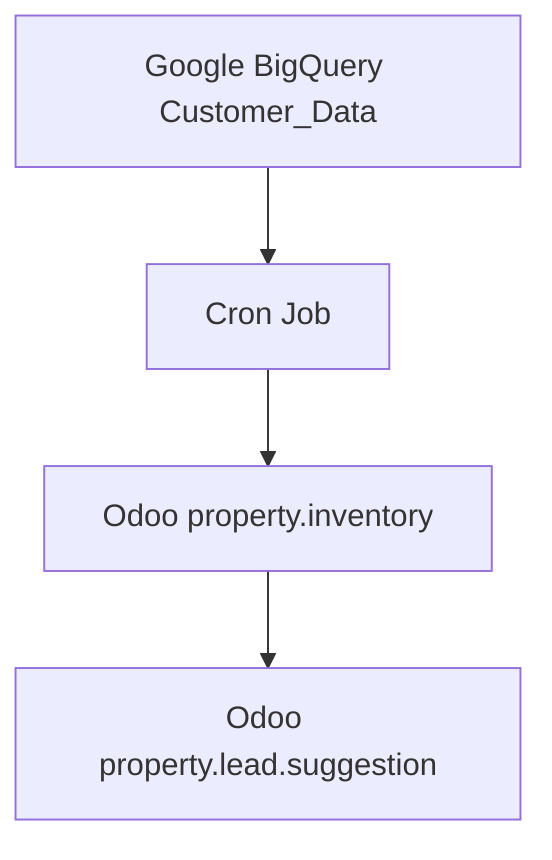

# Lead Suggestor Module — Complete Model Reference

> Intelligent property-to-lead matching engine. Syncs active property inventory and BigQuery-generated lead suggestions into Odoo for RM action workflows.

**Module name:** `lead_suggestor`  
**Odoo version:** `19.0`  
**License:** `LGPL-3`  
**Last updated:** `2026-05-08`  
**Owner:** Cleardeals Engineering Team

---

## Quick navigation

- [Module overview](#module-overview)
- [Model index](#model-index)
- [Model: `property.inventory`](#model-propertyinventory) — legacy property record
- [Model: `property.lead.suggestion`](#model-propertyleadsuggestion) — lead suggestion per property
- [`property.base` extension](#propertybase-extension) — suggestion counts added to canonical property
- [Cross-model relationships](#cross-model-relationships)
- [Data flow](#data-flow)
- [BigQuery sources](#bigquery-sources)

---

## Module overview

The `lead_suggestor` module bridges the gap between Odoo CRM and the Cleardeals Data Warehouse (BigQuery) by automatically syncing high-probability lead matches ("suggestions") for active property inventory.

It owns two models:

1. **`property.inventory`** — the legacy property record, populated by a BigQuery cron. This model pre-dates `property.base` and remains as the historical source for properties that have not yet been migrated to the canonical `property.base` model.
2. **`property.lead.suggestion`** — a single suggested lead match for a property, synced from BigQuery's AI-generated similarity output.

It also extends **`property.base`** (from the `properties` module) to add suggestion count fields and a manager-initiated backfill action.

Unlike standard CRM matching, the similarity algorithm runs externally in BigQuery. Odoo receives only the results (phone numbers + similarity scores) and presents them in a Kanban view for RM action.

---

## Model index

| Model | DB table | Purpose |
|---|---|---|
| `property.inventory` | `property_inventory` | Legacy property record synced from BigQuery Customer_Data |
| `property.lead.suggestion` | `property_lead_suggestion` | A single BigQuery-suggested lead match for a property |

---

## Model: `property.inventory`

**DB table:** `property_inventory`  
**Description:** Legacy master property inventory record. All fields are populated by the BigQuery sync cron (`_cron_sync_properties`) and are read-only in the UI. This model pre-dates `property.base` and is kept for historical data and backward compatibility.

> **Important for API integrations:** New integrations should use `property.base` (in the `properties` module) as the canonical property model. `property.inventory` is considered legacy. The `form_no` field on both models is the stable cross-model join key.

**Order:** `service_expiry_date asc, property_tag`  
**Record name:** `property_tag`

### SQL constraints

| Constraint | Rule |
|---|---|
| `_property_tag_uniq` | `property_tag` must be globally unique |

### Fields

| Field | Type | Required | Stored | Description |
|---|---|---|---|---|
| `property_tag` | `Char` | ✓ | ✓ | Unique short identifier for the property (e.g. `B-505, Green Heights`). Primary display name. Readonly. Indexed. |
| `form_no` | `Char` | — | ✓ | Form number from BigQuery (`Form_Number` column). Matches `form_no` on `property.base` — use this to join the two models. Readonly. Indexed. |
| `owner_name` | `Char` | — | ✓ | Property owner's full name. Readonly. |
| `owner_phone` | `Char` | — | ✓ | Property owner's phone number. Readonly. |
| `rm_user_id` | `Many2one → res.users` | — | ✓ | Assigned Relationship Manager. Readonly. Indexed. |
| `service_expiry_date` | `Date` | — | ✓ | Date the Cleardeals service contract expires. Used for ordering and status calculation. Readonly. Indexed. |
| `welcome_call_date` | `Date` | — | ✓ | Date of the welcome call with the owner. Readonly. Indexed. |
| `service_expiry_date_display` | `Char` | — | ✗ (computed) | `service_expiry_date` formatted as `DD/MM/YYYY`. Not stored. |
| `welcome_call_date_display` | `Char` | — | ✗ (computed) | `welcome_call_date` formatted as `DD/MM/YYYY`. Not stored. |
| `service_expiry_date_str` | `Char` | — | ✓ | Original expiry date string from BigQuery (kept for debugging). Readonly. |
| `is_active` | `Boolean` | — | ✓ | `True` = property is active (not sold/expired). Set by cron. Default: `True`. Readonly. Indexed. |
| `bhk` | `Char` | — | ✓ | BHK configuration string (e.g. `2 BHK`). Readonly. |
| `location` | `Char` | — | ✓ | Location / locality. Readonly. |
| `city` | `Char` | — | ✓ | City. Readonly. |
| `property_link` | `Char` | — | ✓ | URL to the Cleardeals property listing page. Editable (unlike most fields here). |

### Portal ID fields

| Field | Type | Stored | Description |
|---|---|---|---|
| `ninety_nine_acres_id` | `Char` | ✓ | Property listing ID on 99acres. Readonly. Indexed. |
| `housing_id` | `Char` | ✓ | Property listing ID on Housing.com. Readonly. Indexed. |
| `magicbricks_id` | `Char` | ✓ | Property listing ID on Magicbricks. Readonly. Indexed. |
| `olx_id` | `Char` | ✓ | Property listing ID on OLX. Readonly. Indexed. |

### BigQuery sync logic

The `_cron_sync_properties` method runs on a schedule and:

1. Queries `cleardeals-459513.cleardeals_dataset.Customer_Data` for all active properties (status not Sold/Expired, expiry date not past).
2. For each row: if `property_tag` exists → update; if not → create.
3. Properties that were previously active but are no longer in the BigQuery active set are marked `is_active=False`.

**Active property definition** (computed in BigQuery SQL):
- `Property_Status` is NOT `Sold-CD`, `Sold-Others`, or `Rented-CD`.
- `Service_Expiry_Date` is NOT before today (`Asia/Kolkata` timezone).

---

## Model: `property.lead.suggestion`

**DB table:** `property_lead_suggestion`  
**Description:** A single suggested lead match for a property, generated by BigQuery's AI similarity algorithm. Represents "this phone number / lead has interest signals matching this property." RMs act on these suggestions by updating the `status` field and optionally logging `rm_feedback`.

**Order:** `generation_date desc, status asc`  
**Record name:** `suggested_lead_phone`

### SQL constraints

| Constraint | Rule |
|---|---|
| `_prop_lead_uniq` | `(property_base_id, suggested_lead_phone)` must be globally unique — a lead cannot be suggested twice for the same property |

### Fields

| Field | Type | Required | Stored | Description |
|---|---|---|---|---|
| `property_base_id` | `Many2one → property.base` | — | ✓ | The property this suggestion is for. `ondelete=cascade`. Indexed. |
| `property_tag` | `Char` | — | ✓ (related) | Related from `property_base_id.property_tag`. Stored independently — ensures migration/backfill data survives even if the FK is temporarily null. Indexed. Readonly. |
| `suggested_lead_phone` | `Char` | ✓ | ✓ | Phone number of the suggested lead. This is the matching key — the same phone number that appears in `leads.new.phone` and `lead.score.standardized_phone`. |
| `lead_name` | `Char` | — | ✓ | Name of the suggested lead (from BigQuery). |
| `original_property_tag` | `Char` | — | ✓ | The property tag the lead was originally interested in (before similarity matching). Used to explain why this suggestion was made. |
| `original_property_similarity` | `Float` | — | ✓ | Similarity score (0–100%) between the lead's original interest and this property. Aggregator: `avg`. Precision: 16,2. |
| `contact_type` | `Char` | — | ✓ | The lead's current status label as recorded in BigQuery at the time of suggestion generation. |
| `generation_date` | `Date` | — | ✓ | Date this suggestion was generated. Default: today. |
| `generation_date_display` | `Char` | — | ✗ (computed) | `generation_date` formatted as `DD/MM/YYYY`. Not stored. |

### RM feedback fields

| Field | Type | Required | Stored | Description |
|---|---|---|---|---|
| `status` | `Selection` | ✓ | ✓ | RM's current action status for this suggestion. Default: `new`. Indexed. See values below. |
| `rm_feedback` | `Text` | — | ✓ | Free-text feedback or notes from the RM about this suggestion. |

### `status` selection values

| Value | Label |
|---|---|
| `new` | New |
| `contacted` | Contacted |
| `details_shared_of_property` | Details Shared of Property |
| `not_interested` | Not Interested |
| `interested` | Interested |
| `converted` | Converted |
| `whatsapp_done` | WhatsApp Done |
| `other` | Other |

### Utility / display fields

| Field | Type | Stored | Description |
|---|---|---|---|
| `suggested_lead_phone_whatsapp_url` | `Char` | ✗ (computed) | `whatsapp://send?phone=91XXXXXXXXXX` deep link for the suggested lead's phone. Built from `suggested_lead_phone` with Indian number normalization (10-digit → prepend `91`). Not stored. |
| `suggested_lead_phone_html` | `Html` | ✗ (computed) | Clickable WhatsApp icon + phone number link. `sanitize=False`. Not stored. |

### Phone normalization rules

The `_compute_suggested_lead_phone_whatsapp_url` compute method normalizes the stored phone:

| Input format | Conversion |
|---|---|
| 10 digits (e.g. `9876543210`) | Prepend `91` → `919876543210` |
| 12 digits starting with `91` (e.g. `919876543210`) | Use as-is |
| 11 digits starting with `0` (e.g. `09876543210`) | Remove leading `0`, prepend `91` |
| Anything else | No WhatsApp link generated |

### One-click WhatsApp action

`action_whatsapp_with_copy()` builds a pre-filled WhatsApp message using the linked property's `bhk`, `location`, `city`, and `property_link` fields. It triggers a client-side action to open the WhatsApp desktop app with the message pre-populated.

---

## `property.base` extension

**File:** `lead_suggestor/models/property_base_ext.py`  
**Extends:** `property.base` (from the `properties` module)

This extension adds suggestion-related fields and actions directly onto `property.base` records, keeping the base module clean while allowing lead_suggestor to own the dependency.

### Fields added to `property.base`

| Field | Type | Stored | Description |
|---|---|---|---|
| `suggestion_ids` | `One2many → property.lead.suggestion` | ✗ | All suggestions linked to this property (inverse of `property_lead_suggestion.property_base_id`). |
| `suggestion_count` | `Integer` | ✓ (computed) | Total count of all suggestions for this property. Recomputed when `suggestion_ids` or their `status` changes. |
| `new_suggestion_count` | `Integer` | ✓ (computed) | Count of suggestions where `status='new'`. Used for the "New" badge on the property kanban card. |

### Manager action: `action_backfill_suggestions`

A manager-only button that runs a raw SQL backfill to populate `property_base_id` on all `property.lead.suggestion` rows that have a `property_tag` set but no FK. Uses `property_tag` as the matching key. Safe to run multiple times — only processes rows where `property_base_id IS NULL`.

---

## Cross-model relationships

```
property.inventory (property_inventory)
 └── rm_user_id               → res.users

property.lead.suggestion (property_lead_suggestion)
 └── property_base_id         → property.base

property.base (property_base)  [extended by this module]
 ├── suggestion_ids            ← property.lead.suggestion
 ├── suggestion_count          (computed from suggestion_ids)
 └── new_suggestion_count      (computed from suggestion_ids)

Cross-module joins (not owned here):
 property.inventory.form_no   ↔  property.base.form_no  (migration key)
 property.lead.suggestion.suggested_lead_phone  ↔  leads.new.phone
 property.lead.suggestion.suggested_lead_phone  ↔  lead.score.standardized_phone
```

---

## Data flow

```
Google BigQuery
 ├── cleardeals_dataset.Customer_Data
 │     └── _cron_sync_properties()
 │           → creates / updates property.inventory records
 │           → marks is_active=False for expired/sold properties
 │
 └── active_to_active.suggested_leads_for_properties
       └── _cron_sync_suggestions()  (on PropertyLeadSuggestion model)
             → upserts property.lead.suggestion records
             → preserves existing rm_feedback / status (never overwrites)

property.inventory
 └── (one-time migration) _cron_sync_from_inventory()
       → copies form_no, property_tag, portal IDs, dates
       → into property.base (marks inventory_migrated=True)

property.lead.suggestion
 └── RM opens Kanban view
       → updates status + rm_feedback
       → action_whatsapp_with_copy() triggers pre-filled WhatsApp message
```

---

## BigQuery sources

| BigQuery table | Used by | Purpose |
|---|---|---|
| `cleardeals-459513.cleardeals_dataset.Customer_Data` | `property.inventory._cron_sync_properties` | Active property list with RM assignment, dates, portal IDs |
| `cleardeals-459513.active_to_active.suggested_leads_for_properties` | `property.lead.suggestion` cron | AI-generated phone number matches per property |

### BigQuery project

**Project ID:** `cleardeals-459513`  
**Authentication:** Google Application Default Credentials (ADC) via `GOOGLE_APPLICATION_CREDENTIALS` environment variable or `gcloud auth`.

---

## Security groups

| Group | Technical ID | Access |
|---|---|---|
| RM User | `lead_suggestor.group_property_prospector_rm` | View own properties; log feedback on suggestions; read-only on owner details |
| Manager | `lead_suggestor.group_property_prospector_manager` | Full access to all properties, configurations, and manual sync triggers |


## 1. Overview

The Lead Suggestor module is an intelligent property-to-lead matching engine designed for Relationship Managers (RMs). It bridges the gap between Odoo CRM and the Data Warehouse (BigQuery) by automatically syncing high-probability lead matches ("Suggestions") for active property inventory.

Unlike standard CRM matching, this module leverages external data processing (BigQuery) to perform complex similarity algorithms, syncing only the results back to Odoo for actionable RM workflows.

## 2. Key Features

*   **Automated Sync (Cron)**: Daily synchronization of active properties and new lead suggestions from Google BigQuery.
*   **Smart Deduplication**: Implements "Upsert" logic to prevent duplicate suggestions and handle property status changes (Active/Sold/Expired) automatically.
*   **Mobile-First UI**: Custom Kanban view using the Odoo 19 card architecture for RMs on the go.
*   **One-Click Action**: WhatsApp integration with deep linking to open the desktop app directly with a pre-filled, context-aware message.
*   **Feedback Loop**: RMs can log status updates (e.g., "Interested", "Converted") which are preserved even during re-syncs.

## 3. Architecture

### Data Flow



*   **Parent Sync**: The system first syncs the "Parent" records (`property.inventory`) to ensure all active properties exist in Odoo.
*   **Child Sync**: It then fetches new matches for those properties into (`property.lead.suggestion`).
*   **Optimization**: Syncs are batched and use memory mapping (`{tag: id}`) to minimize database read/write operations (avoiding N+1 query issues).

### Tech Stack

*   **Backend**: Python 3.12, Odoo 19 ORM
*   **Database**: PostgreSQL 16 (local), Google BigQuery (remote source)
*   **Frontend**: XML Views (Kanban card, List, Search), JavaScript (Client Actions)

