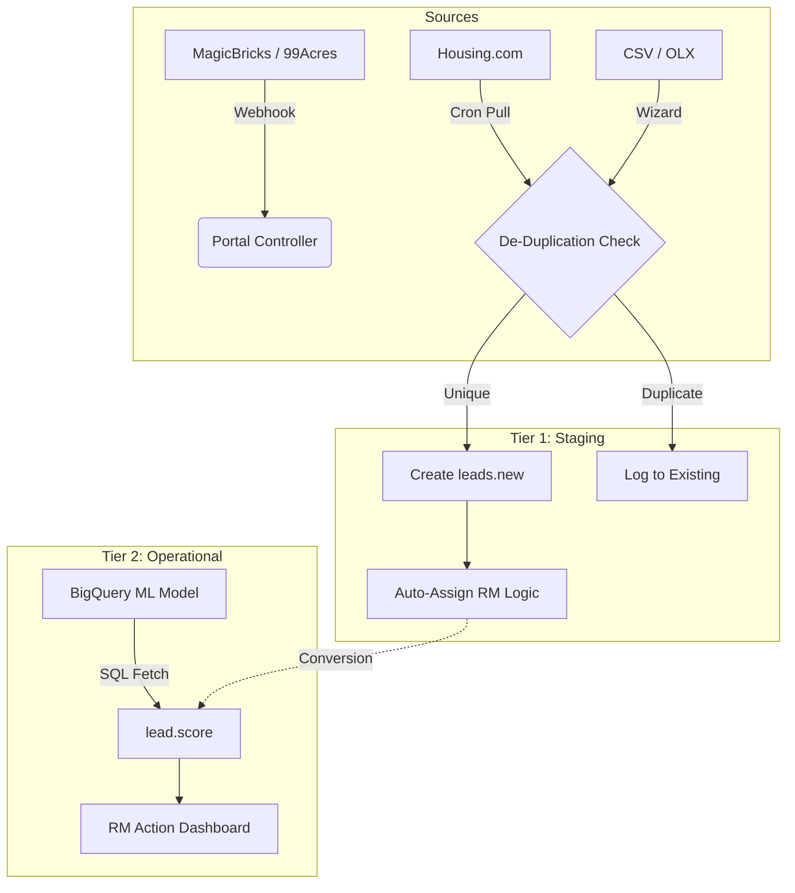

# Lead Scoring & Automation Engine

Odoo Version: 18.0
License: LGPL-3

## 1. Executive Summary
The Lead Scoring & Automation Engine is a centralized ingestion and scoring system designed for high-volume real estate operations. It replaces the standard Odoo CRM pipeline with a custom, performance-optimized workflow.

It implements a Two-Tier Architecture to separate raw data from operational leads:

*   **Ingestion Tier (leads.new)**: A staging area for raw inquiries from portals (MagicBricks, 99acres, Housing, OLX) via Webhooks and CSVs.
*   **Operational Tier (lead.score)**: A clean, ML-scored dataset for Relationship Managers (RMs) to focus strictly on "Actionable" leads.

## 2. Feature Highlights
*   🔌 **Omni-Channel Ingestion**: Centralizes leads from API Webhooks (MagicBricks, 99acres), Manual CSV Uploads (OLX), and Housing.com API pulls.
*   🧠 **ML Integration (BigQuery)**: Two-way sync with Google BigQuery to fetch `predicted_score` values derived from external Machine Learning models.
*   🛡️ **Intelligent De-Duplication**: Prevents duplicate lead creation based on Phone Number + Property ID logic within a rolling 30-day window.
*   💬 **WhatsApp Deep-Linking**: Generates context-aware `whatsapp://` links, pre-filling messages with Property Name, Location, and BHK details for instant RM action.
*   ⚡ **Safe-Update Mechanism**: When syncing with BigQuery, the system respects local operational data (e.g., if an RM manually schedules a visit, the sync will not overwrite it with stale external data).
*   📊 **Actionable Logic**: Automatically flags leads requiring attention based on Next Follow-up Date and Score Thresholds.

## 3. Technical Architecture
The module follows a strict data flow strategy to ensure data integrity.



## 4. Installation & Prerequisites

### 4.1 Python Dependencies
This module requires specific Google Cloud libraries to function. Ensure these are installed in your Odoo environment (Docker/Odoo.sh).

```bash
pip install google-cloud-bigquery db-dtypes pandas requests
```

### 4.2 Odoo System Parameters
Configure the following keys in Settings > Technical > System Parameters:

| Key | Description | Required | Example Value |
|---|---|---|---|
| google.bq.project_id | GCP Project ID for BigQuery | Yes | cleardeals-459513 |
| magicbricks.api.key | Token to validate MB webhooks | Yes | Mb_Key_XyZ |
| 99acres.webhook.api.key | Token to validate 99acres webhooks | Yes | 99_Key_AbC |
| housing.api.key | API Key for Housing.com pulls | No | Housing_Key |
| housing.api.id | Profile ID for Housing.com pulls | No | 1234 |
| n8n.new_lead_webhook_url | Outbound webhook for automation | No | https://n8n... |

## 5. Usage Guide

### 5.1 Importing from BigQuery
Use this wizard to sync ML scores and update statuses based on external analytics.

1.  Navigate to Leads > Import Leads (BQ).
2.  Click Fetch from BigQuery.

**Note**: The system skips updates if a Site Visit is already scheduled locally to preserve data integrity.

### 5.2 Importing CSVs (OLX/Manual)
1.  Navigate to Leads > Import Leads (CSV).
2.  Upload a CSV file containing columns: Name, Phone Number, Inventory ID.

The wizard performs Fuzzy Matching to find the Property and assigned RM automatically based on the Inventory ID (OLX ID).

### 5.3 The "Actionable" Workflow (For RMs)
RMs work primarily from Leads > My Actionable Leads.

**Logic**: The view filters for leads where `next_follow_up_date <= Today` AND `predicted_score > 0.3`.

**Process**:
1.  Open the Lead.
2.  Click the WhatsApp Icon (opens desktop app with pre-filled message).
3.  Log the result in the WhatsApp Response tab (e.g., "Going for visit").

The system automatically calculates and sets the next follow-up date.

## 6. Developer Notes

### Webhook Payloads
The module exposes two public endpoints protected by Application Layer Security (API Key Header).

**Routes**:
*   `POST /api/v1/magicbricks_webhook`
*   `POST /api/v1/99acres_webhook`

**Header Requirement**: Requests must include the header `X-API-KEY` matching the value stored in System Parameters.

### Safe Update Logic (lead_score_bq_wizard.py)
The BigQuery synchronization implements a "Local Truth" priority mechanism to prevent data overwrites.

```python
def _should_skip_update(self, existing_lead, new_vals):
    # If Odoo has a scheduled visit, do not overwrite it with BigQuery data
    if existing_lead.site_visit_scheduled_date and new_vals.get('site_visit_scheduled_date'):
         if new_vals['site_visit_scheduled_date'] != existing_lead.site_visit_scheduled_date:
             return True # Skip
    return False
```

Maintainer: Internal Development Team