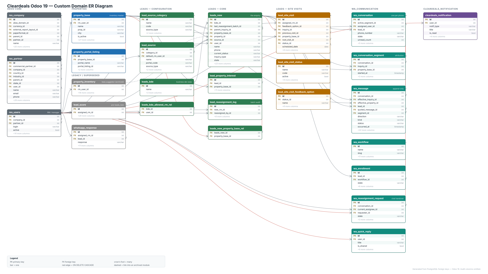

# SOP — Keeping the ER diagram current

Standard operating procedure for `docs/erd/`. The diagram is generated from a
real PostgreSQL schema, so keeping it accurate is mechanical — the only thing
that goes wrong is **forgetting**. §0 gives you a one-command check for exactly
that; automating it in CI is planned but deliberately not done yet (§4).

**Owner:** whoever changes the schema. Not a separate documentation task.

---

## 0. The staleness check — run this before you open a PR

> **Manual today.** Nothing runs this automatically yet; wiring it into CI is the
> deferred plan in §4. Until then it is one command, and it belongs in your
> pre-PR habit alongside `./run_tests.sh`.

A committed fingerprint of the ER-diagram surface lives at
`generate/schema-fingerprint.txt`: one line per in-scope table (with its
non-audit column count) and one per foreign key between in-scope tables
(including its `ondelete` rule).

`generate/check_drift.sh` regenerates that fingerprint from a live database and
diffs it against the committed copy. If they differ, the diagram is out of date
and it exits non-zero listing the exact lines that changed.

```bash
cd docs/erd/generate
PGDATABASE=cleardeals_19_dev PGPORT=5434 ./check_drift.sh
```

```
[erd-drift] OK — schema matches the committed ER diagram (149 entries).
```

It is cheap — one SQL query, no diagram rendering — so it is safe to run on
every pull request. It refuses to compare if fewer than 5 of the 7 custom
modules are installed, so a partial database cannot masquerade as "everything
was deleted".

> **You do not need to have dropped the audit columns to run this.** The
> fingerprint counts non-audit columns explicitly, so it works against any real
> database, including your dev one.

---

## 1. When to regenerate

Regenerate when the **structure** changes. Do not regenerate for data, view,
security or business-logic changes.

| Change | Regenerate? |
|--------|-------------|
| New model (new table) | **Yes** |
| Model deleted | **Yes** |
| New `Many2one` / `Many2many` between models | **Yes** |
| Relationship removed | **Yes** |
| `ondelete=` changed on an existing `Many2one` | **Yes** — it moves a CASCADE edge, and those show the deletion blast radius |
| Field made `required` | **Yes** if it is a `Many2one` |
| New non-relational field (`Char`, `Selection`, …) | Only if it belongs in the diagram; the column count changes, so the gate will tell you |
| Field renamed | **Yes** |
| A module added to or removed from the custom set | **Yes**, and update the module list in three places — see §5 |
| New view, ACL, record rule, cron, controller | No |
| Compute logic changed, no new column | No |
| Data or seed changes | No |

Rule of thumb: **if you wrote a migration that touches the schema, regenerate.**

---

## 2. The regeneration procedure

Roughly five minutes, most of it waiting for Odoo to install.

Nothing touches your dev environment: its own Postgres and volumes, **no GCP
credentials**, `PUBSUB_EMULATOR_HOST` at a dead port so no event can reach the
live `cd-prod-*` topics, port 8071.

```bash
cd docs/erd/generate
export CUSTOM_ADDONS="$(cd ../../../custom_addons && pwd)"
```

### 2.1 Build a schema from your branch

```bash
docker compose -f docker-compose.erd.yml up -d erddb
```

```bash
docker run --rm --network odoo-erd \
  -e PUBSUB_EMULATOR_HOST=127.0.0.1:9 -e PUBSUB_PROJECT_ID=cleardeals-wa-local \
  -v "$PWD/odoo.erd.conf:/etc/odoo/odoo.conf:ro" \
  -v "$CUSTOM_ADDONS:/mnt/extra-addons/custom:ro" \
  odoo-cleardeals:dev odoo -d erd \
  -i base,web,mail,properties,lead_suggestor,leads,cleardeals_notification,cleardeals_pubsub,cleardeals_ui,cleardeals_dashboards,wa_communication \
  --without-demo=all --stop-after-init
```

Two `ERROR ... has no table` lines for `wa.dashboard` and `wa.message.log` are
expected — those are deliberate `_auto = False` analytics models.

### 2.2 Refresh the in-scope table list

Only needed if you added or removed a model, but it is cheap and idempotent:

```bash
docker exec odoo-erd-db psql -U odoo -d erd -tAf tables.sql > tables.txt
python3 -c "
lines=[l.strip() for l in open('tables.txt') if l.strip()]
open('include.rx','w').write('^('+'|'.join(lines)+')\$')
print(len(lines),'tables in scope')"
```

### 2.3 Drop audit columns

`create_uid` / `write_uid` / `create_date` / `write_date` exist on every Odoo
table and both `*_uid` columns point at `res_users`. Left in, they add ~100 edges
converging on one box and the diagram is unreadable. Omitting audit and metadata
columns is standard ER practice.

```bash
python3 -c "
for t in open('tables.txt').read().split():
    for c in ('create_uid','write_uid','create_date','write_date'):
        print(f'ALTER TABLE public.\"{t}\" DROP COLUMN IF EXISTS {c};')" \
| docker exec -i odoo-erd-db psql -U odoo -d erd -q
```

Safe: this is a throwaway database that exists only to be diagrammed.

### 2.4 Export the schema and regenerate the diagram

```bash
docker exec odoo-erd-db psql -U odoo -d erd -tAf schema_export.sql > schema.json
ERD_OUT=.. python3 gen_erd.py
```

```
entities : 27
edges    : 58
canvas   : 2720 x 1534
wrote    : cleardeals-odoo-erd.svg, cleardeals-odoo-erd.drawio
```

If the entity count changed and you did not expect it, stop and find out why
before continuing.

### 2.5 Export the PDF

```bash
cd ..
cat > _print.html <<'HTML'
<!doctype html><html><head><meta charset="utf-8">
<style>@page{size:2720px 1534px;margin:0}html,body{margin:0}img{display:block;width:2720px;height:1534px}</style>
</head><body></body></html>
HTML
python3 -m http.server 8099 --bind 127.0.0.1 & sleep 2
"/Applications/Google Chrome.app/Contents/MacOS/Google Chrome" --headless --disable-gpu \
  --no-pdf-header-footer --print-to-pdf="$PWD/cleardeals-odoo-erd.pdf" \
  "http://127.0.0.1:8099/_print.html"
pkill -f "http.server 8099"; rm -f _print.html
```

If `gen_erd.py` reported a different canvas size, use those numbers in `@page`
and the `img` width/height, or the PDF will be cropped or letterboxed.

### 2.6 Update the fingerprint

```bash
cd generate
PGDATABASE=erd ./check_drift.sh --update
```

### 2.7 Optional — the exhaustive SchemaSpy reference

Not committed (21 MB, gitignored). Generate it when you need per-table
relationship pages:

```bash
docker run --rm --network odoo-erd -v "$PWD/../schemaspy:/output" \
  schemaspy/schemaspy:latest \
  -t pgsql -host erddb -port 5432 -db erd -u odoo -p odoo -s public \
  -i "$(cat include.rx)" -imageformat svg -norows -vizjs
open ../schemaspy/index.html
```

### 2.8 Tear down

```bash
docker compose -f docker-compose.erd.yml down -v
```

---

## 3. Verification before you commit

- [ ] `cleardeals-odoo-erd.svg` opens and the new/changed relationship is visible
- [ ] entity and edge counts from `gen_erd.py` match what you expected
- [ ] `python3 -c "import xml.etree.ElementTree as ET; ET.parse('cleardeals-odoo-erd.drawio')"` parses
- [ ] the PDF is 1 page and not cropped
- [ ] `./check_drift.sh` exits 0
- [ ] no `schemaspy/` directory staged (it is gitignored — check `git status`)
- [ ] if a CASCADE edge appeared or moved, you have thought about the deletion
      blast radius and it is intentional

Commit the diagram **in the same pull request as the schema change**. A separate
"update the ERD" PR is how it falls behind.

Suggested commit style, matching the house convention:

```
docs(erd): add wa.template entity and its conversation relationship
```

---

## 4. FUTURE PLAN — automating the gate in CI

> **Status: deferred, not implemented.** Nothing below is wired up. Today the
> gate is manual: run `check_drift.sh` yourself (§0). This section records the
> intended design and the reasoning so the decision can be picked up later
> without re-deriving it.
>
> It is deferred on purpose — adding a check changes what blocks a merge, and
> that is a team decision rather than something to slip in.

### 4.1 The industry convention

The dominant pattern for any checked-in **generated artefact** is a pair of
commands:

```bash
make erd          # regenerate
make erd-verify   # fail if regenerating would change anything
```

…where `verify` is implemented by regenerating into the working tree and then
asking git whether anything moved:

```bash
make erd
git diff --exit-code -- docs/erd
```

This is the shape used by Kubernetes (`hack/verify-codegen.sh`, `make verify`),
the Go ecosystem (`go generate ./... && git diff --exit-code`), and Bazel/Gazelle
(`gazelle -mode=diff`). The same idea drives every formatter's `--check` flag
(`ruff format --check`, `gofmt -l`, `prettier --check`, `terraform fmt -check`):
**a mode that changes nothing and exits non-zero.** The insight is that git is
already a perfect differ, so you do not write your own.

### 4.2 The gap in our current check

`check_drift.sh` compares a **schema fingerprint**, not the artefacts. That was a
deliberate trade — it costs one SQL query instead of a five-minute Odoo boot plus
diagram rendering — but it has a real blind spot:

> It detects **schema** drift, not **artefact** drift. If someone edits
> `gen_erd.py`'s layout, hand-edits the `.drawio`, or changes the schema and
> updates the fingerprint without regenerating the SVG, the fingerprint can still
> match while the committed diagram is wrong.

So the intended end state is **two tiers**, which is itself the convention —
cheap deterministic gates on every commit, expensive ones on a schedule:

| Tier | Check | Cost | Cadence | Catches |
|------|-------|------|---------|---------|
| **Fast** | `check_drift.sh` (fingerprint) | one SQL query | every PR | schema changed without the diagram being updated |
| **Full** | regenerate + `git diff --exit-code` | ~5 min (Odoo boot + render) | nightly, or on `paths: docs/erd/**` | everything, including layout and hand edits |

### 4.3 Tier 1 — the fast check, in the existing workflow

`.github/workflows/test.yml` already builds the image, starts `postgres:17`, and
installs every custom module into `odoo_test_db`. Tier 1 is one extra step after
the test step — no new job, no second install:

```yaml
      - name: Check ER diagram is up to date (advisory)
        continue-on-error: true          # ← drop once it has proven quiet
        run: |
          docker run --rm --network host \
            -v ${{ github.workspace }}:/repo \
            -e PGHOST=localhost -e PGPORT=5432 \
            -e PGUSER=odoo -e PGPASSWORD=odoo -e PGDATABASE=odoo_test_db \
            postgres:17 \
            bash /repo/docs/erd/generate/check_drift.sh
```

Verified working in exactly this containerised form — see §4.7.

### 4.4 Tier 2 — the full regenerate-and-diff job

A separate scheduled workflow that runs §2 end to end and then asks git whether
the committed artefacts still match:

```yaml
name: ERD full verify
on:
  schedule: [{ cron: '0 3 * * 1' }]     # Monday 03:00
  workflow_dispatch:
  pull_request:
    paths: ['docs/erd/**']

permissions:
  contents: read                         # least privilege

concurrency:
  group: erd-verify-${{ github.ref }}
  cancel-in-progress: true

jobs:
  verify:
    runs-on: ubuntu-latest
    steps:
      - uses: actions/checkout@v4
      - run: make erd
      - name: Fail if the committed diagram is stale
        run: git diff --exit-code -- docs/erd
```

This needs `make erd` to exist first — see §4.5.

### 4.5 Makefile targets to add

Wrapping §2 in two targets is what makes both tiers one-liners, and it gives
developers the same command CI runs:

```make
erd:            ## Regenerate the ER diagram (svg, drawio, pdf, fingerprint)
	@bash docs/erd/generate/regenerate.sh

erd-verify:     ## Fail if regenerating would change the committed diagram
	@$(MAKE) erd
	@git diff --exit-code -- docs/erd
```

`regenerate.sh` does not exist yet; it would be §2.1–§2.6 in one script,
including teardown, and would need to be non-interactive and idempotent.

### 4.6 Rollout, in order

1. **Advisory.** Land Tier 1 with `continue-on-error: true`. Watch it for a
   sprint or two — is it noisy, flaky, or does it fire on unrelated PRs?
2. **Required.** Remove `continue-on-error` and add it as a required status check
   in branch protection for `19.0` and `development_19`.
3. **Path-filter** so it does not run on PRs that cannot affect the schema:
   ```yaml
   paths: ['custom_addons/**/models/**', 'custom_addons/**/migrations/**', 'docs/erd/**']
   ```
4. **Add Tier 2** on a nightly schedule.
5. **Consider autofix** (§4.8) only if step 2 turns out to annoy people.

### 4.7 Already verified

The Tier 1 command has been tested against a real database, in the same
container form as the snippet above:

| Scenario | Expected | Result |
|----------|----------|--------|
| Clean schema matching the committed diagram | exit 0 | exit 0 |
| New column added | exit 1, names the table | exit 1, `TABLE wa_conversation cols=12 → 13` |
| New foreign key added | exit 1, names the FK | exit 1, named it |
| `ondelete` changed on an existing FK | exit 1 | exit 1, `on_delete=restrict → cascade` |
| Pointed at a non-Odoo database | refuse, not "everything deleted" | exit 2, refused |
| No database reachable | exit 2 | exit 2 |

So Tier 1 is known-good; what is missing is only the decision to enforce it.

### 4.8 Optional later — autofix instead of fail

The mature end state for generated artefacts is often not failing the build but
fixing it: a bot commits the regenerated artefact to the PR branch, or opens a
"regenerate ERD" PR when the nightly job finds drift
(`peter-evans/create-pull-request` is the usual GitHub Actions building block;
`pre-commit.ci` does the same for hooks).

Worth it when regeneration is deterministic and the artefact is large or tedious.
For three files behind a five-minute boot, a clear failure message is probably
the better cost/benefit — revisit only if the required check proves irritating.

### 4.9 Two cheap wins, independent of CI

Neither of these blocks anything, and both can land on their own:

**Mark the generated files as generated.** In `.gitattributes` at the repo root:

```
docs/erd/cleardeals-odoo-erd.svg          linguist-generated=true
docs/erd/cleardeals-odoo-erd.drawio       linguist-generated=true
docs/erd/generate/schema-fingerprint.txt  linguist-generated=true
```

GitHub then collapses them in pull-request diffs and excludes them from language
statistics. Without this, a regenerated 63 KB SVG buries the actual code change
in review. Standard practice for any checked-in generated file.

**Local/CI parity via `pre-commit`.** Running the same hook locally and in CI
means drift is found before the push, not after.

### 4.10 Tooling we deliberately did not use

For schema drift there is real off-the-shelf tooling — **Atlas** (atlasgo.io) does
schema-as-code with `schema diff`, drift detection *and* ERD generation;
**Squawk** and **Skeema** lint migrations; **Liquibase**/**Flyway** do drift
detection in the Java world.

We hand-rolled instead because **Odoo owns its own schema**: it generates DDL from
Python models, so a schema-as-code tool would be fighting the ORM rather than
helping. Worth reaching for if the schema ever moves outside Odoo's control.

> Sourcing note: the conventions above are drawn from publicly documented
> practice in large open-source projects (Kubernetes, Go, Bazel, the Python and
> Terraform tooling ecosystems) and standard GitHub Actions patterns — not from
> inside knowledge of any particular company's internal tooling.

---

## 5. Changing what the diagram covers

Adding or removing a **module** from the custom set means updating the module
list in **three** places, or the three will disagree:

| File | What to change |
|------|----------------|
| `generate/fingerprint.sql` | the `scope` CTE's `d.module IN (...)` list |
| `generate/tables.sql` | the same list |
| `generate/gen_erd.py` | `ENTITIES` / `LINK_TABLES` / `BAND_X` / `PALETTE` |

To change **which entities appear** in the curated diagram, edit the data at the
top of `gen_erd.py`, not the renderers:

- `ENTITIES` — table, band, and the business columns to surface. Foreign keys are
  added automatically, so you never list those.
- `LINK_TABLES` — many-to-many join tables.
- `BAND_X` — x position per module column. Bands may share a column; `legacy`
  deliberately stacks under `properties`. The cursor is keyed by x, so sharing is
  safe.
- `PALETTE` — colours and band labels.

Then rerun §2.4 and §2.5.

> The `.svg` and `.drawio` come from the **same layout model**, so they cannot
> disagree. If you hand-edit the `.drawio` in draw.io, the next regeneration
> overwrites it — either fold the change back into `gen_erd.py`, or accept the
> file as a one-off fork and say so in the PR.

---

## 6. If something breaks

| Symptom | Cause | Fix |
|---------|-------|-----|
| `check_drift.sh` exit 2, "cannot connect" | wrong `PGPORT` | dev stack is `5434`, throwaway ERD stack is `5432` inside its network |
| exit 2, "only N/7 modules installed" | pointed at the wrong database | use a database with the custom modules installed |
| Drift lines all `-`, nothing `+` | fingerprint ran against a near-empty schema | check the install completed; the guard should have caught this |
| `gen_erd.py` KeyError on a band | new entity references a band not in `BAND_X` | add the band to `BAND_X` and `PALETTE` |
| Entity boxes overlap in the SVG | two bands share an x but the cursor was keyed by band | keep the cursor keyed by `x` — see the comment in `place()` |
| Edges point at nothing | an `ENTITIES` table is not in `tables.txt` | rerun §2.2 |
| PDF cropped or letterboxed | `@page` size does not match the canvas | use the size `gen_erd.py` printed |
| SchemaSpy overview unreadable | inherent to auto-layout over 58 tables | use the per-table pages; the curated diagram is the readable one |

---

## 7. What this cannot catch

The fingerprint watches tables and foreign keys. It will **not** notice:

- **Polymorphic references** — `Many2oneReference` (e.g. `ir_attachment.res_id`)
  has no FK constraint, so no tool can see it. If you add one and it matters,
  document it by hand.
- **`One2many` fields** — they store no column; they appear only as the inverse
  `Many2one`.
- **Semantic changes** — `_inherits` delegation looks like an ordinary FK; a
  stored compute looks like a plain column.
- **Whether the diagram is *understandable*** — it checks that the diagram is
  complete, not that the layout still reads well. If a band has grown to
  fifteen boxes, rebalance `BAND_X` by hand.

See [README.md](README.md#known-limitations) for the full list.
