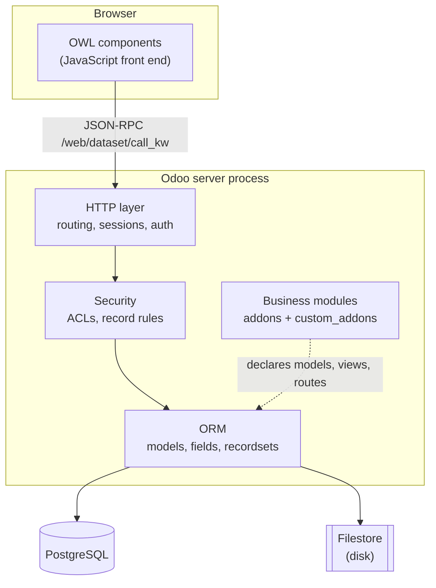
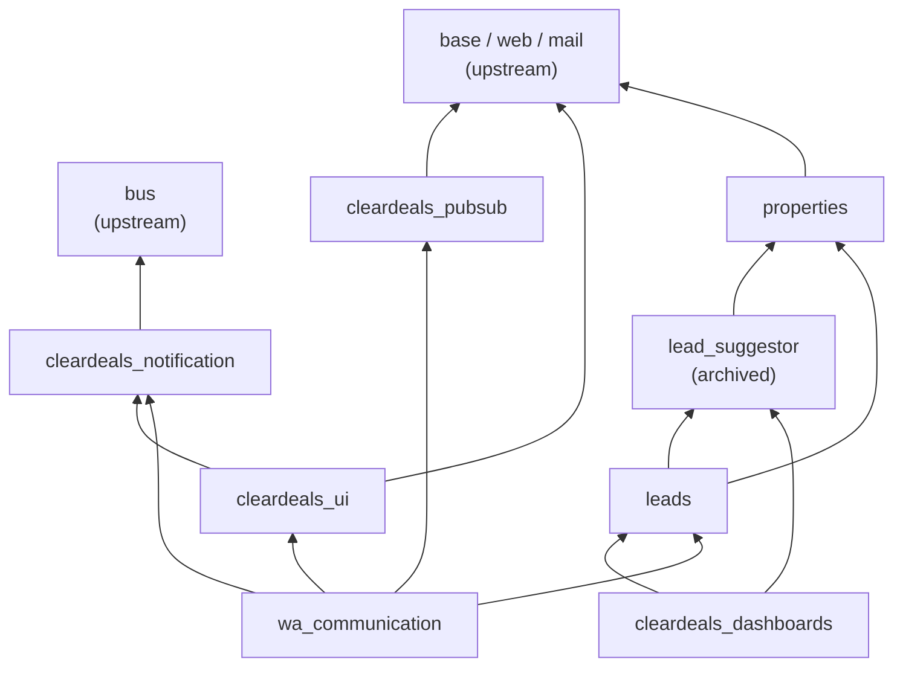

# 01 — What Odoo is, and how this repo is laid out

[← Index](00-INDEX.md) · [Next: Getting started →](02-getting-started.md)

---

## 1.1 The one-paragraph version

Odoo is two things wearing one name. It is an **application framework** — a
Python ORM over PostgreSQL, an HTTP layer, a permission system, a declarative
UI layer, and a JavaScript front end — and it is a **suite of business
applications** (CRM, Accounting, Inventory, HR…) built on top of that
framework. We use very little of the suite. We use the framework heavily, and
we have written our own applications on it: leads, properties, WhatsApp
communication, dashboards.

So when you read Odoo documentation aimed at "users", it is about the suite,
and mostly irrelevant to you. You are here for the framework.

## 1.2 What the framework actually does for you

It is worth being concrete about this, because it explains why Odoo code looks
the way it does. If you declare a Python class like this:

```python
# Illustrative — the shortest meaningful Odoo model.
from odoo import fields, models


class Fruit(models.Model):
    _name = "fruit"
    _description = "A Fruit"

    name = fields.Char(required=True)
    ripe = fields.Boolean(default=False)
```

…then, with no further work, Odoo gives you:

- a PostgreSQL table `fruit` with columns `id`, `name`, `ripe`, plus the
  automatic `create_uid`, `create_date`, `write_uid`, `write_date`;
- an ORM: `env["fruit"].search([("ripe", "=", True)])`;
- a permission layer you can configure per group, per model, per row;
- a generic REST-ish JSON-RPC endpoint the web client already knows how to call;
- automatically generated list and form views if you do not write your own;
- translation, audit fields, and a change-tracking chatter if you opt in;
- a migration path — add a field, restart with `-u`, and the column appears.

The cost of all that is that **Odoo owns the schema**. You do not write
`CREATE TABLE`, you do not write migrations by hand for ordinary changes, and
you very rarely write SQL. When you fight the ORM, you usually lose. Chapter
[04](04-orm-and-database.md) is about working with it rather than against it.

## 1.3 The layers



Two things in that diagram surprise people:

**The filestore is not in the database.** Uploaded files and attachments live
on disk, referenced by rows in `ir_attachment`. A database dump alone is not a
backup. See [Chapter 10](10-filestore-and-attachments.md).

**The front end is a real single-page application.** The web client is OWL,
Odoo's own component framework (similar in spirit to Vue). It talks to the
server almost entirely through one endpoint, `/web/dataset/call_kw`, which is
a generic "call this method on this model" bridge. See
[Chapter 06](06-views-and-web-client.md) and
[Chapter 08](08-controllers-and-http.md).

## 1.4 Everything is an addon

There is no "core" and "plugins" split. `base` is an addon. `web` is an addon.
The ORM loads a graph of addons, in dependency order, and each one may declare
models, extend other addons' models, add views, add routes, and ship data.

An addon is just a directory with an `__init__.py` and an `__manifest__.py`.
That is the entire contract. [Chapter 05](05-writing-a-module.md) builds one.

The word **module** is used interchangeably with **addon** everywhere,
including in this handbook and in Odoo's own source. They mean the same thing.

> **Trap.** "Module" in Odoo does *not* mean "Python module". An Odoo module is
> a directory of many Python modules plus XML, CSV and JavaScript. When someone
> says "install the module", they mean the addon.

## 1.5 Community vs Enterprise, and which we run

Odoo ships in two editions. Community is LGPL and open source. Enterprise adds
proprietary modules (studio, some accounting localisations, better mobile
support) and is licensed per user.

**We run Community.** Nothing in this handbook depends on Enterprise, and no
custom module here may depend on an Enterprise addon. If you find a solution
online that references `web_studio`, `account_accountant`, or similar, it does
not apply to us.

Our modules declare `"license": "LGPL-3"` in their manifests to match.

## 1.6 The repository map

This repository is a **fork of Odoo itself** with our own modules added. That
is why it is enormous. Here is what is in it and what you should care about:

```
odoo/                      ← vendored Odoo server source (the framework)
addons/                    ← ~600 standard Odoo modules (upstream)
custom_addons/             ← OUR CODE. This is where you work.
setup/, debian/, doc/      ← upstream packaging. Ignore.
docs/                      ← project documentation, including this handbook
.github/                   ← CI workflows, PR template, and skills
.claude/                   ← skills for the AI assistant
docker-compose.dev.yml     ← the local development stack
odoo.dev.conf              ← local server configuration
Dockerfile, entrypoint.sh  ← how the image is built
Makefile                   ← the commands you will actually type
run_tests.sh               ← the test runner
ruff.toml, pyproject.toml  ← linting
```

**You will spend ~95% of your time in `custom_addons/`.**

### Why `odoo/` and `addons/` are here at all

Two reasons, and it is worth being clear because it confuses people:

1. **`odoo/` is your reference implementation.** When you need to know how the
   framework really behaves — and in Odoo you often do, because the online
   documentation is thin on internals — you read this source. This handbook
   cites it constantly.
2. **`addons/` is where you look up patterns.** Six hundred modules written by
   the people who wrote the framework is the best style guide available. If you
   are not sure how to structure a wizard, find three in `addons/` and copy the
   consensus.

> **Trap.** The `odoo/` and `addons/` directories in this repo are **not** what
> runs in the container. The Docker image is built `FROM odoo:19.0`, which
> carries its own copy of the framework at
> `/usr/lib/python3/dist-packages/odoo`. Only `custom_addons/` is mounted in.
> They are the same 19.0 line, so reading the vendored source to understand
> behaviour is valid — but editing a file under `odoo/` will not change what
> your local server does. Do not try to patch the framework that way.

You can see this in the addons path the server logs at boot:

```
addons paths: ['/usr/lib/python3/dist-packages/odoo/addons',
               '/var/lib/odoo/addons/19.0',
               '/mnt/extra-addons/custom',          ← this is custom_addons/
               '/usr/lib/python3/dist-packages/addons']
```

## 1.7 Our modules

Eight modules make up the live system. Each owns a clear slice.

| Module | Version | What it owns |
|--------|---------|--------------|
| `properties` | 19.0.1.7.0 | `property.base` — the single source of truth for property data, synced from the website API. Also portal listings. |
| `leads` | 1.7.2 | `leads.new` and lead scoring, site visits, sources, BDE, CSV/BigQuery import, portal + SquareYards + OLX ingestion. The biggest module. |
| `wa_communication` | 1.3.8 | WhatsApp: conversations, messages, the inbox, the Pub/Sub push receiver, outbound sending, quick replies, dashboards. |
| `cleardeals_pubsub` | 1.0.0 | The GCP Pub/Sub transport itself — publishing, and OIDC verification for inbound push. No business logic. |
| `cleardeals_notification` | 1.0.0 | A persistent, WhatsApp-independent notification model and `notify()` API. |
| `cleardeals_ui` | 1.1.3 | Shared OWL component library — chat bubbles, composer, metric cards, charts, badges, the systray bell. |
| `cleardeals_dashboards` | 19.0.1.0 | Analytics models and dashboard views built on the above. |

### The dependency graph



Read the arrows as "depends on". The shape tells you the rules:

- **`properties` is the foundation.** It knows nothing about leads or WhatsApp.
- **`leads` sits on properties.** It may reference `property.base`. It must not
  reference anything from `wa_communication`.
- **`wa_communication` sits on top of everything.** It extends `leads.new` to
  publish events. This direction is deliberate: leads does not know WhatsApp
  exists, WhatsApp knows about leads.
- **`cleardeals_pubsub` is pure transport.** If you find business logic in it,
  that is a bug.

> **Our convention.** Dependencies point one way. If you need module A to react
> to something in module B, and B is lower in the graph, do not add a
> dependency from B to A — extend B's model *from within A*. That is exactly
> what `wa_communication` does when it inherits `leads.new` to publish lead
> events. [Chapter 04](04-orm-and-database.md) explains the inheritance
> mechanism that makes this possible.

### Archived modules — ignore these

`property_listings`, `property_dashboard`, `property_renewal` and
`lead_suggestor` are **archived platforms, no longer in use**. Do not read them
for patterns, do not extend them, do not fix them.

Two footnotes, so their presence does not confuse you:

- `property_listings` and its two dependents **cannot even install on Odoo 19** —
  they set `category_id` on a `res.groups` record, and that field was removed in
  19 (see [Chapter 07](07-security.md)).
- `lead_suggestor` *is* still installed, because `leads` and
  `cleardeals_dashboards` still list it in `depends`, and `leads` still loads
  `lead_suggestor/static/src/js/whatsapp_action.js` into its asset bundle. It
  comes along for the ride. Treat it as dead weight, not as a live component.

## 1.8 Vocabulary

You need these words before the next chapter. They recur constantly.

| Term | Meaning |
|------|---------|
| **Model** | A Python class mapping to a database table. `leads.new`, `property.base`. Named with dots, table named with underscores (`leads_new`). |
| **Record** | One row. |
| **Recordset** | An ordered collection of records of one model — *the* core abstraction. A single record is just a recordset of length 1. Almost every ORM method is called on a recordset and operates on all of it. |
| **Field** | A column, or a computed value that behaves like one. |
| **Environment** (`env`) | The execution context: database cursor, user, company, and a context dict. Reached as `self.env`. Everything hangs off it. |
| **Cursor** (`cr`) | The PostgreSQL transaction. One per request, normally. |
| **Registry** | The in-memory, per-database assembly of all model classes after all modules have been loaded and merged. |
| **Addon / Module** | A directory with a manifest that the registry loads. |
| **External ID** (XML ID) | A stable, human-readable name for a record, of the form `module.identifier`, e.g. `leads.group_lead_score_manager`. Lets data files and code reference records without knowing their numeric id. |
| **Domain** | A search filter, written as a list of tuples: `[("ripe", "=", True)]`. |
| **View** | An XML description of a screen. |
| **Action** | A description of "what to open" — a window action opens a model in some views; a client action opens a JavaScript component. |
| **Wizard** | A short-lived form, backed by a `TransientModel` whose rows are periodically garbage-collected. Used for dialogs like "import CSV". |
| **Chatter** | The message/activity log attached to a record, provided by the `mail` module via `mail.thread`. |
| **QWeb** | Odoo's XML templating language, used for views, reports, and OWL component templates. |
| **Bundle** | A named collection of JS/CSS assets that Odoo concatenates and serves, e.g. `web.assets_backend`. |
| **Sudo** | `record.sudo()` returns the same records in an environment that bypasses access rules. Powerful and dangerous — see [Chapter 07](07-security.md). |

## 1.9 What to read next

Go to [Chapter 02](02-getting-started.md) and get a server running. Everything
after this point is much easier to absorb with a live instance you can poke at.

---

[← Index](00-INDEX.md) · [Next: Getting started →](02-getting-started.md)
