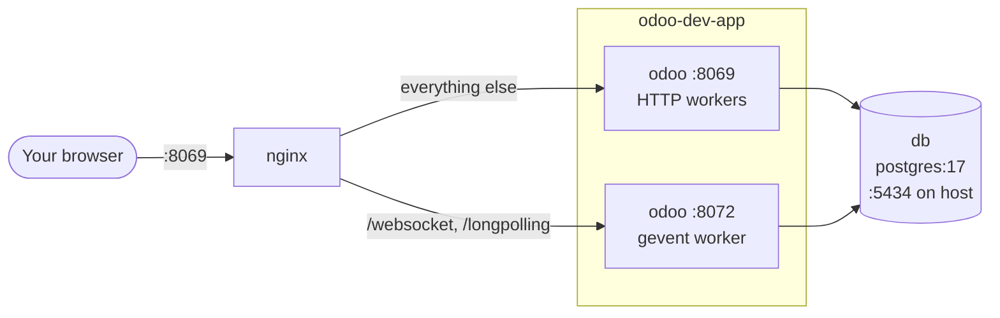
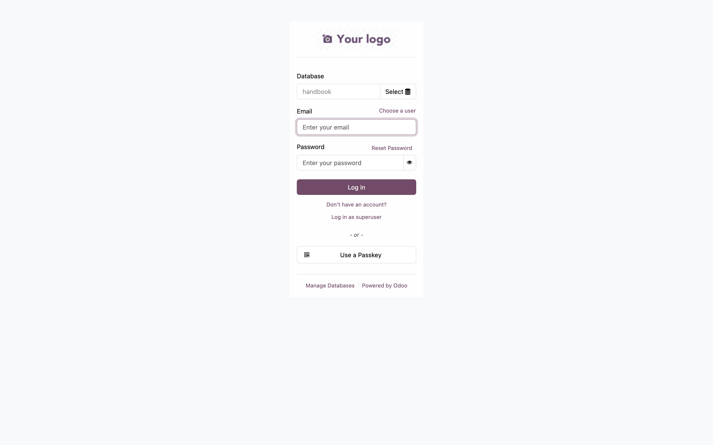
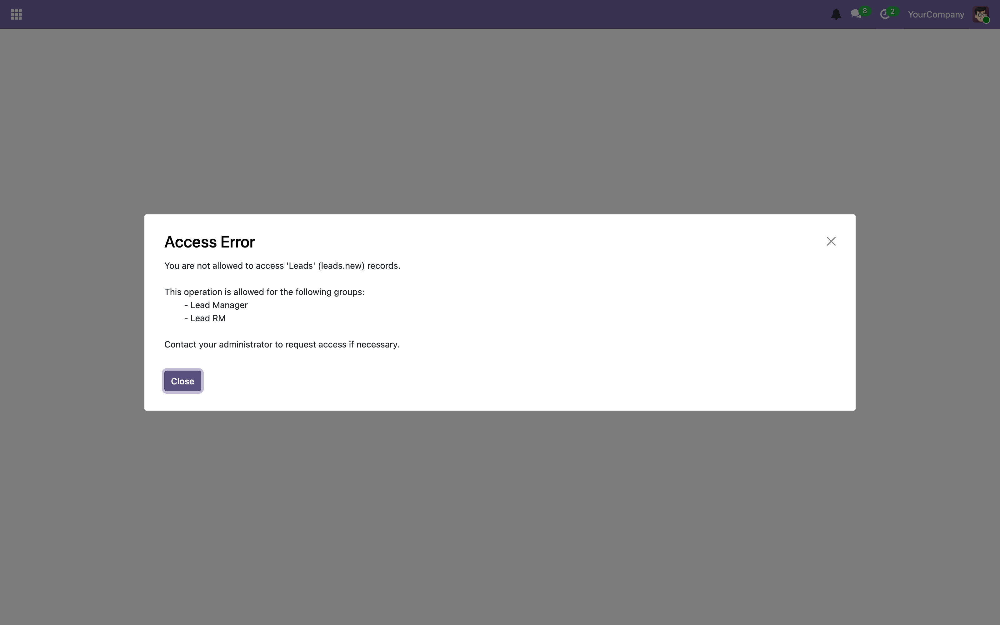
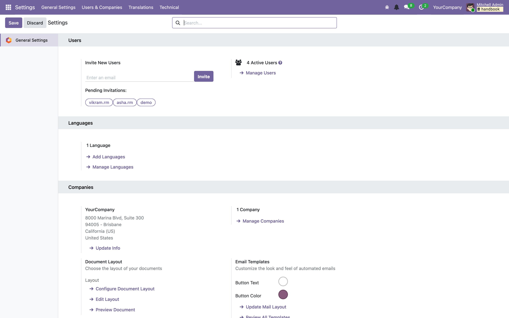
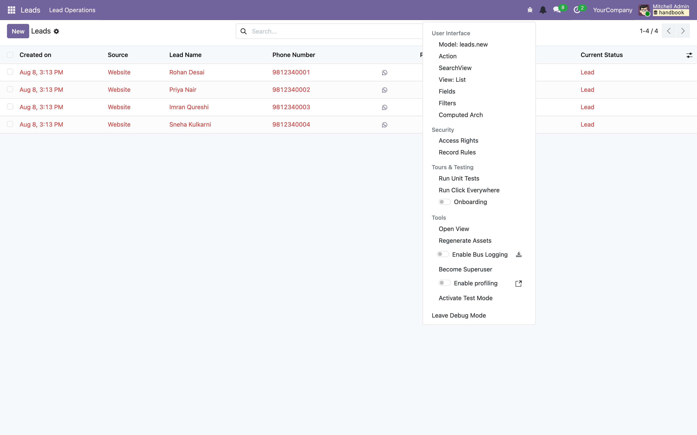
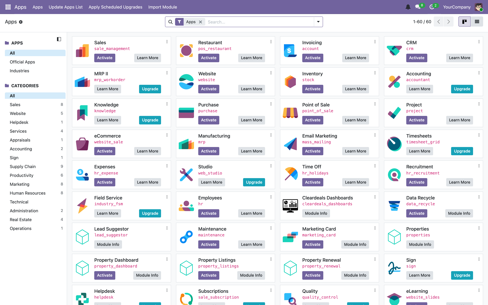
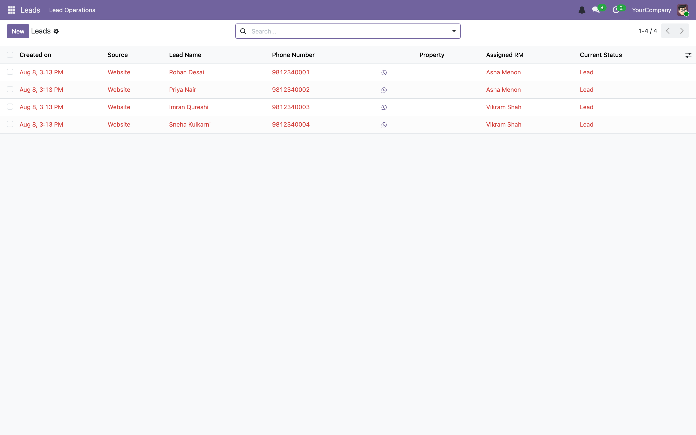
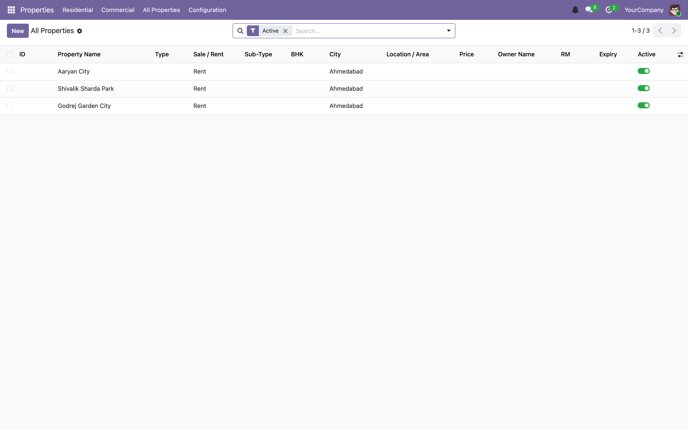
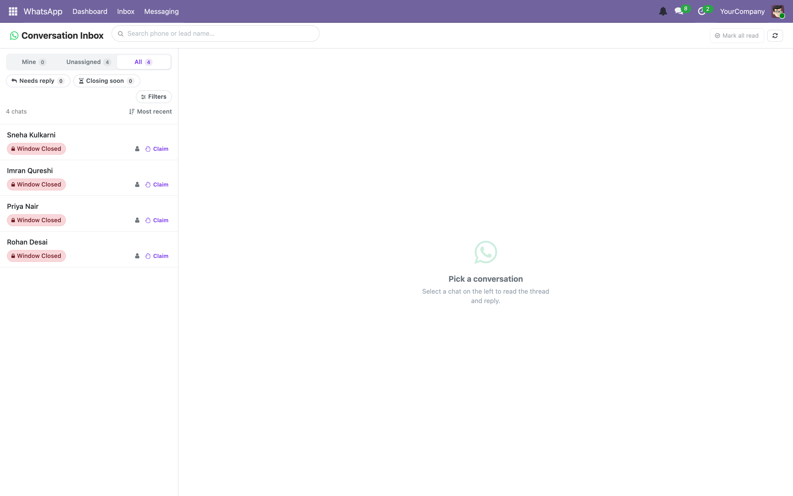
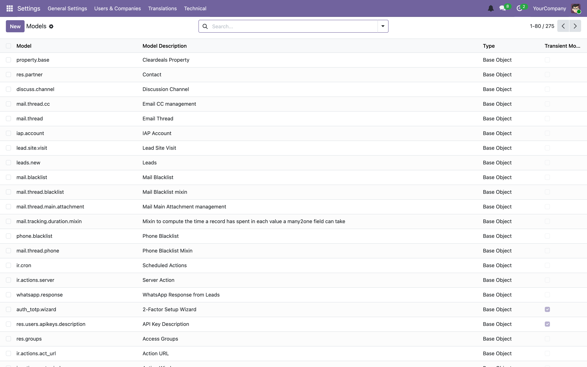

# 02 — Getting started: your local environment

[← What Odoo is](01-what-is-odoo.md) · [Index](00-INDEX.md) · [Next: Server and execution modes →](03-server-and-execution-modes.md)

---

By the end of this chapter you will have Odoo running locally, developer mode
on, and the six or seven commands you will use every day.

## 2.1 Prerequisites

- **Docker Desktop**, running. Everything runs in containers; you do not
  install Odoo or PostgreSQL on your machine.
- **A PostgreSQL client** (optional but strongly recommended) — `psql`, or a
  GUI like TablePlus, for poking at the database directly.
- **macOS users:** enable VirtioFS in Docker Desktop
  (Settings → Resources → File Sharing). Without it, file-change events do not
  cross the VM boundary and Odoo's auto-reload will not work.
- **Windows users:** run from Git Bash or WSL2. There is a PowerShell
  equivalent of the Makefile, `make.ps1`, with the same target names. You will
  need `Set-ExecutionPolicy -ExecutionPolicy RemoteSigned -Scope CurrentUser`
  once.

## 2.2 The stack

`docker-compose.dev.yml` defines four services. Three of them matter.



| Service | Container | What it is |
|---------|-----------|------------|
| `db` | `odoo-dev-db` | PostgreSQL 17. Exposed on host port **5434** so you can attach TablePlus. Data lives in `./odoo-dev-db-data`. |
| `odoo` | `odoo-dev-app` | The Odoo server, built from our `Dockerfile`. **No host ports** — nginx fronts it. |
| `nginx` | `odoo-dev-nginx` | Reverse proxy on host port **8069**. Routes `/websocket` and `/longpolling` to the gevent worker on 8072, everything else to the HTTP workers on 8069. |
| `dev` | — | A convenience container; not needed for normal work. |

**Why nginx exists locally.** Because `odoo.dev.conf` sets `workers = 2`, which
means the server runs in prefork mode and websockets are served by a *separate*
gevent process on a *different port*. Something has to route between them.
Production uses Traefik for the same job; nginx mirrors it locally so you are
developing against the same shape. [Chapter 03](03-server-and-execution-modes.md)
explains why websockets need their own process.

### ⚠️ Read this before you create any data

`docker-compose.dev.yml` is configured to talk to **real production Pub/Sub
topics**, with your own GCP credentials mounted in:

```yaml
- PUBSUB_PROJECT_ID=cleardeals-wa-prod
- GCP_ENV=production
- GOOGLE_APPLICATION_CREDENTIALS=/gcp/application_default_credentials.json
```

The compose file says so itself, in capitals. The consequence is blunt:

> **Trap.** Creating a lead, or triggering a WhatsApp send, on your local dev
> stack **can send a real WhatsApp message to a real customer**. There is no
> safety net between your laptop and production Pub/Sub.

If you are doing anything that touches leads or WhatsApp, switch to the
emulator first by editing the `odoo` service environment:

```yaml
- PUBSUB_EMULATOR_HOST=host.docker.internal:8085
- PUBSUB_PROJECT_ID=cleardeals-wa-local
```

…and remove `GCP_ENV` and the credentials mount. See
[Chapter 14](14-integrations.md) for running the emulator.

## 2.3 First boot

```bash
make up
```

That is `docker compose -f docker-compose.dev.yml up -d`. First run also needs
a build:

```bash
make build
```

Watch it come up:

```bash
make logs-odoo
```

You are looking for these lines:

```
Odoo version 19.0-20260528
Using configuration file at /etc/odoo/odoo.conf
addons paths: [... '/mnt/extra-addons/custom' ...]
database: odoo@db:5432
HTTP service (werkzeug) running on ...:8069
```

Then open **http://localhost:8069**.

If the database `cleardeals_19_dev` does not exist yet, Odoo shows the database
manager. The master password is `admin` (set by `admin_passwd` in
`odoo.dev.conf`).


*The database selector. It only appears because `list_db = True` in
`odoo.dev.conf`; production sets it to `False` so the list is not public.*

### Populating the database

You have two options.

**Option A — copy your existing local Postgres data in** (only if you already
had Odoo running natively on port 5432):

```bash
make migrate-db
```

**Option B — create a fresh database and install the modules.** Create it from
the database manager UI, then install our modules from the command line:

```bash
docker compose -f docker-compose.dev.yml exec odoo python3 /usr/bin/odoo -d cleardeals_19_dev -i properties,leads,cleardeals_pubsub,cleardeals_notification,cleardeals_ui,cleardeals_dashboards,wa_communication --stop-after-init
```

`-i` means *install*. `--stop-after-init` means "do the work, then exit"
rather than starting a web server. Restart the container afterwards:

```bash
make restart-odoo
```

## 2.4 Log in

Default credentials on a fresh database are `admin` / `admin`.



> **Trap.** The `admin` user is **not** a superuser. It is an ordinary user
> that happens to be in the administrator groups. If a model's ACL does not
> grant access to a group `admin` is in, `admin` gets an access error like
> anyone else:
>
> 
>
> That screenshot is real — it is what you see if you open the Leads menu
> without being in *Lead Manager* or *Lead RM*. The genuine superuser is
> `SUPERUSER_ID` (uid 1, "OdooBot"), which you only ever reach in code via
> `sudo()`. See [Chapter 07](07-security.md).

## 2.5 Turn on developer mode — do this immediately

Developer mode is not optional for our work. It exposes the technical menus,
the view inspector, and the debug tools.

Two ways to enable it:

- **URL:** append `?debug=1` to any Odoo URL, e.g.
  `http://localhost:8069/odoo/settings?debug=1`. Fastest.
- **UI:** Settings → scroll to the bottom → Developer Tools → *Activate the
  developer mode*.

You will know it worked because a bug icon appears in the top-right systray.



### The debug menu

Click the bug icon. This menu is the single most useful thing in Odoo for a
developer:



| Item | What it does | When you want it |
|------|--------------|------------------|
| **Model: `leads.new`** | Opens the model's definition | "What fields does this thing actually have?" |
| **Action** | Opens the window action behind this screen | Finding the action's XML ID and domain/context |
| **View: List / Form** | Opens the view record | Finding which XML file defines what you are looking at |
| **Fields** | Lists every field on the model with type and metadata | Faster than reading the Python |
| **Filters** | The saved search filters | Debugging a search view |
| **Computed Arch** | The *final* XML after all inheritance has been applied | **Essential** when an xpath is not doing what you expect |
| **Access Rights / Record Rules** | Jumps to ACLs and rules for this model | Debugging "why can't this user see it" |
| **Run Unit Tests** | Opens the Hoot JS test runner | [Chapter 13](13-testing.md) |
| **Open View** | Opens a view directly by name | |
| **Regenerate Assets** | Rebuilds the JS/CSS bundles | **Fixes stale-JavaScript bugs.** Reach for this when your front-end change refuses to appear. |
| **Become Superuser** | Switches you to uid 1, bypassing all ACLs | Confirming a bug is a permissions bug. Use briefly. |
| **Enable profiling** | Records a performance profile | [Chapter 16](16-debugging-and-ops.md) |

> **Our convention.** "Computed Arch" and "Regenerate Assets" solve a large
> share of confusing UI problems. Learn them now rather than after an hour of
> debugging.

## 2.6 The commands you will actually use

Everything is wrapped in the Makefile. `make help` prints this list; here is
what each one is *for*.

### Stack lifecycle

```bash
make up             # start everything (detached)
make down           # stop everything, keep data
make build          # rebuild the odoo image and recreate the container
make restart        # restart all services
make restart-odoo   # restart just Odoo — what you want 90% of the time
make status         # docker compose ps
```

`make restart-odoo` is the one you will type most. Any Python change that
auto-reload does not pick up needs it.

### Logs

```bash
make logs        # everything, followed
make logs-odoo   # just Odoo — this is the one you want
make logs-db     # just PostgreSQL
```

### Shells

```bash
make shell        # bash inside the Odoo container
make odoo-shell   # a Python REPL with `env` already bound to the database
make psql         # psql on cleardeals_19_dev
```

**`make odoo-shell` is the single most useful debugging tool in Odoo.** It
gives you a Python prompt with a live `env`:

```python
# Count leads by status. (_read_group returns a list of tuples in Odoo 17+.)
>>> env["leads.new"]._read_group([], ["current_status"], ["__count"])

# Find one lead and inspect it.
>>> lead = env["leads.new"].search([("name", "=", "Rohan Desai")], limit=1)
>>> lead.phone, lead.user_id.name, lead.current_status

# What fields does a model have?
>>> sorted(env["wa.conversation"]._fields)

# What are the valid values of a selection field?
>>> env["wa.message"]._fields["kind"]._description_selection(env)

# Read a config parameter.
>>> env["ir.config_parameter"].sudo().get_param("wa_communication.topic_actor_events")

# Look up a record by external ID.
>>> env.ref("leads.group_lead_score_manager")

# Which groups is a user in?
>>> env.ref("base.user_admin").group_ids.mapped("name")

# Write something — note that you MUST commit; the shell does not autocommit.
>>> lead.write({"current_status": "site_visit_scheduled"})
>>> env.cr.commit()
```

> **Trap.** The shell opens a transaction and never commits it for you. If you
> write and then exit without `env.cr.commit()`, your change is silently rolled
> back. Conversely, if you commit something wrong, there is no undo.

### Updating a module after a code change

```bash
make update MODULE=leads
make update MODULE=leads,properties
```

This runs `odoo -d cleardeals_19_dev -u <module> --stop-after-init`.

**When do you need it?** This is the question everyone gets wrong at first:

| You changed… | What to do |
|--------------|------------|
| Python logic inside a method | Nothing — auto-reload handles it (or `make restart-odoo`) |
| A field definition, a new model | `make update MODULE=…` — the schema must change |
| XML views, menus, actions | `make update MODULE=…` — the records must be reloaded |
| A data file (`data/*.xml`) | `make update MODULE=…`, and mind `noupdate` ([Chapter 11](11-data-files-and-crons.md)) |
| `security/ir.model.access.csv` | `make update MODULE=…` |
| The manifest's `data` list | `make update MODULE=…` |
| JavaScript / SCSS | Hard-refresh the browser; if stale, *Regenerate Assets* |

> **Our convention.** When in doubt, `make update MODULE=<the module you
> touched>`. It is cheap and idempotent. The failure mode of *not* updating —
> silently running against an old view or an old schema — wastes far more time.

### Destroying everything

```bash
make wipe
```

Prompts for confirmation, then stops the stack and deletes
`./odoo-dev-db-data` and `./odoo-dev-web-data`. Both the database and the
filestore. There is no recovery. Use it when your local database has got into a
state you do not want to debug.

### WhatsApp media testing

Two targets exist for a specific problem: Interakt fetches media over a
**public** URL, so `localhost` is unreachable from their servers.

```bash
make wa-tunnel                        # opens a cloudflared tunnel and points WA media at it
make wa-media-url URL=https://…       # set the base URL manually
make wa-media-url URL=                # clear it
```

`wa-tunnel` sets the `wa_communication.media_public_base_url` system parameter
rather than `web.base.url`, deliberately — changing `web.base.url` would break
login redirects in dev. It uses cloudflared rather than ngrok because the free
ngrok tier allows only one tunnel, which is already used for the
webhook-gateway. See [Chapter 14](14-integrations.md).

## 2.7 Reading the configuration

`odoo.dev.conf` is mounted read-only into the container at `/etc/odoo/odoo.conf`.
It is worth reading in full once — it is heavily commented — but here are the
settings that change how the server behaves:

```ini
db_name = cleardeals_19_dev     ; created on first start if absent
list_db = True                  ; database selector visible (False in production)
db_maxconn = 16                 ; connection pool size

addons_path = /usr/lib/python3/dist-packages/odoo/addons,/mnt/extra-addons/custom
data_dir = /var/lib/odoo        ; filestore AND sessions live here

http_port = 8069
gevent_port = 8072              ; only active when workers > 0
proxy_mode = True               ; trust X-Forwarded-* from nginx

workers = 2                     ; prefork mode

limit_time_cpu = 300            ; generous — do not kill a debug session
limit_time_real = 600

logfile =                       ; empty = log to stdout
log_level = info
log_handler = :INFO,werkzeug:WARNING
```

Three notes:

**`workers = 2` means prefork.** Set it to `0` for threaded mode if you want to
attach a debugger without worrying about which process you land in — but then
websockets stop working, because gevent only starts when `workers > 0`.
[Chapter 03](03-server-and-execution-modes.md) covers the trade-off.

**`log_handler = :INFO,werkzeug:WARNING`** suppresses the per-request access
log, which otherwise floods the terminal. If you are debugging routing, remove
the `werkzeug:WARNING` part.

**`dev_mode` is not in this file.** Odoo marks it `file_exportable=False`, so it
cannot be set from a config file. It comes from `ODOO_DEV=all` in the compose
environment, which expands to `access,reload,qweb,xml`:

| Flag | Effect |
|------|--------|
| `reload` | Restart the server when a Python file changes (needs VirtioFS on macOS) |
| `xml` | Reload XML view definitions without a restart |
| `qweb` | Log the compiled template when a QWeb render fails |
| `access` | Log a full traceback for permission errors instead of a bare message |

## 2.8 A quick tour, so the pieces are real

With the server up and developer mode on, look at four screens.

**The apps list** (`Settings → Apps`, or `/odoo/action-base.open_module_tree`) —
every installed and installable module, including ours.



**A list view with real data** — Leads.



Note what is on screen: columns come from an XML list view, the WhatsApp icon in
the Phone Number column is a *field widget*, "Assigned RM" is a `Many2one` to
`res.users`, and "Current Status" is a `Selection`. Every one of those is
explained in [Chapter 04](04-orm-and-database.md) and
[Chapter 06](06-views-and-web-client.md).

**Another list view** — Properties, the model `leads` builds on.



**A client action** — the WhatsApp Inbox is not a generated view at all. It is
an OWL component rendered by JavaScript, talking to the server over JSON-RPC.



**The technical menus** — with developer mode on, `Settings → Technical` gives
you direct access to the framework's own tables: models, fields, views, access
rights, record rules, scheduled actions, system parameters, sequences,
attachments. You will live in here.



## 2.9 Running the tests

You do not need the dev stack for this; the test runner brings up its own
throwaway containers.

```bash
./run_tests.sh                    # all default modules
./run_tests.sh leads              # one module
./run_tests.sh leads properties   # several
```

Useful environment overrides:

```bash
KEEP_DB=1 ./run_tests.sh leads    # leave the Postgres container up to inspect
REBUILD=1 ./run_tests.sh          # force a fresh image build
LOG_LEVEL=debug ./run_tests.sh    # noisier output
```

[Chapter 13](13-testing.md) covers what the tests are doing and how to write
them.

## 2.10 When it will not start

| Symptom | Cause | Fix |
|---------|-------|-----|
| `port is already allocated` on 8069 or 5434 | Another stack is already running | `make down`, or `docker ps` and stop the conflicting container |
| Odoo container exits immediately | Config or import error | `make logs-odoo` and read the traceback; it is almost always a syntax error in a module you just touched |
| "Database `cleardeals_19_dev` does not exist" | Fresh volume | Create it from the database manager, then install modules (§2.3) |
| Browser shows an old version of your JS | Cached asset bundle | Hard refresh, then debug menu → *Regenerate Assets* |
| Python change has no effect | Auto-reload did not fire (VirtioFS off, or prefork) | `make restart-odoo` |
| View change has no effect | Views are database records, not files | `make update MODULE=…` |
| `Invalid field 'x' in 'model'` at boot | A data file references a field that does not exist, often after an Odoo version change | Read [Chapter 11](11-data-files-and-crons.md); the traceback names the file and line |

A fuller symptom table lives in [Chapter 16](16-debugging-and-ops.md).

---

[← What Odoo is](01-what-is-odoo.md) · [Index](00-INDEX.md) · [Next: Server and execution modes →](03-server-and-execution-modes.md)
