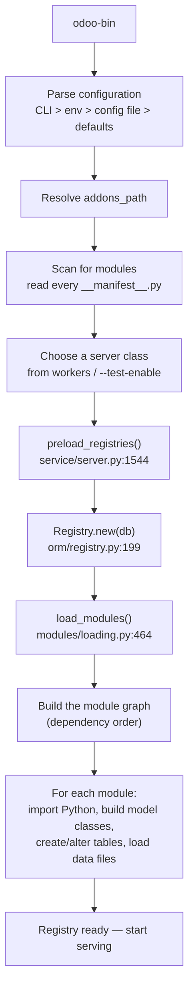
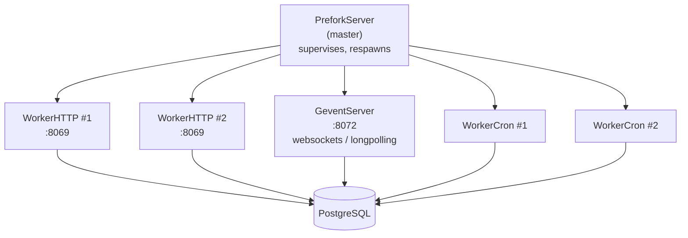
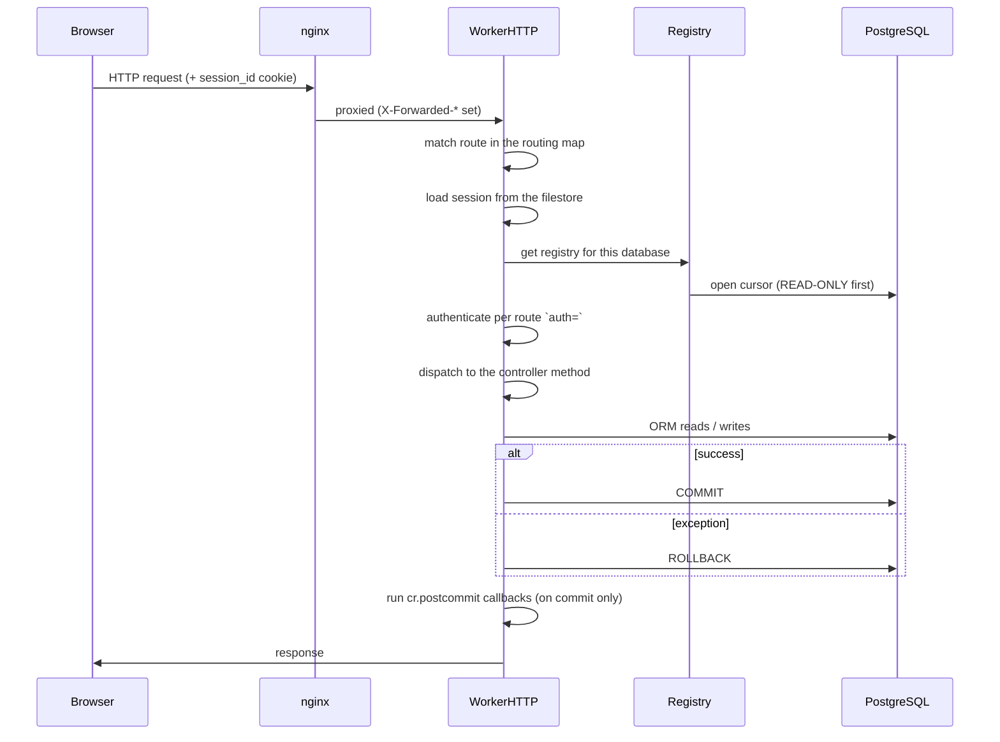

# 03 — The server process and execution modes

[← Getting started](02-getting-started.md) · [Index](00-INDEX.md) · [Next: The ORM and database →](04-orm-and-database.md)

---

This chapter is about what happens between `odoo-bin` and an HTTP response.
You can write Odoo code without knowing it — right up until a worker gets
SIGKILLed in production, a cron runs twice, or a write silently fails because
your route was running in a read-only transaction. Then you need all of it.

All line references are to the vendored source in [`odoo/`](../../odoo).

## 3.1 Startup, in order

`odoo-bin` is three lines; the work is in `odoo.cli`. The sequence is:



### Configuration precedence

Highest wins:

1. Command-line flags (`-d`, `--workers`, `-u`…)
2. Environment variables where supported
3. The config file (`/etc/odoo/odoo.conf`, ours is `odoo.dev.conf`)
4. Built-in defaults (`odoo/tools/config.py`)

> **Trap.** A handful of options are marked `file_exportable=False` and
> **cannot** be set in a config file at all. `dev_mode` is the one that bites —
> which is why the compose file sets `ODOO_DEV=all` in the environment instead.
> If a setting appears to be ignored from the conf file, check this first.

At boot the server prints its resolved configuration, and reading those lines is
the fastest way to confirm the server is using the config you think it is:

```
Odoo version 19.0-20260528
Using configuration file at /etc/odoo/odoo.conf
addons paths: ['/usr/lib/python3/dist-packages/odoo/addons',
               '/var/lib/odoo/addons/19.0',
               '/mnt/extra-addons/custom',
               '/usr/lib/python3/dist-packages/addons']
database: odoo@db:5432
```

You will also see this warning in 19, which is harmless but will become a real
change later:

```
missing --http-interface/http_interface, using 0.0.0.0 by default,
will change to 127.0.0.1 in 20.0
```

### The registry, and why loading takes seconds

The **registry** is the per-database, in-memory result of merging every
installed module's model definitions into a single set of Python classes. Three
modules each adding fields to `res.partner` produce *one* `res.partner` class
with all of them.

Building it means: importing every module's Python, assembling the inheritance
chain, reconciling that against the actual PostgreSQL schema (creating and
altering tables and columns as needed), and loading every XML and CSV data file.

On our stack that is about 12 seconds and ~20,000 queries for 35 modules:

```
35 modules loaded in 7.09s, 20779 queries (+20780 extra)
Registry loaded in 12.318s
```

Two consequences you feel daily:

- **Restarting is not instant.** Budget ten-plus seconds.
- **The registry is per-database.** A multi-database server holds one per
  database, built lazily on first access.

### Registry cache invalidation across processes

In prefork mode there are several processes, each with its own registry cache.
When one changes something registry-wide, it has to tell the others. Odoo does
that through the database:

```
Registry changed, signaling through the database
```

> **Trap.** This is why granting a user a group from an `odoo shell` process
> may not take effect in your browser until the server process notices. During
> the writing of this handbook, exactly that happened: groups were added and
> committed from a shell, and the running server kept refusing access until it
> was restarted. If a permission or model change stubbornly does not apply,
> `make restart-odoo` before you start debugging anything else.

## 3.2 The three execution modes

Which server class runs is decided almost entirely by one setting: `workers`.

| `workers` | Class | Processes | Websockets | Use |
|-----------|-------|-----------|------------|-----|
| `0` | `ThreadedServer` | one, many threads | in-process | local debugging, tests |
| `> 0` | `PreforkServer` | N HTTP + 1 gevent + M cron | separate gevent process | production, and our dev stack |
| — | `GeventServer` | the gevent process itself | — | spawned *by* PreforkServer |

Source: `odoo/service/server.py` — `ThreadedServer` (428), `GeventServer` (721),
`PreforkServer` (833).

### Threaded mode (`workers = 0`)

One process. Each request runs on a thread from a pool. Cron runs on
`max_cron_threads` additional threads in the same process.

The HTTP thread cap is derived, not configured
(`service/server.py:235`):

```python
self.max_http_threads = max((config['db_maxconn'] - config['max_cron_threads']) // 2, 1)
```

So `db_maxconn` indirectly caps your concurrency. With `db_maxconn = 16` and
`max_cron_threads = 2`, you get 7 HTTP threads.

**Why you want it locally:** one process means `breakpoint()` works predictably,
tracebacks all land in one log stream, and there is no watchdog racing your
debugger.

**Why it is not production:** the GIL, and no worker isolation — one thread
leaking memory or wedging affects everything.

### Prefork mode (`workers > 0`)

A master process forks children and supervises them.



- **`WorkerHTTP`** (1313) — serves requests. There are `workers` of them.
- **`WorkerCron`** (1356) — runs scheduled actions. `max_cron_threads` of them.
- **The gevent process** — one, listening on `gevent_port` (8072). It exists
  because websockets and long-polling hold a connection open for a long time; a
  prefork worker doing that would be blocked for the duration. Gevent handles
  many such connections cooperatively in one process.

> **Trap.** The gevent worker **only starts when `workers > 0`**. In threaded
> mode websockets are handled in-process and port 8072 is not used. This is why
> our dev stack sets `workers = 2` and puts nginx in front — so that
> `/websocket` and `/longpolling` reach 8072 while everything else goes to 8069.
> If you set `workers = 0` locally, real-time features (the notification bell,
> live inbox updates) stop working, and nginx will fail to proxy to 8072.

## 3.3 Limits, and the watchdog that kills your worker

This is the part that produces mystifying production incidents, so it is worth
knowing precisely. All of it is in `service/server.py`.

| Setting | Enforced how | Effect when exceeded |
|---------|--------------|----------------------|
| `limit_time_cpu` | `RLIMIT_CPU`, re-set per unit of work (1243–1247) | The OS raises `SIGXCPU` in the worker |
| `limit_time_real` | Master watchdog compares wall-clock age of the request | Master **`SIGKILL`s** the worker (973) |
| `limit_time_real_cron` | Same, for cron workers (845) | Same |
| `limit_memory_soft` | Checked by the worker itself (1237) | Worker finishes the request, then exits cleanly and is respawned |
| `limit_memory_hard` | `resource.setrlimit` (89–99) | `MemoryError` in the process |
| `limit_request` | Request counter (1195, 1427) | Worker exits after N requests and is respawned (leak mitigation) |

Two separate gevent-specific limits exist as well —
`limit_memory_soft_gevent` and `limit_memory_hard_gevent` (94, 733) — because
the long-lived websocket process has a legitimately different memory profile
from a request worker.

The distinction that matters:

> **`limit_time_real` is a hard `SIGKILL` from the master.** The worker gets no
> chance to clean up, the transaction is not committed, and there is no
> traceback in the log — just a worker disappearing and being respawned. If you
> see requests dying at suspiciously round numbers of seconds with no Python
> error, this is what is happening. `limit_memory_soft`, by contrast, is
> graceful: the worker finishes what it is doing first.

Our `odoo.dev.conf` sets generous values (`limit_time_cpu = 300`,
`limit_time_real = 600`) precisely so that a debugging session is never killed
mid-breakpoint. Production values are much tighter.

In threaded mode the equivalent check compares each thread's execution time
against `limit_time_real`, or `limit_time_real_cron` for cron threads
(476–483), and logs rather than killing.

## 3.4 Cron

Scheduled actions are rows in `ir_cron`. `WorkerCron` processes wake up
periodically (`SLEEP_INTERVAL = 60`, line 67), look for due jobs, and run them.

The critical property: **a job is claimed with a PostgreSQL row lock**. Multiple
cron workers, and multiple servers pointed at the same database, therefore do
not run the same job twice concurrently — whoever gets the lock runs it, the
others move on.

What that does *not* protect you from:

> **Trap.** The lock prevents concurrent execution, not repeated execution. A
> job that fails and rolls back will be retried. A job that times out mid-way
> may leave partial work committed if it commits internally. **Write crons to
> be idempotent.** [Chapter 11](11-data-files-and-crons.md) covers the pattern.

You can see and edit every scheduled action in the UI, which is the fastest way
to check whether one is enabled and when it last ran:


## 3.5 The request lifecycle

Here is the whole path, and then the two parts of it that surprise people.



### Surprise 1 — the transaction starts read-only

In Odoo 19, `Request._serve_db` (`odoo/http.py:2213`) opens a **read-only
cursor first** (2222). If the matched route is declared readonly, it stays on
that cursor. If a write is attempted anyway, Odoo catches the failure, logs

```
..., retrying with a read/write cursor
```

(2254) and re-runs the whole request on a read/write cursor.

The default is the part to memorise (`http.py:924`):

```python
default_mode = submethod.original_routing.get('readonly', default_auth == 'none')
```

> **Trap.** **A route with `auth='none'` defaults to `readonly=True`.** If such
> a route writes, every request costs two executions, and under `HttpCase` in
> the test suite the retry does not save you — the test fails outright.
>
> Our Pub/Sub push receiver hits exactly this, and declares itself explicitly.
> From [`push_controller.py`](../../custom_addons/wa_communication/controllers/push_controller.py):
>
> ```python
> @http.route(
>     '/wa/pubsub/push',
>     type='http',
>     auth='none',
>     methods=['POST'],
>     csrf=False,
>     save_session=False,
>     # In Odoo 19 routes default to readonly when ``auth='none'``.  This
>     # endpoint *writes* (creates conversations, messages, event-log rows),
>     # so it must be explicitly read/write — otherwise the handler runs in a
>     # read-only transaction and relies on the implicit readonly→readwrite
>     # retry, which wastes a request in production and fails outright under
>     # HttpCase.  Declaring it here keeps the write intent unambiguous.
>     readonly=False,
> )
> ```
>
> If you write an unauthenticated endpoint that writes, copy this.

### Surprise 2 — concurrency failures are retried automatically

`odoo/service/model.py` wraps request execution in `retrying()` (156). On a
PostgreSQL concurrency error it rolls back and runs the whole thing again, up to
`MAX_TRIES_ON_CONCURRENCY_FAILURE = 5` (line 29). The retried errors are
(line 27):

- `LOCK_NOT_AVAILABLE`
- `SERIALIZATION_FAILURE`
- `DEADLOCK_DETECTED`

> **Trap.** This only works if the exception reaches the framework. A broad
> `except Exception:` inside your controller **swallows the signal**, the
> transaction's writes are lost, and the request returns success. That is a
> silent data-loss bug, and we have shipped it before.
>
> The fix, as implemented in `push_controller.py`:
>
> ```python
> # Postgres concurrency errors that must NOT be swallowed: a serialization
> # failure or deadlock means the transaction has to be retried in a FRESH one
> # (Odoo runs the request inside ``service.model.retrying``, which does exactly
> # that).  Swallowing them here would silently drop the event's writes — e.g. a
> # 'read' status + seen_at lost because a concurrent 'delivered' event touched
> # the same wa.message row.
> _PG_RETRY_ERRORS = (
>     psycopg2.errorcodes.SERIALIZATION_FAILURE,
>     psycopg2.errorcodes.DEADLOCK_DETECTED,
> )
> ```
>
> Because a retry re-runs your handler from the top, **handlers must be safe to
> execute more than once.** This is the same idempotency requirement as crons.

### `cr.postcommit`

Callbacks registered on `env.cr.postcommit` run **after** a successful commit,
and not at all on rollback. This is the correct place for any side effect that
must not happen if the transaction is abandoned — sending a message, publishing
an event.

It is the foundation of our Pub/Sub pattern
([Chapter 14](14-integrations.md)) and it has a direct consequence for tests:
in a `TransactionCase` nothing is ever committed, so postcommit callbacks never
fire, which is why our test fixtures flush them manually
([Chapter 13](13-testing.md)).

## 3.6 The CLI

`odoo` (or `odoo-bin`) takes subcommands. The ones you will use:

```bash
# Run the server.
odoo -c /etc/odoo/odoo.conf

# Install modules into a database, then exit.
odoo -d mydb -i leads,properties --stop-after-init

# Upgrade modules (re-run schema changes, reload data, run migrations).
odoo -d mydb -u leads --stop-after-init

# Upgrade absolutely everything (slow; occasionally necessary).
odoo -d mydb -u all --stop-after-init

# A Python REPL with `env` bound.
odoo shell -d mydb

# Run tests.
odoo -d mydb -i leads --test-enable --test-tags /leads --stop-after-init

# Generate an empty module skeleton.
odoo scaffold my_module /mnt/extra-addons/custom
```

Flags worth knowing:

| Flag | Effect |
|------|--------|
| `-d` | Database name |
| `-i` | Install these modules |
| `-u` | Update these modules |
| `--stop-after-init` | Do the work and exit; do not serve HTTP |
| `--dev=all` | `access,reload,qweb,xml` — see [Chapter 02](02-getting-started.md) |
| `--log-level=debug_sql` | Log every SQL statement. Very loud, very useful |
| `--test-enable` / `--test-tags` | [Chapter 13](13-testing.md) |
| `--without-demo=all` | Skip demo data |
| `--no-http` | Useful with `shell` |

> **Trap.** Our Docker image installs Python dependencies into a virtualenv at
> `/opt/odoo-venv` and uses a custom `entrypoint.sh` to rewrite the `odoo`
> command to `python3 /usr/bin/odoo` using that interpreter.
> **`docker exec` bypasses the entrypoint.** So this fails with import errors:
>
> ```bash
> docker exec odoo-dev-app odoo shell -d cleardeals_19_dev     # wrong
> ```
>
> and this works:
>
> ```bash
> docker exec -it odoo-dev-app /opt/odoo-venv/bin/python3 /usr/bin/odoo shell -d cleardeals_19_dev
> ```
>
> The Makefile targets already do it correctly — another reason to use them.

## 3.7 Multiple databases and `dbfilter`

One Odoo server can serve many databases. Which one a request targets is decided
by the `db_name` setting, the `?db=` parameter, the session, or `dbfilter` — a
regex matched against the hostname, so `client-a.example.com` maps to database
`client_a`.

For us this is mostly a security setting rather than a feature:

- `list_db = True` (dev) shows the database selector.
- `list_db = False` (production) hides it, so the database list is not public.

## 3.8 Auto-reload

With `--dev=reload`, Odoo watches the addons directories and restarts on Python
changes, using `FSWatcherInotify` on Linux or `FSWatcherWatchdog` elsewhere
(`service/server.py:310`, `333`). At boot you will see:

```
Watching addons folder /mnt/extra-addons/custom
AutoReload watcher running with watchdog
```

> **Trap.** On macOS this needs VirtioFS enabled in Docker Desktop; without it
> inotify events do not cross the VM boundary and nothing reloads. And even when
> it works, **it only reloads Python.** Changes to XML views, security CSVs, or
> the manifest require `make update MODULE=…`, because those are database
> records, not code.

## 3.9 What to take away

1. `workers = 0` for debugging, `workers > 0` for anything resembling
   production — and websockets only exist in the second case.
2. `limit_time_real` kills workers with no traceback. Know it before you debug
   a mysterious disappearance.
3. Odoo 19 starts every request on a read-only cursor, and `auth='none'`
   defaults to `readonly=True`. Declare `readonly=False` on writing endpoints.
4. Requests are automatically retried on concurrency failures — so never
   swallow `SerializationFailure` or `DeadlockDetected`, and write handlers that
   can run twice.
5. Side effects that must not happen on rollback belong in `cr.postcommit`.

---

[← Getting started](02-getting-started.md) · [Index](00-INDEX.md) · [Next: The ORM and database →](04-orm-and-database.md)
