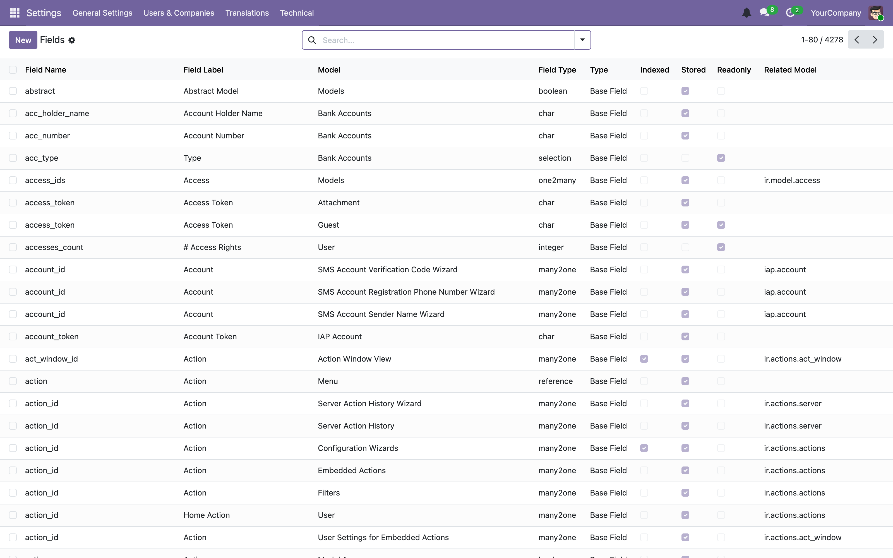

# 04 — The ORM and how databases work in Odoo

[← Server and execution modes](03-server-and-execution-modes.md) · [Index](00-INDEX.md) · [Next: Writing a module →](05-writing-a-module.md)

---

This is the longest chapter, and the one worth reading twice. Almost every bug
we have shipped that was not a typo was a misunderstanding of something on this
page.

## 4.1 Models and tables

A model is a Python class. Odoo derives the table from `_name` by replacing dots
with underscores.

```python
class LeadSourceCategory(models.Model):
    _name = "lead.source.category"      # → table lead_source_category
    _description = "Lead Source Category"
    _order = "sequence, id"
```
— [`leads/models/lead_source.py`](../../custom_addons/leads/models/lead_source.py)

Odoo adds five columns you never declare:

| Column | Meaning |
|--------|---------|
| `id` | Primary key, serial |
| `create_uid` / `create_date` | Who created it, when |
| `write_uid` / `write_date` | Who last modified it, when |

Class attributes that matter:

| Attribute | Purpose |
|-----------|---------|
| `_name` | The model identifier. Required for a new model. |
| `_description` | Human-readable name. **Required** — Odoo warns without it. |
| `_inherit` | Extend an existing model, or inherit from one. See §4.3. |
| `_order` | Default sort, SQL-ish: `"reg_date desc, name"`. |
| `_rec_name` | Which field is the record's display name. Defaults to `name`. |
| `_auto` | If `False`, Odoo does not create a table. Used for SQL views and for pure-service models. |
| `_table` | Override the derived table name. Rarely needed. |

### `_auto = False`

We use this for analytics models that expose methods to the front end but store
nothing — [`wa.dashboard`](../../custom_addons/wa_communication/models/wa_dashboard.py)
and [`wa.message.log`](../../custom_addons/wa_communication/models/wa_message_log.py):

```python
"""wa.dashboard — server-side analytics methods for the WA Dashboard client action.

All public methods accept plain arguments and return JSON-serialisable dicts.
There is no database table — this is a pure analytics utility model.
"""
```

> **Trap.** Odoo 19 logs these at ERROR level during boot:
>
> ```
> ERROR handbook odoo.registry: Model wa.dashboard has no table.
> ERROR handbook odoo.registry: Model wa.message.log has no table.
> ```
>
> These two are expected and harmless. Do not go hunting. But equally, do not
> ignore *new* "has no table" errors — if a model you meant to be persistent
> reports this, you have `_auto = False` set by accident or an `AbstractModel`
> where you wanted a `Model`.

### Three base classes

| Base | Table? | Records live | Use for |
|------|--------|--------------|---------|
| `models.Model` | yes | forever | normal business data |
| `models.TransientModel` | yes | until garbage-collected | wizards and dialogs |
| `models.AbstractModel` | no | n/a | mixins, shared behaviour |

`TransientModel` rows are periodically deleted by a vacuum job — that is the
point. All our wizards in [`leads/wizard/`](../../custom_addons/leads/wizard)
are transient.

## 4.2 Fields

### Scalars

| Field | PostgreSQL | Notes |
|-------|-----------|-------|
| `Char` | `varchar` | `size=` limits length; usually omit it |
| `Text` | `text` | multi-line |
| `Html` | `text` | sanitised on write by default |
| `Integer` | `int4` | defaults to `0`, never `NULL`, in the ORM |
| `Float` | `numeric`/`float8` | `digits=(16, 2)` for fixed precision |
| `Monetary` | `numeric` | needs a `currency_field` |
| `Boolean` | `bool` | |
| `Date` | `date` | Python `date` |
| `Datetime` | `timestamp` | **stored in UTC**, always |
| `Selection` | `varchar` | a list of `(key, label)` pairs |
| `Binary` | `bytea` or filestore | see [Chapter 10](10-filestore-and-attachments.md) |
| `Json` | `jsonb` | |

> **Trap — datetimes.** `Datetime` values are UTC in the database and in
> Python. The web client converts to the user's timezone for display. If you
> compare a `Datetime` to `datetime.now()` you are comparing UTC to server-local
> and will be wrong by your offset. Use `fields.Datetime.now()`. For "today in
> the user's timezone" use `fields.Date.context_today(self)` — as
> [`lead_score.py`](../../custom_addons/leads/models/lead_score.py) does:
>
> ```python
> lead.next_follow_up_date = fields.Date.context_today(lead)
> ```

> **Trap — Selection.** The stored value is the *key*. Passing a label, or a
> key that is not in the list, raises at write time:
>
> ```
> ValueError: Wrong value for wa.message.kind: 'text'
> ```
>
> That is a real error from seeding this handbook's database — the valid key
> was `freetext`, not `text`. To discover valid keys at runtime:
>
> ```python
> >>> env["wa.message"]._fields["kind"]._description_selection(env)
> [('template', 'Template'), ('freetext', 'Free text'), ...]
> ```

### Relational fields

**`Many2one`** — a foreign key column on this table.

```python
category_id = fields.Many2one(
    "lead.source.category",
    string="Category",
    required=True,
    index=True,
    ondelete="restrict",
)
```
— [`lead_source.py`](../../custom_addons/leads/models/lead_source.py)

`ondelete` decides what happens when the target is deleted:

| Value | Behaviour |
|-------|-----------|
| `"set null"` | default — the field becomes empty |
| `"restrict"` | block the delete |
| `"cascade"` | delete this record too |

> **Our convention.** Choose `ondelete` deliberately on every `Many2one`. The
> default silently orphans data. `restrict` for references that represent real
> configuration (as above); `cascade` for children that make no sense alone.

**`One2many`** — the reverse of a `Many2one`. **Stores nothing.** It needs the
name of the inverse field on the other model:

```python
message_ids = fields.One2many("wa.message", "conversation_id", ...)
```

**`Many2many`** — a join table, created automatically, or named explicitly:

```python
all_associated_properties = fields.Many2many(
    "property.base",
    relation="leads_new_property_base_rel",
    string="All Associated Properties",
    compute="_compute_all_associated_properties",
    store=True,
)
```
— [`new_portal_leads.py`](../../custom_addons/leads/models/new_portal_leads.py)

> **Our convention.** Name the `relation` table explicitly whenever two models
> could plausibly have more than one many-to-many between them. The generated
> name is derived from the model names, so a second relation collides.

Writing to `One2many` / `Many2many` uses **commands**, not plain lists:

```python
# Add an existing record to the set.
admin.write({"group_ids": [(4, group.id)]})

# Replace the whole set.
rec.write({"tag_ids": [(6, 0, [id1, id2])]})

# Create a new child inline.
rec.write({"line_ids": [(0, 0, {"name": "new line"})]})
```

| Command | Meaning |
|---------|---------|
| `(0, 0, values)` | create a new linked record |
| `(1, id, values)` | update a linked record |
| `(2, id)` | delete the record |
| `(3, id)` | unlink (keep the record) |
| `(4, id)` | link an existing record |
| `(5,)` | unlink all |
| `(6, 0, ids)` | replace the set with exactly these |

Odoo also offers named equivalents — `Command.create(vals)`, `Command.link(id)`,
`Command.set(ids)`, `Command.unlink(id)`, `Command.clear()` — imported as
`from odoo import Command` (or `from odoo.fields import Command`, which is what
most upstream addons use). They are considerably more readable than the numeric
tuples and are worth preferring in new code:

```python
admin.write({"group_ids": [Command.link(group.id)]})
rec.write({"tag_ids": [Command.set([id1, id2])]})
rec.write({"line_ids": [Command.create({"name": "new line"})]})
```

### Common attributes

| Attribute | Effect |
|-----------|--------|
| `required=True` | `NOT NULL` at the database level |
| `index=True` | create a database index |
| `default=` | a value, or a callable (`fields.Date.today`) |
| `readonly=True` | not editable in the UI (**not** a security control) |
| `copy=False` | excluded when a record is duplicated |
| `tracking=True` | log changes to the chatter (needs `mail.thread`) |
| `groups="module.group"` | only these groups can read/write the field |
| `help=` | tooltip — use it generously |
| `related=` | mirror a field from a related record (§4.4) |
| `compute=` | derive the value (§4.4) |

> **Trap.** `readonly=True` is a UI hint. It does **not** stop a write from
> Python or from the JSON-RPC API. For real enforcement use `groups=` or a
> constraint. See [Chapter 07](07-security.md).

Live field metadata is browsable in the UI, which is often faster than reading
the Python:



## 4.3 The three inheritance mechanisms

This is where Odoo differs most from ordinary Python, and it is the mechanism
that lets `wa_communication` react to leads without `leads` knowing WhatsApp
exists.

### Extension — `_inherit` alone

Add fields and override methods **on the existing model and table**. No new
model is created.

```python
class NewPortalLead(models.Model):
    _inherit = "leads.new"          # no _name

    # new fields land on the existing leads_new table
```

This is what almost all of our cross-module work uses.
[`wa_lead_event_publisher.py`](../../custom_addons/wa_communication/models/wa_lead_event_publisher.py)
extends `leads.new` purely to publish events on state changes.

### Prototype — `_inherit` **and** `_name`

Copies the fields and methods into a **new** model with its **own** table. Rare.

```python
class Something(models.Model):
    _name = "my.something"
    _inherit = "some.mixin"
```

### Delegation — `_inherits`

Note the **s**. Embeds another model by holding a required `Many2one` to it and
transparently proxying its fields. Used by Odoo for things like
`res.users` → `res.partner`. Rare in our code; know it exists so you recognise
it.

### Mixins

`_inherit` accepts a list, which is how you pull in abstract mixins:

```python
class PropertyBase(models.Model):
    _name = "property.base"
    _description = "Cleardeals Property"
    _inherit = ["mail.thread", "mail.activity.mixin"]
    _order = "reg_date desc, name"
    _rec_name = "name"
```
— [`property_base.py`](../../custom_addons/properties/models/property_base.py)

`mail.thread` gives the chatter and `tracking=True`; `mail.activity.mixin` gives
scheduled activities.

> **Trap.** Adding `mail.thread` to an existing model adds tables and triggers
> a fair amount of machinery. It is not free, and it is awkward to remove later.
> Add it because you want the chatter, not by reflex.

## 4.4 Computed and related fields

### Computed

A method assigns the value. `@api.depends` tells the ORM when to recompute.

```python
@api.depends("current_status", "site_visit_scheduled_date")
def _compute_next_follow_up_date(self):
    """Compute the follow-up date based on the state and the site visit date."""
    for lead in self:
        if (
            lead.current_status == "site_visit_scheduled"
            or lead.current_status == "rescheduled"
        ) and lead.site_visit_scheduled_date:
            lead.next_follow_up_date = lead.site_visit_scheduled_date + timedelta(days=1)
        else:
            if not lead.next_follow_up_date:
                lead.next_follow_up_date = fields.Date.context_today(lead)
```
— [`lead_score.py`](../../custom_addons/leads/models/lead_score.py)

Three rules, all of which are violated regularly:

1. **Always iterate `self`.** A compute method receives a recordset, not one
   record. `self.field = x` on a multi-record set raises.
2. **Assign on every path.** If any branch leaves the field unassigned, you get
   a `ValueError` about a compute method failing to set a value. Set a default
   first if the logic is branchy.
3. **`@api.depends` must list everything you read**, including dotted paths
   through relations:
   `@api.depends("event_ids.event_type", "event_ids.message_direction")`.

### Stored vs non-stored

| | `store=False` (default) | `store=True` |
|---|---|---|
| Column in the table | no | yes |
| Computed | on every read | when a dependency changes |
| Searchable | only with a `search=` method | yes |
| Sortable | no | yes |
| Usable in a domain | no | yes |

> **Trap — the big one.** A **stored** computed field is only recomputed when a
> field named in `@api.depends` is written. If the value really depends on
> something else — the current date, a config parameter, a record in another
> table that is not in the dependency graph — it will go stale and stay stale,
> silently, possibly for months.
>
> `_compute_is_actionable_today` in
> [`lead_score.py`](../../custom_addons/leads/models/lead_score.py) is exactly
> this shape: it compares `next_follow_up_date` against *today*, and time is not
> a dependency. The codebase handles it by running a scheduled action,
> `_recompute_actionable_flag`, to re-evaluate the flag. That is the correct
> answer — if a stored compute depends on the clock, something must trigger the
> recompute.

> **Trap — changing a compute.** Editing the body of a stored compute does
> **not** recompute existing rows. `-u` recomputes only if the field definition
> changed in a way Odoo notices. To be sure, force it in a migration:
>
> ```python
> env["leads.new"].search([])._compute_next_follow_up_date()
> ```
>
> See [Chapter 12](12-migrations.md).

### Related fields

Shorthand for "the value of a field on a linked record":

```python
source_type = fields.Selection(
    related="category_id.source_type",
    store=True,
    readonly=True,
)
```
— [`lead_source.py`](../../custom_addons/leads/models/lead_source.py)

A `related` field is a computed field with the dependency chain generated for
you. `store=True` denormalises it into this table, which is what makes it
searchable and sortable — at the cost of an update whenever the source changes.

> **Trap.** A non-stored `related` across a `Many2one` that can be empty
> evaluates to the field's falsy default, not an error. `lead.source_id.name`
> on a lead with no source is `False`, not `None` and not an exception. Guard
> accordingly.

### Inverse and search

- `inverse="_inverse_x"` makes a computed field writable — the method turns a
  written value back into whatever underlies it.
- `search="_search_x"` makes a non-stored computed field usable in a domain by
  returning a domain of your own.

## 4.5 Recordsets

Everything the ORM returns is a recordset: an ordered, deduplicated collection
of records of one model. A single record is just a recordset of length 1. This
is the abstraction to internalise.

```python
leads = env["leads.new"].search([("current_status", "=", "lead")])

len(leads)                       # how many
leads.ids                        # [1, 2, 3]
for lead in leads: ...           # iterate → recordsets of length 1
leads[0]                         # first
leads.mapped("name")             # ['Rohan Desai', 'Priya Nair', ...]
leads.mapped("user_id.name")     # follows relations, deduplicated
leads.filtered(lambda l: l.phone)          # a smaller recordset
leads.filtered_domain([("phone", "!=", False)])
leads.sorted("create_date", reverse=True)
leads_a | leads_b                # union
leads_a & leads_b                # intersection
leads_a - leads_b                # difference
bool(leads)                      # empty test
```

Crucially, **writes are batched**:

```python
leads.write({"current_status": "busy"})   # ONE UPDATE for all of them
```

versus

```python
for lead in leads:
    lead.write({"current_status": "busy"})   # N UPDATEs. Don't.
```

> **Our convention.** Do not name a loop variable `l` — the linter rejects it
> (E741) and it is unreadable. `for lead in leads`, `for line in lines`,
> `for rec in self`.

### The environment

`self.env` carries the cursor, the user, and the context.

```python
self.env.cr             # the database cursor
self.env.uid            # current user id
self.env.user           # res.users record
self.env.company        # active company
self.env.context        # a frozen dict
self.env["res.users"]   # an empty recordset of that model — the entry point
self.env.ref("leads.group_lead_score_manager")   # look up by external ID
```

Deriving a modified environment returns *new* recordsets; it never mutates in
place:

```python
recs.with_context(automated_lead_creation=True)
recs.with_user(some_user)
recs.with_company(company)
recs.sudo()
```

The context is how optional behaviour is threaded through the stack. Our lead
creation uses exactly this:

```python
return self.env["leads.new"].with_context(automated_lead_creation=True).create(base)
```
— [`wa_communication/tests/common.py`](../../custom_addons/wa_communication/tests/common.py)

## 4.6 Domains

A domain is a list of criteria in prefix (Polish) notation.

```python
[("current_status", "=", "lead")]

[("current_status", "=", "lead"), ("user_id", "=", uid)]        # implicit AND

["|", ("state", "=", "new"), ("state", "=", "assigned")]        # OR

["&", ("active", "=", True),
      "|", ("phone", "!=", False), ("email", "!=", False)]

[("user_id.name", "ilike", "asha")]                             # dotted path
```

| Operator | Meaning |
|----------|---------|
| `=`, `!=`, `>`, `>=`, `<`, `<=` | comparison |
| `in`, `not in` | membership; give it a list |
| `like`, `ilike` | substring, `ilike` is case-insensitive |
| `=like`, `=ilike` | you supply the `%` wildcards |
| `child_of`, `parent_of` | hierarchies |
| `any`, `not any` | Odoo 19: match on a sub-domain over a relation |

Logical prefixes: `&` (and, the default), `|` (or), `!` (not). They apply to the
**next N terms**, which is why complex domains are hard to read — build them in
Python rather than writing one enormous literal.

> **Trap.** `[("x", "=", False)]` matches both SQL `NULL` and empty string for
> `Char` fields. That is usually what you want, but it means `= False` and
> `!= False` are not exact complements in the way you might assume.

### Searching

```python
Model.search(domain, limit=10, order="create_date desc", offset=0)
Model.search_count(domain)
Model.search_read(domain, ["name", "phone"], limit=10)   # skips recordsets
Model.browse([1, 2, 3])                                  # by id, no query yet
Model.exists()                                           # drop deleted ids
```

### Grouping

> **Trap — this changed.** The public `read_group()` still exists in Odoo 19
> (`odoo/orm/models.py:2749`) but its docstring begins *"Deprecated"*. New code
> should use `_read_group()`, and **`_read_group` returns a list of tuples, not
> a list of dicts.**

```python
# [(status, count), ...]
rows = env["leads.new"]._read_group(
    domain=[],
    groupby=["current_status"],
    aggregates=["__count"],
)
```

Our code documents the gotcha at the call site, which is the right instinct:

```python
# Odoo 19 ``_read_group`` returns a list of ``(*groupby, *aggregates)`` tuples
```
— [`wa_conversation_serializers.py`](../../custom_addons/wa_communication/models/wa_conversation_serializers.py)

Signature (`odoo/orm/models.py:1861`):

```python
_read_group(domain, groupby=(), aggregates=(), having=(), offset=0, limit=None, order=None)
```

Date granularity is supported in the groupby spec —
`"create_date:month"`, `:day`, `:week`, `:quarter`, `:year` — and aggregates are
`"field:agg"` where `agg` is any PostgreSQL aggregate, plus `count_distinct` and
`recordset`.

## 4.7 Transactions, flushing, and the cache

### One cursor per request

A request runs in a single transaction. It commits at the end if no exception
escaped, and rolls back otherwise. **You almost never call `commit()`
yourself** — doing so in the middle of a request breaks the atomicity the
framework guarantees, and defeats the automatic concurrency retry described in
[Chapter 03](03-server-and-execution-modes.md).

The exceptions: the `odoo shell` (which never commits for you), migration
scripts, and long-running crons that deliberately checkpoint.

### The ORM cache, and when SQL actually runs

The ORM keeps a per-transaction cache and defers writes. This means the SQL you
expect has often not run yet:

```python
lead.name = "New Name"      # in cache, no UPDATE yet
env.cr.execute("SELECT name FROM leads_new WHERE id = %s", (lead.id,))
# ← still sees the OLD name
```

Two tools:

```python
env.flush_all()             # push pending writes to the database
recs.flush_recordset(["field"])   # push just these
env.invalidate_all()        # drop the cache; re-read from the database
```

> **Trap.** Any time you mix raw SQL with the ORM, `flush` before you read and
> `invalidate` after you write. This is the single most common cause of
> "the database says one thing and Python says another".

`ir_attachment` shows the pattern in the framework itself — flush the fields the
subsequent non-ORM work depends on:

```python
self.flush_recordset(['checksum', 'store_fname'])
```

### Savepoints

```python
with env.cr.savepoint():
    risky_operation()       # rolled back to the savepoint on exception
```

Useful when you want to attempt something that may raise without losing the rest
of the transaction — bulk imports that skip bad rows, for instance.

### `cr.postcommit`

```python
env.cr.postcommit.add(lambda: publish_event(payload))
```

Runs **after** a successful commit; never on rollback. This is where every
irreversible external side effect belongs. See
[Chapter 14](14-integrations.md).

## 4.8 Constraints

There are two kinds, and choosing correctly matters.

### SQL constraints — Odoo 19 changed this

> **Trap — this will bite anyone who has used Odoo before.** The old
> `_sql_constraints = [(name, definition, message)]` list **no longer works**.
> Odoo 19 detects it and logs a warning, then ignores it
> (`odoo/orm/model_classes.py:162`):
>
> ```python
> if hasattr(model_def, '_sql_constraints'):
>     _logger.warning("Model attribute '_sql_constraints' is no longer supported, "
>                     "please define model.Constraint on the model.")
> ```
>
> A warning, not an error. So a model carrying the old form looks fine, starts
> fine, and simply **has no constraint** — the uniqueness you thought you were
> enforcing is not enforced. We have hit this.

The Odoo 19 form is a declarative class attribute:

```python
class PropertyBase(models.Model):
    _name = "property.base"

    _uuid_uniq = models.Constraint(
        "UNIQUE(uuid)",
        message="A property with this UUID already exists.",
    )
    _prop_id_uniq = models.Constraint(
        "UNIQUE(prop_id)",
        message="A property with this short-code (prop_id) already exists.",
    )
```
— [`property_base.py`](../../custom_addons/properties/models/property_base.py)

The attribute name becomes the constraint name; the first argument is raw SQL
appended to `ADD CONSTRAINT`. `odoo/orm/table_objects.py:79` documents the
accepted forms:

```
- CHECK (x > 0)
- FOREIGN KEY (abc) REFERENCES some_table(id)
- UNIQUE (user_id)
```

Companion classes `Index` and `UniqueIndex` (lines 125, 185) exist for cases
where you want an index rather than a constraint — notably partial unique
indexes, which `UNIQUE(...)` cannot express.

Good news: **our codebase has already migrated.** Every constraint in
`custom_addons` uses `models.Constraint`. Keep it that way.

### Python constraints — `@api.constrains`

For anything SQL cannot express. Runs on create and on write, but **only when
one of the named fields is touched**.

```python
@api.constrains("source_type", "portal_code")
def _check_portal_code_consistency(self):
    for rec in self:
        if rec.source_type == "portal" and not rec.portal_code:
            raise ValidationError(
                "Portal sources require a portal code for listing matching.",
            )
        if rec.source_type != "portal" and rec.portal_code:
            raise ValidationError(
                "Only portal sources can have a portal code.",
            )
```
— [`lead_source.py`](../../custom_addons/leads/models/lead_source.py)

### A worked example worth studying

[`_check_phone_number`](../../custom_addons/leads/models/new_portal_leads.py) is
the best constraint in the codebase, and its docstring teaches three separate
lessons:

```python
@api.constrains("phone")
def _check_phone_number(self):
    """Reject a missing or malformed phone on manually entered leads.

    Scope is deliberate.  Every automated path (portal webhooks, the CSV
    import wizard, the SquareYards/OLX pulls, WhatsApp triage, the recommend
    wizard) sets ``automated_lead_creation``; the lead form is the only
    creator that does not.  Enforcing there and only there means an RM can
    no longer save a lead nobody can call, while a portal sending a bad
    number still lands the lead instead of being rejected at the door —
    losing a real inbound enquiry is worse than storing a number an RM will
    have to correct.

    Because Odoo only runs a constraint when one of its trigger fields is
    written, existing rows with bad numbers stay editable: the check bites
    when someone touches ``phone``, not when they edit anything else.
    """
    if self.env.context.get("automated_lead_creation"):
        return
    for rec in self:
        error = self._phone_validation_error(rec.phone)
        if error:
            raise ValidationError(error)
```

1. **Context as a scope switch.** The same constraint is strict for humans and
   lenient for machines, because the business cost of the two failures differs.
2. **Trigger-field semantics as a migration strategy.** Adding a constraint to a
   table with bad existing data would normally make those rows uneditable. It
   does not here, because Odoo only evaluates the constraint when `phone`
   itself is written.
3. **The rule is extracted** into `_phone_validation_error`, so it can be reused
   and tested without a record.

### Which to use

| Need | Use |
|------|-----|
| Uniqueness, simple `CHECK` | `models.Constraint` — the database enforces it against every writer |
| Cross-field or cross-record logic | `@api.constrains` |
| Cross-model validation | `@api.constrains` on both sides, or rethink the model |
| Something the user should be *warned* about, not blocked | Neither — an `onchange` or a UI warning |

> **Our convention.** Prefer a SQL constraint when the rule is expressible in
> SQL. It cannot be bypassed by `sudo()`, by a migration script, or by direct
> SQL, and it is enforced for rows created before the code existed.

### Testing constraints

> **Trap.** A SQL constraint does not fire until the write reaches the
> database. In a test, `create()` alone may not raise. Flush explicitly, and
> wrap in a savepoint so the failed transaction does not poison the rest of
> the test. See [Chapter 13](13-testing.md).

## 4.9 `onchange` vs `compute` vs `constrains`

These are confused constantly. The distinction is *who* and *when*.

| | Runs where | Runs when | Sees |
|---|---|---|---|
| `@api.depends` (compute) | server | whenever dependencies change, from any source | all writers |
| `@api.onchange` | server, called by the form | as the user edits, **before saving** | only the form |
| `@api.constrains` | server | on create/write of the named fields | all writers |

```python
@api.onchange("current_status")
def _onchange_state_set_follow_up(self):
    """When the state changes in the UI, set a default follow-up date."""
    if (
        self.current_status != "site_visit_scheduled"
        and self.current_status != "rescheduled"
    ):
        self.next_follow_up_date = fields.Date.context_today(self) + timedelta(days=1)
```
— [`lead_score.py`](../../custom_addons/leads/models/lead_score.py)

> **Trap.** **`onchange` is not validation.** It only runs for a user typing in
> a form. An import, an API call, a webhook, a migration or a cron never
> triggers it. If a rule must always hold, it is a constraint. If a value must
> always be correct, it is a compute. `onchange` is for *convenience defaults*
> only — exactly as the docstring above frames it.

Note the pairing in that file: `next_follow_up_date` has **both** a compute
(authoritative, runs for everyone) and an onchange (a helpful default while
typing). That is the correct combination when you want both behaviours.

## 4.10 Overriding create, write and unlink

```python
@api.model_create_multi
def create(self, vals_list):
    for vals in vals_list:
        vals.setdefault("state", "new")
    records = super().create(vals_list)
    records._do_something_after()
    return records
```

> **Trap.** Use `@api.model_create_multi` and accept a **list** of dicts.
> Odoo batches creates, and a single-dict `create` override silently kills that
> batching — or breaks outright when something passes a list.
> [`property_portal_listing.py`](../../custom_addons/properties/models/property_portal_listing.py)
> has the correct shape.

For `write`, remember you may need the old values, and they are gone after
`super()`:

```python
def write(self, vals):
    before = {rec.id: rec.state for rec in self}   # snapshot BEFORE
    result = super().write(vals)
    for rec in self:
        if before[rec.id] != rec.state:
            rec._on_state_changed()
    return result
```

This snapshot-then-`super()`-then-react shape is exactly what our Pub/Sub
publishers use ([Chapter 14](14-integrations.md)).

> **Trap — infinite recursion.** Writing to `self` inside `write()` re-enters
> `write()`. Guard with a context flag, or write to a different record, or use
> a compute instead.

## 4.11 Access, `sudo()` and the context

Every ORM call is checked against ACLs and record rules for `env.user`.
`sudo()` returns the same records in an environment with those checks disabled.

```python
lead.sudo().read(["name"])
self.env["ir.config_parameter"].sudo().get_param("some.key")
```

`ir.config_parameter` genuinely requires `sudo()` for ordinary users — that one
is routine. Business records are a different matter, and
[Chapter 07](07-security.md) covers the discipline in full. The short version:

> **Our convention.** `sudo()` on the narrowest possible scope, with a comment
> saying why. `self.env["x"].sudo().browse(id).field` is defensible;
> `self.sudo()` at the top of a 60-line method is not.

## 4.12 Performance

### Prefetching and N+1

The ORM prefetches: reading a field on one record of a recordset fetches that
field for the whole recordset in one query. This makes the obvious loop fast:

```python
for lead in leads:
    print(lead.name)        # ONE query for all names
```

You break it by re-browsing inside a loop:

```python
for lead_id in lead_ids:
    lead = env["leads.new"].browse(lead_id)   # separate prefetch set each time
    print(lead.name)                          # N queries. Don't.
```

> **Our convention.** Browse once, iterate the recordset. Use `mapped()` to
> traverse relations in bulk. If you find yourself calling `search()` inside a
> loop, restructure — search once with an `in` domain and group in Python.

### Indexes

Add `index=True` to any field you filter or sort on regularly. Our code does
this consistently on lookup keys:

```python
uuid = fields.Char(index=True, readonly=True, copy=False, ...)
prop_id = fields.Char(index=True, readonly=True, copy=False, ...)
form_no = fields.Char(index=True, readonly=True, copy=False, ...)
```
— [`property_base.py`](../../custom_addons/properties/models/property_base.py)

`Many2one` fields are **not** indexed automatically. If you filter by one, add
`index=True` — as `lead_source.py` does on `category_id`.

### Raw SQL

Justified for bulk operations and heavy aggregation. Rules:

```python
self.env.cr.execute(
    "SELECT id FROM leads_new WHERE phone = %s", (phone,),
)
```

- **Always** parameterise. Never f-string or `%` a value into SQL.
- `flush` before reading, `invalidate` after writing.
- Raw SQL bypasses ACLs, record rules, computes and constraints. That is
  sometimes the point, and sometimes a security hole.

## 4.13 Looking at the database directly

Odoo's own metadata lives in ordinary tables, and they are extremely useful.

| Table | Contents |
|-------|----------|
| `ir_model` | every model |
| `ir_model_fields` | every field, with type and metadata |
| `ir_model_data` | external ID → (model, id) mapping |
| `ir_model_access` | the ACLs ([Chapter 07](07-security.md)) |
| `ir_rule` | record rules |
| `ir_cron` | scheduled actions |
| `ir_config_parameter` | system parameters |
| `ir_attachment` | files ([Chapter 10](10-filestore-and-attachments.md)) |
| `ir_module_module` | installed modules and their versions |

Recipes:

```bash
make psql
```

```sql
-- What is the external ID of this record?
SELECT module || '.' || name FROM ir_model_data
WHERE model = 'res.groups' AND res_id = 42;

-- Which modules are installed, and at what version?
SELECT name, latest_version, state FROM ir_module_module
WHERE state = 'installed' AND author ILIKE '%cleardeals%';

-- Every field our module added to leads.new.
SELECT f.name, f.ttype, f.required, f.store
FROM ir_model_fields f JOIN ir_model m ON m.id = f.model_id
WHERE m.model = 'leads.new' ORDER BY f.name;

-- Is a query slow because of a missing index?
EXPLAIN ANALYZE SELECT * FROM leads_new WHERE phone = '9812340001';
```

The same information is in the UI under Technical:


## 4.14 What to take away

1. Recordsets, not records. Iterate `self`; batch your writes.
2. Stored computes go stale if their real dependency is not in
   `@api.depends`. Time is never a dependency.
3. `_sql_constraints` is dead in Odoo 19 and fails **silently**. Use
   `models.Constraint`.
4. `onchange` is not validation. `@api.constrains` is.
5. The ORM caches and defers. Mixing raw SQL without `flush`/`invalidate`
   produces phantom bugs.
6. `@api.model_create_multi` and a list of dicts, always.
7. `sudo()` narrow, and say why.

---

[← Server and execution modes](03-server-and-execution-modes.md) · [Index](00-INDEX.md) · [Next: Writing a module →](05-writing-a-module.md)
