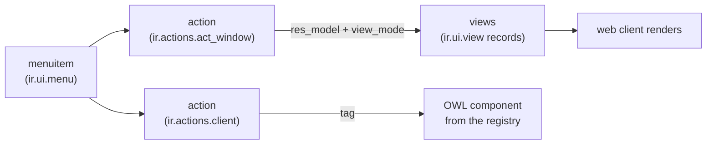
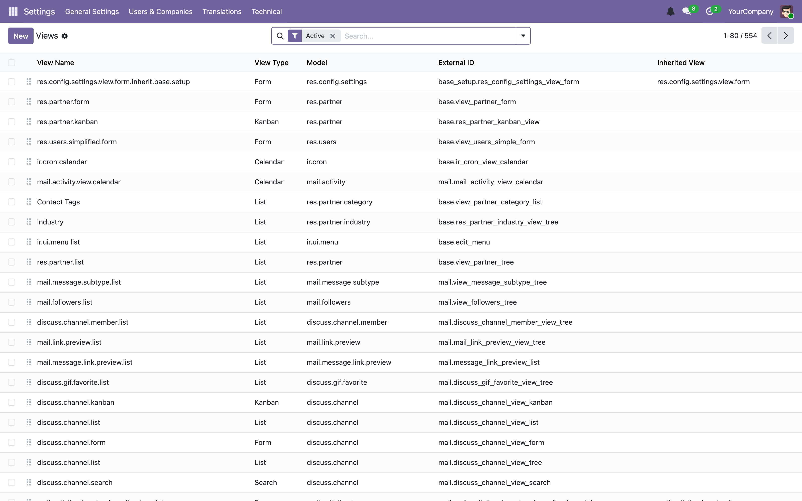
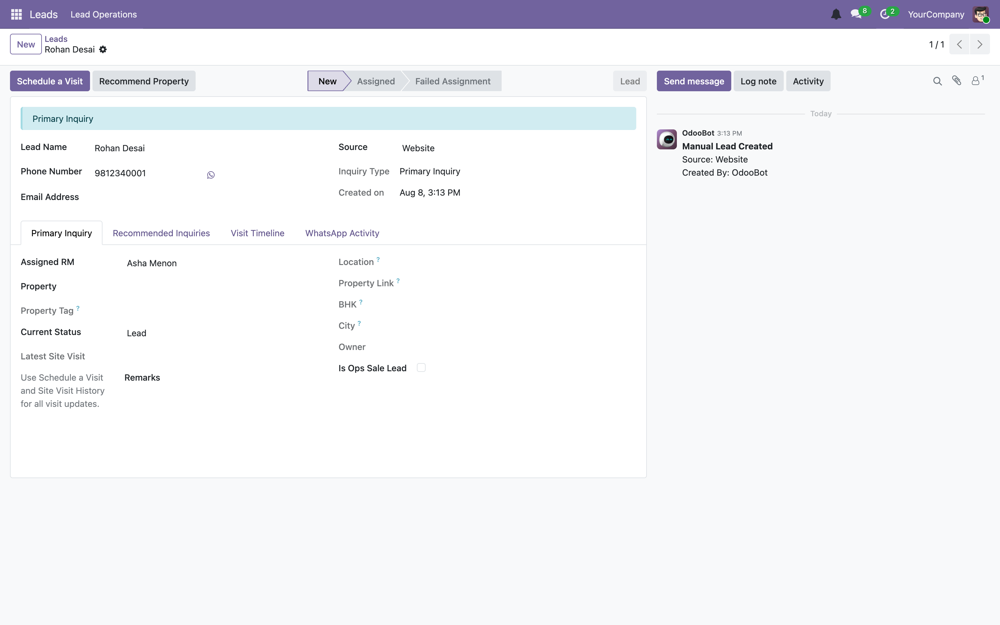
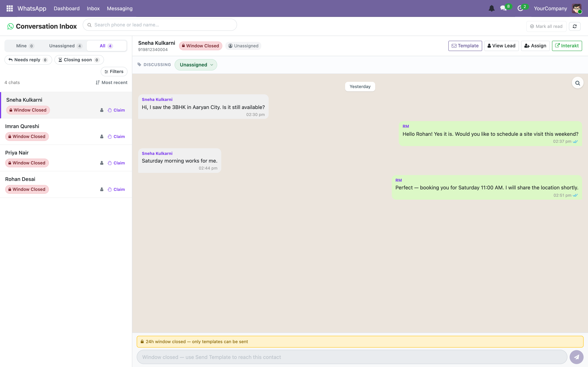
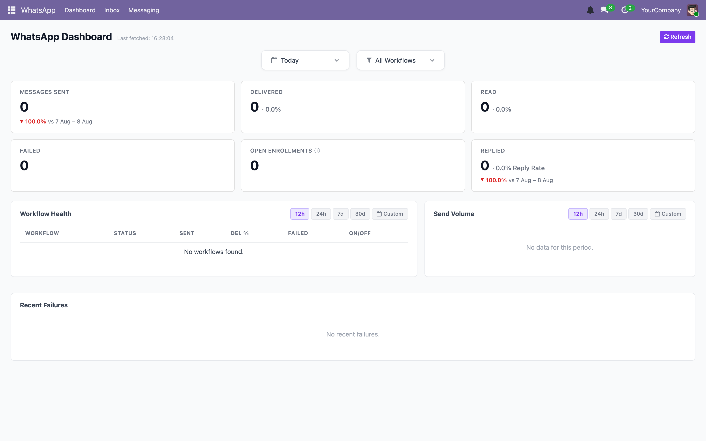
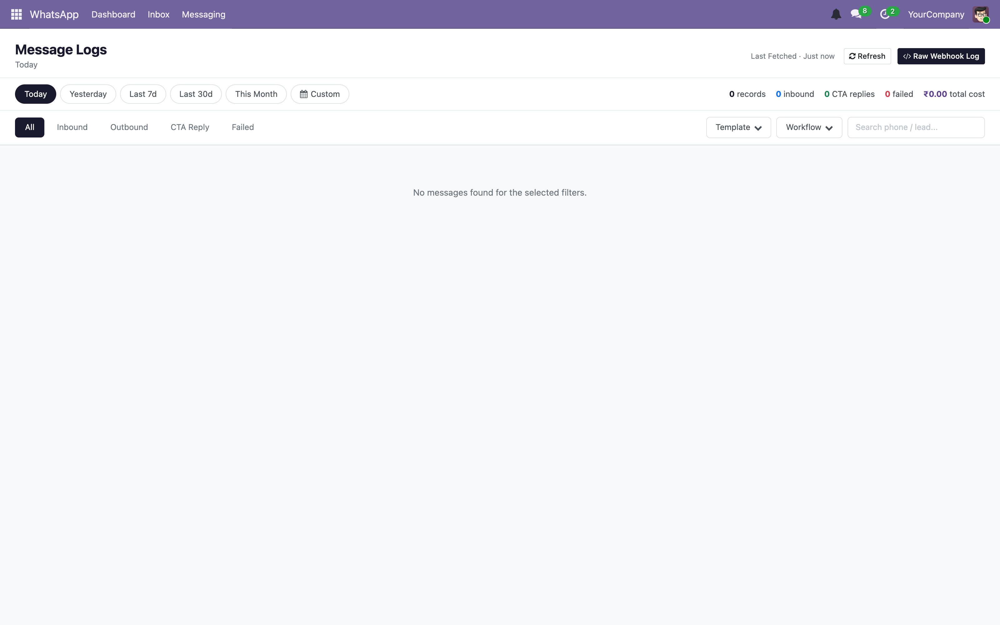
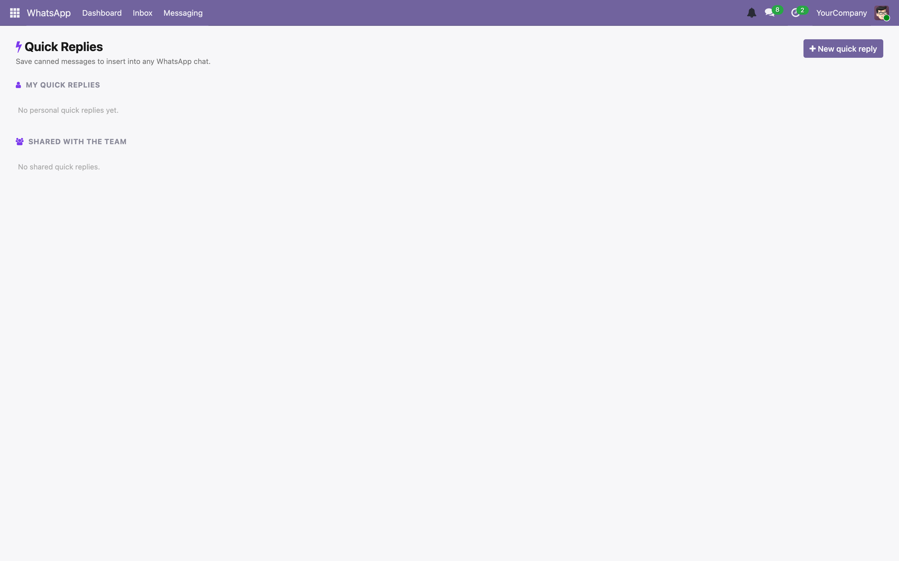

# 06 — Views, actions and the web client

[← Writing a module](05-writing-a-module.md) · [Index](00-INDEX.md) · [Next: Security →](07-security.md)

---

Odoo's UI comes in two flavours, and knowing which one you are looking at is the
first step in changing it.

**Declarative views.** You write XML describing a form or a list; the generic
web client renders it. Cheap, consistent, and enough for 90% of screens.

**OWL components.** You write JavaScript. Used when the interaction does not fit
a record-oriented view at all — our WhatsApp inbox and dashboards.

This chapter covers both, and the asset pipeline that delivers the second.

## 6.1 How a click becomes a screen



Three separate records. A menu points at an action; the action names a model and
which view types to offer; views are XML records keyed by model and type.

The important consequence: **views are database rows, not files.** The XML in
your module is loaded *into* `ir_ui_view` at install/update time. That is why
editing a view file and refreshing the browser does nothing — you need
`make update MODULE=…`. You can browse and even edit the live records:



## 6.2 Actions

### Window actions — `ir.actions.act_window`

The workhorse. Opens a model in one or more view types.

```xml
<record id="action_lead_source" model="ir.actions.act_window">
    <field name="name">Lead Sources</field>
    <field name="res_model">lead.source</field>
    <field name="view_mode">list,form</field>
    <field name="help" type="html">
        <p class="o_view_nocontent_smiling_face">
            Start by adding a lead source.
        </p>
        <p>
            For portal sources, set a Fallback RM so unmatched leads are routed
            to the right user.
        </p>
    </field>
</record>
```
— [`lead_source_views.xml`](../../custom_addons/leads/views/lead_source_views.xml)

| Field | Purpose |
|-------|---------|
| `res_model` | The model to open |
| `view_mode` | Comma-separated view types, **first one is the default** |
| `domain` | A fixed filter always applied |
| `context` | Defaults and flags passed to the views — `{'search_default_open': 1}` pre-activates a search filter named `open`; `{'default_state': 'draft'}` presets a field on new records |
| `target` | `current` (default), `new` (modal dialog), `fullscreen` |
| `res_id` | Open one specific record |
| `search_view_id` | Force a specific search view |
| `help` | The empty-state message. Fill it in — an empty list with no guidance is a bad screen |
| `binding_model_id` + `binding_view_types` | Adds the action to another model's **Actions** cog menu, which is how our wizards are reached without menu items |

> **Our convention.** Always write the `help` empty state. `action_lead_source`
> above is the standard to match: one line telling the user what to do, one line
> of context. `o_view_nocontent_smiling_face` is the Odoo class that renders it
> nicely.

### Client actions — `ir.actions.client`

Hands control to a JavaScript component. There is no model and no view.

```xml
<record id="action_wa_inbox" model="ir.actions.client">
    <field name="name">WhatsApp Inbox</field>
    <field name="tag">wa_inbox</field>
</record>
```

`tag` is a key into the JS action registry (§6.8). All four of our WhatsApp
screens work this way:

| External ID | tag |
|-------------|-----|
| `wa_communication.action_wa_dashboard` | `wa_dashboard` |
| `wa_communication.action_wa_inbox` | `wa_inbox` |
| `wa_communication.action_wa_message_log` | `wa_message_log` |
| `wa_communication.action_wa_quick_replies` | `wa_quick_replies` |

### Server actions and automated actions

`ir.actions.server` runs Python. `base_automation` rules trigger server actions
on record events from the UI.

> **Our convention.** Prefer real Python in a module over a server action whose
> code lives in a database row. Database-resident code is invisible to git, to
> review, and to the test suite. If you find one, it is usually worth
> migrating — `leads` has a migration that does exactly that:
> `post-02-remove_orphan_server_actions.py`.

### Menus

```xml
<menuitem id="lead_source_config_root"
          name="Settings"
          parent="leads.lead_score_menu_main"
          sequence="90"
          groups="leads.group_lead_score_manager"/>

<menuitem id="menu_lead_source"
          name="Sources"
          parent="lead_source_config_root"
          action="action_lead_source"
          sequence="10"
          groups="leads.group_lead_score_manager"/>
```

A menu with no `action` is a container. `sequence` orders siblings. `groups`
hides the menu from everyone else.

> **Trap.** `groups` on a menu is **cosmetic only** — it hides the entry, it does
> not protect the data. A user who knows the URL can still reach the action. Real
> protection is ACLs and record rules ([Chapter 07](07-security.md)). Set both:
> `groups` for a clean UI, ACLs for security.

## 6.3 View types

| Type | Tag | Use |
|------|-----|-----|
| List | `<list>` | tabular. **Renamed from `<tree>` in Odoo 17** — `tree` still works but is legacy |
| Form | `<form>` | one record |
| Search | `<search>` | the filter/group-by panel |
| Kanban | `<kanban>` | cards in columns |
| Pivot | `<pivot>` | cross-tab analysis |
| Graph | `<graph>` | bar/line/pie |
| Calendar | `<calendar>` | date-based |
| Activity | `<activity>` | scheduled activities grid — added by `mail`, not `base` |

The base `ir.ui.view.type` selection is `list, form, graph, pivot, calendar,
kanban, search, qweb` (`odoo/addons/base/models/ir_ui_view.py:149`); `mail` adds
`activity` with `selection_add`. A neat illustration of extending a `Selection`
from another module ([Chapter 04](04-orm-and-database.md)).

### List views

```xml
<record id="view_lead_source_list" model="ir.ui.view">
    <field name="name">lead.source.list</field>
    <field name="model">lead.source</field>
    <field name="arch" type="xml">
        <list string="Lead Sources" editable="bottom">
            <field name="sequence" widget="handle"/>
            <field name="name" string="Source Name"/>
            <field name="category_id" string="Category"/>
            <field name="source_type" readonly="1"/>
            <field name="portal_code" optional="hide"/>
            <field name="default_rm_user_id"/>
            <field name="active"/>
        </list>
    </field>
</record>
```
— [`lead_source_views.xml`](../../custom_addons/leads/views/lead_source_views.xml)

| Attribute | Effect |
|-----------|--------|
| `editable="bottom"` / `"top"` | edit inline instead of opening the form |
| `widget="handle"` on a `sequence` field | drag-to-reorder rows |
| `optional="hide"` / `"show"` | user-toggleable column, hidden by default |
| `column_invisible="1"` | fetch the field but never show the column — needed when a `decoration-*` depends on it |
| `decoration-danger="expr"` | colour rows red when the expression is true (also `-warning`, `-info`, `-muted`, `-bf`, `-it`) |
| `default_order` | override `_order` for this view |
| `sum="Label"` on a numeric field | column total |

### Form views

```xml
<form string="Lead Source">
    <sheet>
        <div class="alert alert-info" role="status" invisible="source_type != 'portal'">
            Set a Fallback RM to make sure portal leads are still assigned when
            listing matching fails.
        </div>
        <group>
            <group string="Source Details">
                <field name="name"/>
                <field name="category_id"/>
                <field name="source_type" readonly="1"/>
            </group>
            <group string="Routing Settings">
                <field name="portal_code" invisible="source_type != 'portal'"/>
                <field name="default_rm_user_id"
                       invisible="source_type != 'portal'"
                       required="source_type == 'portal'"
                       domain="[('share', '=', False)]"
                       options="{'no_open': True}"/>
                <field name="sequence"/>
                <field name="active"/>
            </group>
        </group>
    </sheet>
</form>
```

A rendered form, from the leads module — note the status bar in the header, the
two side-by-side `<group>` blocks, and the chatter below:



Structure:

| Element | Purpose |
|---------|---------|
| `<header>` | status bar and workflow buttons across the top |
| `<sheet>` | the white page. Almost everything goes here |
| `<group>` | two-column label/field layout. Nested groups sit side by side |
| `<notebook>` / `<page>` | tabs |
| `<field>` | a field |
| `<button>` | `type="object"` calls a Python method, `type="action"` runs an action |
| `<chatter/>` | the message thread (needs `mail.thread`) |
| `<div class="oe_button_box">` | the stat buttons at top-right |

### Search views

```xml
<search string="Search Lead Sources">
    <field name="name"/>
    <field name="category_id"/>
    <field name="portal_code"/>

    <filter name="portal_sources" string="Portal Sources"
            domain="[('source_type', '=', 'portal')]"/>
    <filter name="missing_fallback_rm" string="Needs Fallback RM"
            domain="[('source_type', '=', 'portal'), ('default_rm_user_id', '=', False)]"/>

    <separator/>
    <filter name="group_by_category" string="Category"
            context="{'group_by': 'category_id'}"/>
</search>
```

Three distinct things live in a search view:

- `<field>` — searchable in the box.
- `<filter domain="…">` — a toggleable filter. **Filters in the same
  `<separator>`-delimited block are ORed together**; across blocks they are
  ANDed. Getting a surprising result set is usually this.
- `<filter context="{'group_by': …}">` — a group-by option.

A `name` on a filter lets an action pre-activate it via
`context="{'search_default_<name>': 1}"`.

## 6.4 Odoo 19 attribute expressions — `attrs` is gone

> **Trap — the biggest view-related version change.** Older Odoo used a single
> `attrs` attribute holding a dict of domains:
>
> ```xml
> <!-- LEGACY — does not work in Odoo 17+ -->
> <field name="portal_code" attrs="{'invisible': [('source_type', '!=', 'portal')]}"/>
> ```
>
> Odoo 17 replaced this with direct attributes holding **Python expressions**:
>
> ```xml
> <!-- CURRENT -->
> <field name="portal_code" invisible="source_type != 'portal'"/>
> <field name="default_rm_user_id" required="source_type == 'portal'"/>
> ```
>
> Almost every view example you find online predates this. `attrs` in Odoo 19
> raises at view-validation time, so you will notice — but you will waste time
> translating examples if you do not know the rule.

The expression is evaluated client-side against the record currently on screen.
Field names are bare; you also get `context`, `uid`, and `parent` (inside a
`One2many` sub-view).

Available on `<field>`, `<group>`, `<page>`, `<button>`, `<div>` and most
elements:

| Attribute | Effect |
|-----------|--------|
| `invisible="expr"` | hide |
| `readonly="expr"` | not editable |
| `required="expr"` | must be filled |
| `column_invisible="expr"` | list views only — hide the whole column |

> **Trap.** A field used in an expression must be **present in the view**, even
> if invisible, because evaluation happens in the browser against loaded data.
> If the expression references a field the view never fetched, it evaluates
> against `undefined`. Add the field with `invisible="1"` (form) or
> `column_invisible="1"` (list).

## 6.5 Widgets

`widget="…"` changes how a field renders.

| Widget | For | Notes |
|--------|-----|-------|
| `many2many_tags` | M2M | chips instead of a list |
| `handle` | Integer `sequence` | drag to reorder |
| `statusbar` | Selection | the clickable pipeline in a form header |
| `badge` | Selection/Char | coloured pill |
| `monetary` | Monetary | needs a currency field |
| `email`, `phone`, `url` | Char | clickable links |
| `image` | Binary | renders an image |
| `many2one_avatar_user` | M2O to `res.users` | avatar + name |
| `boolean_toggle` | Boolean | a switch |
| `percentage` | Float | shows as % |
| `html` | Html | rich text editor |
| `daterange` | two Date fields | one paired picker |

Options are JSON in `options="…"`:

```xml
<field name="default_rm_user_id"
       domain="[('share', '=', False)]"
       options="{'no_open': True}"/>
```

`no_open` stops the internal link, `no_create` stops "Create and edit…",
`no_quick_create` stops inline creation.

Note the `domain` there: `[('share', '=', False)]` excludes portal/share users,
so only internal users are selectable. That is the right way to constrain a
`Many2one` in the UI — and remember it is a UI constraint, not a validation.

## 6.6 View inheritance

You almost never edit another module's view. You inherit and patch it.

```xml
<record id="view_lead_form_wa_inherit" model="ir.ui.view">
    <field name="name">leads.new.form.wa</field>
    <field name="model">leads.new</field>
    <field name="inherit_id" ref="leads.view_leads_new_form"/>
    <field name="arch" type="xml">
        <xpath expr="//notebook" position="inside">
            <page string="WhatsApp" name="whatsapp">
                <field name="wa_conversation_ids"/>
            </page>
        </xpath>
    </field>
</record>
```

`position` values:

| Position | Effect |
|----------|--------|
| `inside` | append as the last child (default) |
| `after` | as a sibling after the matched node |
| `before` | as a sibling before |
| `replace` | replace the matched node entirely |
| `attributes` | change attributes only (see below) |

Changing an attribute without touching content:

```xml
<xpath expr="//field[@name='phone']" position="attributes">
    <attribute name="required">1</attribute>
    <attribute name="placeholder">10-digit mobile, e.g. 9812345678</attribute>
</xpath>
```

You can also match by field name directly, which is shorter and more robust than
an xpath when the target is a field:

```xml
<field name="phone" position="after">
    <field name="alternate_phone"/>
</field>
```

### Debugging inheritance

> **Our convention.** When an xpath does not match, do not guess. Open the debug
> menu → **Computed Arch**. That shows the final merged XML after every
> inheriting view has been applied, which tells you both what the structure
> really is and whether another module got there first.

Failure looks like this at install:

```
Element '<xpath expr="//notebook">' cannot be located in parent view
```

Causes, in order of likelihood: the element genuinely is not there (no notebook
in that form); another module already replaced it; your `inherit_id` points at
the wrong view; or you are matching a class that Odoo renamed between versions.

`priority` (default 16) controls the order inheriting views are applied — lower
first. Only reach for it when two modules must patch the same node in a
particular order.

## 6.7 The asset pipeline

Front-end files are declared in the manifest against **named bundles**:

```python
"assets": {
    "web.assets_backend": [
        "wa_communication/static/src/**/*.js",
        "wa_communication/static/src/**/*.xml",
        "wa_communication/static/src/**/*.scss",
    ],
    # Hoot (OWL) unit tests — run in a browser at /odoo/web/tests.
    "web.assets_unit_tests": [
        "wa_communication/static/tests/**/*.test.js",
    ],
},
```
— [`wa_communication/__manifest__.py`](../../custom_addons/wa_communication/__manifest__.py)

| Bundle | Loaded where |
|--------|--------------|
| `web.assets_backend` | the logged-in backend UI — where our code goes |
| `web.assets_frontend` | public website pages |
| `web.assets_common` | both |
| `web.assets_unit_tests` | the Hoot test runner only |

Odoo concatenates and minifies each bundle and **stores the result as an
`ir.attachment`** ([Chapter 10](10-filestore-and-attachments.md)).

> **Trap.** Because bundles are cached attachments, a JS or SCSS change can
> refuse to appear no matter how hard you refresh. The fix is the debug menu →
> **Regenerate Assets**. If you remember one thing from this chapter, it is
> that. Symptoms: your `console.log` never fires, a new component is "not
> registered", or SCSS changes do nothing.

Glob patterns are evaluated at install time. **A new file matching an existing
glob still needs `make update MODULE=…`**, because the bundle definition is
re-read then.

## 6.8 OWL

OWL is Odoo's component framework. If you know Vue or React, the model is
familiar: components with props and reactive state, and a template language —
here QWeb — that compiles to a render function.

The full reference is vendored as a skill at
[`.github/skills/cleardeals-owl-components/`](../../.github/skills/cleardeals-owl-components)
with eighteen reference files covering components, props, hooks, reactivity,
slots, refs, error handling, concurrency and template syntax. Read that when you
are writing a non-trivial component. This section gives you the working model
and our conventions.

### A complete component

```javascript
/** @odoo-module */

import { Component } from "@odoo/owl";

/**
 * CdMetricCard — headline KPI card for the WA Dashboard.
 *
 * Props:
 *   label      {String}         Card title ("Messages Sent", etc.)
 *   value      {Number|String}  Primary metric value.
 *   ...
 * Not a field widget — imported directly by WaDashboard.
 */
export class CdMetricCard extends Component {
    static template = "cleardeals_ui.MetricCard";

    static props = {
        label:      { type: String },
        value:      { type: [Number, String] },
        subValue:   { type: String,  optional: true },
        trend:      { type: Number,  optional: true },
        variant:    { type: String,  optional: true },
        hint:       { type: String,  optional: true },
    };

    static defaultProps = {
        variant: "default",
    };

    get variantClass() {
        return `cd-metric-card--${this.props.variant || "default"}`;
    }

    /** "up" | "down" | null */
    get trendDirection() {
        if (this.props.trend == null) return null;
        return this.props.trend >= 0 ? "up" : "down";
    }
}
```
— [`cleardeals_ui/static/src/components/metric_card/metric_card.js`](../../custom_addons/cleardeals_ui/static/src/components/metric_card)

Four things to copy from this:

1. **`/** @odoo-module */`** on line 1. This marks the file for Odoo's module
   transpiler. Without it the file is treated as a legacy script and your
   imports fail.
2. **`static props` with types.** OWL validates props in dev mode and tells you
   exactly which component got the wrong shape. Our components declare them
   fully — do the same, it is the cheapest debugging aid available.
3. **A docstring listing the props and their meaning**, plus a note on how the
   component is used (`Not a field widget — imported directly by WaDashboard`).
4. **Getters for derived display values**, not logic in the template.

### The template

```xml
<?xml version="1.0" encoding="utf-8"?>
<templates xml:space="preserve">
  <t t-name="cleardeals_ui.MetricCard">
    <div t-att-class="'cd-metric-card ' + variantClass">
      <div class="cd-metric-card__label">
        <t t-esc="props.label"/>
        <t t-if="props.hint">
          <span class="cd-metric-card__hint" t-att-title="props.hint">&#x24D8;</span>
        </t>
      </div>
      <t t-if="trendDirection">
        <div t-att-class="'cd-metric-card__trend cd-metric-card__trend--' + trendDirection">
          <t t-if="trendDirection === 'up'">&#x25B2;</t>
          <t t-else="">&#x25BC;</t>
        </div>
      </t>
    </div>
  </t>
</templates>
```

QWeb directives you need:

| Directive | Meaning |
|-----------|---------|
| `t-name` | template name — **must** match `static template` |
| `t-esc` | insert text, escaped |
| `t-out` | insert raw HTML — only for values you trust |
| `t-if` / `t-elif` / `t-else=""` | conditionals |
| `t-foreach` + `t-as` + **`t-key`** | loops. `t-key` is required |
| `t-att-x="expr"` | computed attribute |
| `t-on-click="handler"` | event listener |
| `t-model` | two-way binding on an input |
| `t-slot` / `t-set-slot` | slots |
| `t-props` | spread an object as props |
| `t-call` | include another template |

> **Trap.** `t-name` must exactly match the `static template` string, including
> the module prefix. A mismatch gives you a blank component and a console error
> about a missing template — not a build failure.

> **Trap.** `t-esc` escapes; `t-out` does not. Never `t-out` anything that came
> from user input or an external system. A WhatsApp message body is user input.

### State and reactivity

```javascript
import { Component, useState, onWillStart } from "@odoo/owl";
import { useService } from "@web/core/utils/hooks";

export class MyPanel extends Component {
    static template = "my_module.MyPanel";

    setup() {
        this.orm = useService("orm");
        this.notification = useService("notification");

        this.state = useState({
            rows: [],
            loading: true,
            error: null,
        });

        onWillStart(async () => {
            await this.load();
        });
    }

    async load() {
        this.state.loading = true;
        try {
            const result = await this.orm.call("lead.callback", "get_queue", [], {
                limit: 50,
            });
            this.state.rows = result.rows;
            this.state.error = null;
        } catch (error) {
            this.state.error = error.message || "Could not load the queue.";
        } finally {
            this.state.loading = false;
        }
    }
}
```

Rules:

- **`useState` is what makes an object reactive.** Assigning to
  `this.state.rows` re-renders. Assigning to `this.rows` does not.
- **Mutate the reactive object, do not replace it.** `this.state.rows = [...]`
  is fine (you are setting a property *on* the proxy); `this.state = {...}` is
  not.
- **All hooks go in `setup()`**, never in the constructor, never conditionally.
- Lifecycle hooks: `onWillStart` (async, before first render), `onMounted`,
  `onWillUpdateProps`, `onWillUnmount`, `onWillDestroy`.

### Services

`useService("name")` gets you a framework singleton.

| Service | Use |
|---------|-----|
| `orm` | call model methods — `this.orm.call(model, method, args, kwargs)`, plus `read`, `searchRead`, `write`, `create`, `unlink` |
| `action` | open actions and records |
| `notification` | toasts |
| `dialog` | modals and confirmations |
| `bus_service` | real-time messages over the websocket |
| `user` | current user, `hasGroup()` |
| `company` | active company |

`this.orm.call(...)` is the JSON-RPC bridge — it becomes a
`/web/dataset/call_kw` request ([Chapter 08](08-controllers-and-http.md)). This
is exactly how our `_auto = False` analytics models are consumed, and their
docstrings even show the JS call site:

```javascript
const metrics = await this.orm.call(
    'wa.dashboard', 'get_metrics', [],
    { date_from: '2026-05-01', date_to: '2026-05-02', workflow_slug: '' }
);
```
— from the docstring of [`wa_dashboard.py`](../../custom_addons/wa_communication/models/wa_dashboard.py)

> **Our convention.** Server methods called from OWL take plain keyword
> arguments and return plain JSON-serialisable dicts. No recordsets across the
> boundary. Both `wa.dashboard` and `wa.message.log` say so in their module
> docstrings, and both document the JS call shape — copy that habit, it makes
> the contract reviewable from either side.

### Registering a client action

```javascript
import { registry } from "@web/core/registry";

registry.category("actions").add("wa_inbox", WaInbox);
```

The string must match the `tag` on the `ir.actions.client` record (§6.2).

### Registering a field widget

```javascript
import { registry } from "@web/core/registry";

registry.category("fields").add("cd_status_badge", {
    component: StatusBadge,
    supportedTypes: ["selection"],
});
```

Then `widget="cd_status_badge"` in XML. We have one at
[`cleardeals_ui/static/src/fields/status_badge/`](../../custom_addons/cleardeals_ui/static/src/fields/status_badge).

### Other registries worth knowing

| Category | What it holds |
|----------|---------------|
| `actions` | client action tags |
| `fields` | field widgets |
| `views` | whole custom view types |
| `services` | your own services |
| `main_components` | components mounted globally — this is how our notification popups render on every screen |
| `systray_items` | top-right systray — our notification bell |

## 6.9 Our component library

`cleardeals_ui` exists so WhatsApp UI pieces are written once. Before building
anything chat- or dashboard-shaped, look here:

| Component | Purpose |
|-----------|---------|
| `chat_thread` | scrollable message thread |
| `chat_bubble` | one message |
| `chat_composer` | the reply box |
| `conversation_list_item` | one row in the inbox list |
| `quick_reply_picker` | canned responses |
| `template_picker_modal` | WhatsApp template chooser |
| `window_badge` | the 24-hour window state pill |
| `inquiry_switcher` | switch between a contact's inquiries |
| `metric_card` | KPI card |
| `bar_chart`, `line_chart` | charts |
| `workflow_health_table`, `recent_failures_table` | dashboard tables |
| `status_badge` (field) | Selection as a coloured pill |

Here they are assembled — the inbox list on the left is
`conversation_list_item` repeated, with `window_badge` inside each row:



And the dashboard, built from `metric_card`, the charts, and the tables:



Two more client actions, both backed by the table-less analytics models from
[Chapter 04](04-orm-and-database.md) — the message log (`wa.message.log`) and the
quick-reply manager:





> **Our convention.** CSS classes are prefixed — `cd-` for `cleardeals_ui`
> components (`cd-metric-card__value`), `wa-` for `wa_communication` screens
> (`wa-inbox__chip`), BEM-style with `__element` and `--modifier`. Keeping this
> consistent is what makes the Hoot tests able to select on stable hooks.

## 6.10 Testing the front end

OWL components are tested with **Hoot**, in a real browser, at `/web/tests`.

Tests live in `static/tests/**/*.test.js` and are added to the
`web.assets_unit_tests` bundle. Filter to your module:

```
http://localhost:8069/web/tests?filter=wa_communication
```


Full coverage of Hoot, and an important gap in our CI, is in
[Chapter 13](13-testing.md).

## 6.11 What to take away

1. Views are database records. Change the XML, then `make update MODULE=…`.
2. `attrs` is gone. Use `invisible="expr"`, and make sure the referenced field
   is in the view.
3. `<tree>` is now `<list>`.
4. When an xpath fails or a view looks wrong, open **Computed Arch**.
5. When JavaScript will not update, **Regenerate Assets**.
6. `groups` on a menu hides; it does not secure.
7. `/** @odoo-module */`, `static props` with types, and a `t-name` that matches
   `static template` — three things that silently break components.
8. Look in `cleardeals_ui` before writing a new component.

---

[← Writing a module](05-writing-a-module.md) · [Index](00-INDEX.md) · [Next: Security →](07-security.md)
