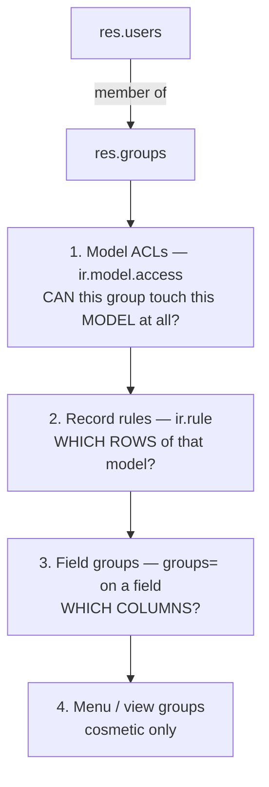
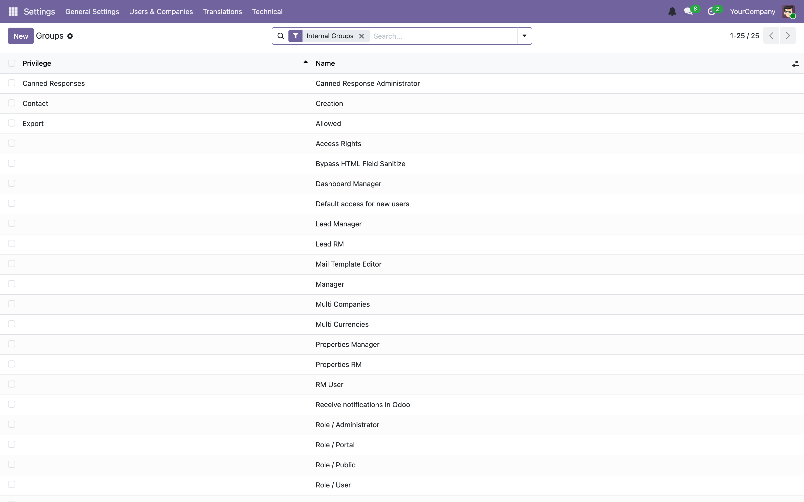
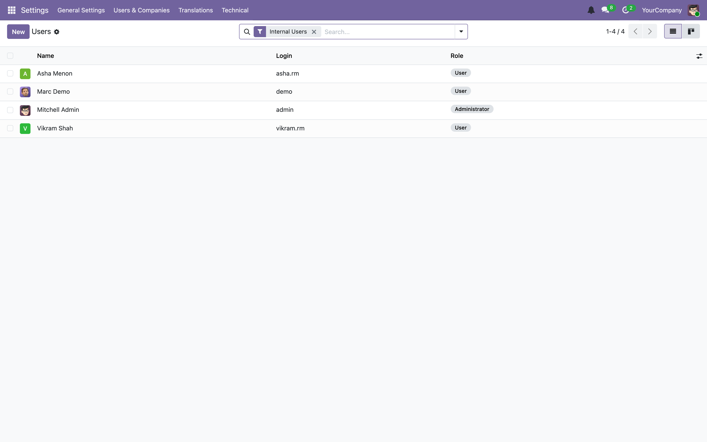
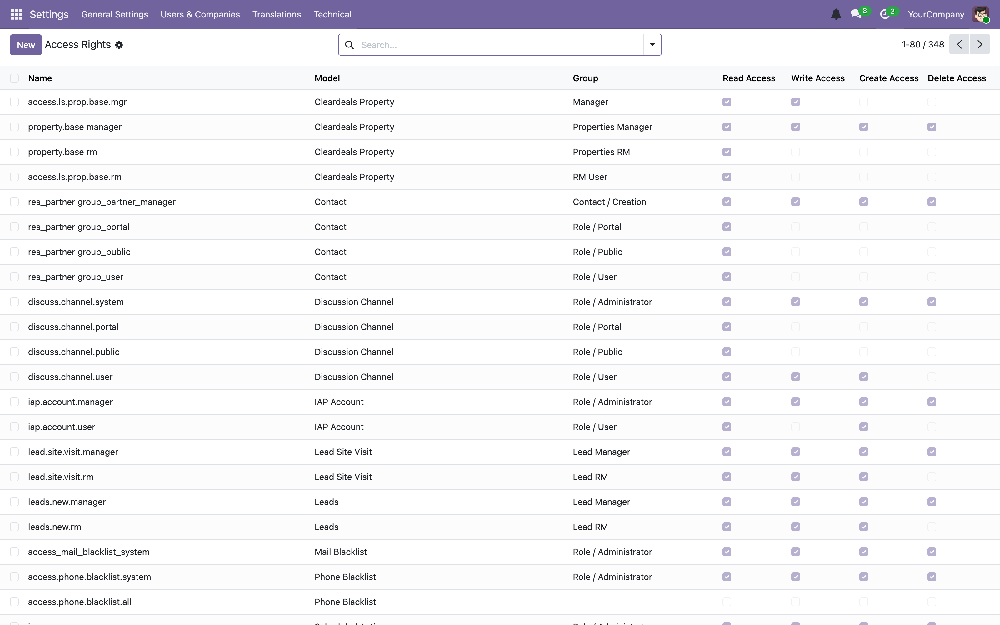
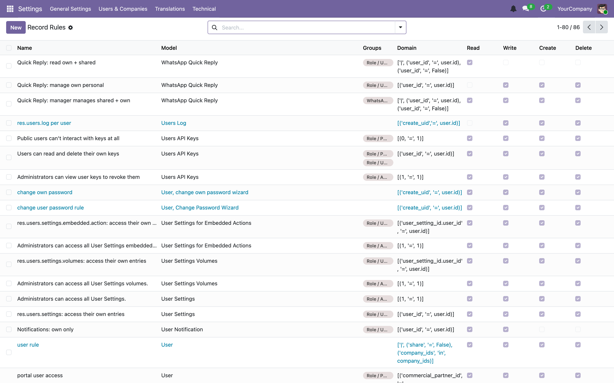

# 07 — Security: users, groups, ACLs and record rules

[← Views and the web client](06-views-and-web-client.md) · [Index](00-INDEX.md) · [Next: Controllers and HTTP →](08-controllers-and-http.md)

---

Odoo's permission model has four independent layers. Most access bugs — in both
directions, too locked down and too open — come from confusing them.



Read it as a funnel: an ACL is a yes/no per model; a record rule narrows to rows;
field groups narrow to columns; menu groups only tidy the UI.

## 7.1 Users, groups and privileges

### `res.users`

A user record. It is *not* a person's contact record — it delegates to
`res.partner` for name, email and so on, via `_inherits`
([Chapter 04](04-orm-and-database.md)).

Two special users exist on every database:

| uid | Login | What it is |
|-----|-------|------------|
| **1** | `__system__` / OdooBot | `SUPERUSER_ID`. **Bypasses every check.** Reached only from code, via `sudo()`. |
| **2** | `admin` | An ordinary user that happens to be in the admin groups. |

> **Trap — the one everyone gets wrong.** **`admin` is not a superuser.** If a
> model's ACL grants access only to groups `admin` is not in, `admin` gets an
> access error like anybody else. This is real, and it is what happens if you
> open the Leads menu without the Lead groups:
>
> 
>
> Note how useful that error is — Odoo tells you exactly which groups would
> grant the operation. Read the error before you start guessing.

### `res.groups` — and what Odoo 19 changed

```xml
<record id="group_lead_score_rm" model="res.groups">
    <field name="name">Lead RM</field>
</record>

<record id="group_lead_score_manager" model="res.groups">
    <field name="name">Lead Manager</field>
    <field name="implied_ids" eval="[(4, ref('group_lead_score_rm'))]"/>
</record>
```
— [`leads/security/security.xml`](../../custom_addons/leads/security/security.xml)

**`implied_ids` is inheritance.** Anyone in *Lead Manager* automatically gets
*Lead RM* as well. This is the standard two-tier shape and every one of our
modules uses it:

| Module | User tier | Manager tier |
|--------|-----------|--------------|
| `leads` | `group_lead_score_rm` | `group_lead_score_manager` |
| `properties` | `group_property_rm` | `group_property_manager` |
| `wa_communication` | `group_wa_rm` | `group_wa_manager` |
| `cleardeals_dashboards` | — | `group_dashboard_manager` |

> **Trap — Odoo 19 renamed fields on `res.groups`.** The field that grouped a
> group under an application category, `category_id`, **no longer exists**. It
> was replaced by `privilege_id`, a `Many2one` to the new `res.groups.privilege`
> model (`odoo/addons/base/models/res_groups.py:36`).
>
> This is not a soft deprecation. A data file doing the old thing fails the
> install outright:
>
> ```
> ValueError: Invalid field 'category_id' in 'res.groups'
> while parsing .../security/security.xml:10, somewhere inside
> <record id="group_property_listings_rm" model="res.groups">
> ```
>
> That is a real traceback from this repository — it is why the archived
> `property_listings` family cannot be installed on Odoo 19 at all
> ([Chapter 01](01-what-is-odoo.md)).
>
> Our live modules were fixed by simply dropping the `category_id` line, which
> is why `leads/security/security.xml` still defines an
> `ir.module.category` record (`module_category_lead_scoring`) that nothing
> references any more. Harmless; do not copy it into new modules.

Other `res.groups` fields worth knowing (same source file):

| Field | Meaning |
|-------|---------|
| `implied_ids` | groups this group also grants |
| `all_implied_ids` | transitive closure of the above |
| `implied_by_ids` / `all_implied_by_ids` | the reverse direction |
| `disjoint_ids` | groups that must not be held at the same time |
| `user_ids` | users explicitly in this group |
| `all_user_ids` | including those who get it via `implied_ids` |
| `privilege_id` | the v19 replacement for `category_id` |
| `full_name` | computed as `"privilege / name"`, and `_rec_name` |
| `share` | `True` for portal/share groups — this is why our domains say `[('share', '=', False)]` to mean "internal users only" |

Browse them live:



And the users themselves, where you can see and edit group membership per user:



## 7.2 Layer 1 — model ACLs

One CSV, one line per (model, group) pair.

```csv
id,name,model_id:id,group_id:id,perm_read,perm_write,perm_create,perm_unlink
access_leads_new_manager,leads.new.manager,model_leads_new,leads.group_lead_score_manager,1,1,1,1
access_leads_new_rm,leads.new.rm,model_leads_new,leads.group_lead_score_rm,1,1,1,0
access_lead_source_manager,lead.source.manager,model_lead_source,leads.group_lead_score_manager,1,1,1,1
access_lead_source_rm,lead.source.rm,model_lead_source,leads.group_lead_score_rm,1,0,0,0
```
— [`leads/security/ir.model.access.csv`](../../custom_addons/leads/security/ir.model.access.csv)

| Column | Meaning |
|--------|---------|
| `id` | external ID for this ACL row. Convention: `access_<model>_<group>` |
| `name` | free text; convention `<model>.<group>` |
| `model_id:id` | the model's auto external ID — `model_` + table name |
| `group_id:id` | qualified group external ID |
| `perm_read` / `perm_write` / `perm_create` / `perm_unlink` | `1` or `0` |

Read those four example lines as a design:

- Managers get everything on `leads.new`.
- RMs get read/write/create but **not delete** (`1,1,1,0`). Deliberate: an RM
  should never be able to destroy an enquiry.
- On configuration models like `lead.source`, RMs are **read-only**
  (`1,0,0,0`) while managers can edit. Also deliberate: RMs must be able to
  *see* a source to use it, not redefine routing.

> **Our convention.** Default to the narrowest set that lets the role do its
> job, and make `perm_unlink` a conscious decision every time. Deletion is the
> only irreversible one.

> **Trap.** **Every model needs at least one ACL line — including
> `TransientModel` wizards.** With no line, only uid 1 can touch it. The
> failure mode is nasty because it usually works for whoever built it and fails
> for everyone else. Scan `leads/security/ir.model.access.csv` and you will see
> lines for `model_lead_csv_import_wizard`, `model_lead_recompute_wizard`,
> `model_lead_migration_wizard` and so on — the wizards are all there.

Odoo combines ACLs across a user's groups as a **union**: if any group the user
holds grants `perm_write`, they can write. There is no way to subtract a
permission with a second ACL row.



## 7.3 Layer 2 — record rules

An ACL says *whether*; a rule says *which rows*. A rule is a domain injected
into every query.

```xml
<record id="rule_leads_new_rm_see_own_or_unassigned" model="ir.rule">
    <field name="name">New Leads: RM See Own</field>
    <field name="model_id" ref="model_leads_new"/>
    <field name="groups" eval="[(4, ref('leads.group_lead_score_rm'))]"/>
    <field name="perm_read" eval="True"/>
    <field name="perm_write" eval="True"/>
    <field name="perm_create" eval="True"/>
    <field name="perm_unlink" eval="True"/>
    <field name="domain_force">[('user_id', '=', user.id)]</field>
</record>

<record id="rule_leads_new_manager_see_all" model="ir.rule">
    <field name="name">New Leads: Manager See All</field>
    <field name="model_id" ref="model_leads_new"/>
    <field name="groups" eval="[(4, ref('leads.group_lead_score_manager'))]"/>
    <field name="domain_force">[(1, '=', 1)]</field>
</record>
```
— [`leads/security/security.xml`](../../custom_addons/leads/security/security.xml)

`[(1, '=', 1)]` is the idiom for "all records" — a tautology.

Inside `domain_force` you have `user` (the current `res.users` record),
`company_id`, and `time`. `user.id` is the overwhelmingly common case.

### Global vs group rules — the rule that catches everyone

| Rule kind | `groups` field | How it combines |
|-----------|----------------|-----------------|
| **Group rule** | non-empty | **OR**ed with other group rules the user matches |
| **Global rule** | empty | **AND**ed with everything |

> **Trap — this is the single most important sentence in this chapter.**
> **Group rules are ORed.** Adding a permissive rule for one group does not
> narrow anything — it *widens* access for anyone in that group, even if a
> stricter rule from another module also applies to them.

Our codebase documents this beautifully, because we relied on it deliberately.
From the same file:

```xml
<!-- property.base cross-RM read access for Leads RMs
     ─────────────────────────────────────────────────
     The properties module restricts property.base reads to own records
     via [('rm_user_id','=',user.id)] for group_property_rm.
     Odoo ORs rules across groups, so adding [(1,'=',1)] here means
     any user in leads.group_lead_score_rm can read ANY property record.
     This is required so that:
       - A lead form can display a recommended/linked property that
         belongs to a different RM (the Many2one display_name read
         goes through _search/_fetch which applies rules as SQL).
     Write/create/unlink remain governed by the properties module. -->
<record id="rule_property_base_leads_rm_read_all" model="ir.rule">
    <field name="name">Property Base: Leads RM can read all properties</field>
    <field name="model_id" ref="properties.model_property_base"/>
    <field name="groups" eval="[(4, ref('leads.group_lead_score_rm'))]"/>
    <field name="domain_force">[(1, '=', 1)]</field>
    <field name="perm_read"   eval="True"/>
    <field name="perm_write"  eval="False"/>
    <field name="perm_create" eval="False"/>
    <field name="perm_unlink" eval="False"/>
</record>
```

Three lessons in one record:

1. **Cross-module widening is intentional here**, and the comment says so. An
   undocumented `[(1,'=',1)]` in a review should be challenged.
2. **The `perm_*` flags scope the widening.** Read is opened; write, create and
   unlink are left `False` so the `properties` module's own rules still govern
   them. Always scope a permissive rule to the operations that actually need it.
3. **Why it was needed at all** is a genuinely subtle ORM fact: rendering a
   `Many2one`'s `display_name` performs a read that goes through `_search`, so
   record rules apply *as SQL*. A lead pointing at another RM's property would
   otherwise render blank.

The comment also records the mitigation — the `properties` list view stays tidy
because a `_search` override re-applies the narrow domain when a context key is
present. That is the pattern to reach for when you must widen for one purpose
without polluting another module's UI.

### `perm_*` on a rule

A rule only applies to the operations whose flag is `True`. Omitting the flags
means all four apply. This is how the site-visit rules let RMs read/write/create
their own visits but never delete:

```xml
<record id="rule_lead_site_visit_rm_own" model="ir.rule">
    <field name="groups" eval="[(4, ref('leads.group_lead_score_rm'))]"/>
    <field name="perm_read" eval="True"/>
    <field name="perm_write" eval="True"/>
    <field name="perm_create" eval="True"/>
    <field name="perm_unlink" eval="False"/>
    <!-- Filter on the visit's own assigned_rm_id — direct lookup, no join. -->
    <field name="domain_force">[('assigned_rm_id', '=', user.id)]</field>
</record>
```

Note the comment justifying a *direct* field over a join
(`assigned_rm_id` rather than `inquiry_id.assigned_rm_id`).

> **Our convention.** Prefer a direct field in `domain_force` over a dotted
> path. Every rule domain becomes part of every query on that model, so a join
> in a rule is a join on every single read. Denormalise the field if you must
> ([Chapter 04](04-orm-and-database.md) on stored related fields).

A well-designed small example — notifications, where users may read and mark
their own read but never create or delete, because creation happens via `sudo()`
inside `notify()`:

```xml
<!-- A user may only see (and mark read) their own notifications. Emission is
     done with sudo via notify(), so users need no create/unlink rights. -->
<record id="rule_cleardeals_notification_own" model="ir.rule">
    <field name="model_id" ref="model_cleardeals_notification"/>
    <field name="groups" eval="[(4, ref('base.group_user'))]"/>
    <field name="perm_read" eval="True"/>
    <field name="perm_write" eval="True"/>
    <field name="perm_create" eval="False"/>
    <field name="perm_unlink" eval="False"/>
    <field name="domain_force">[('user_id', '=', user.id)]</field>
</record>
```
— [`cleardeals_notification_rules.xml`](../../custom_addons/cleardeals_notification/security/cleardeals_notification_rules.xml)



## 7.4 Layer 3 — field-level groups

```python
internal_margin = fields.Float(groups="leads.group_lead_score_manager")
```

Users outside the group cannot read or write the field — it is stripped from
reads and rejected on writes. Unlike `readonly`, this is real enforcement.

> **Trap.** `readonly=True` on a field, and `readonly="expr"` in a view, are
> **UI hints only**. They do not stop a write from Python, from a JSON-RPC call,
> or from a webhook. If a field must not be changed by a role, use `groups=`.
> If it must never be changed by anyone, compute it or constrain it.

## 7.5 Layer 4 — menus and views

```xml
<menuitem id="menu_lead_source" ... groups="leads.group_lead_score_manager"/>
```

Purely cosmetic — it hides the entry. The action behind it is still reachable by
URL. Use it to keep the UI clean; never as your only protection.

## 7.6 `sudo()` — the discipline

`recordset.sudo()` returns the same records in an environment running as
`SUPERUSER_ID`. **All four layers above are bypassed.**

There are legitimate uses:

**Reading framework configuration.** Ordinary users genuinely cannot read
`ir.config_parameter`:

```python
expected_key = (
    request.env["ir.config_parameter"].sudo().get_param(_API_KEY_PARAM, default="")
)
```
— [`properties/controllers/auth.py`](../../custom_addons/properties/controllers/auth.py)

**Writing a record on a user's behalf that they may not create themselves.**
This is the notification case, and it pairs exactly with the record rule above
that denies `perm_create`:

```python
recs = self.sudo().create([{
    'user_id': uid,
    'notif_type': notif_type,
    ...
} for uid in user_ids])
```
— [`cleardeals_notification.py`](../../custom_addons/cleardeals_notification/models/cleardeals_notification.py)

**Reading a related record the actor legitimately should not own.** We hit a
real `AccessError` in the notification flow: the user *requesting* a chat
handover had to be told which lead it concerned, but they did not own that lead.
The fix was a narrow `sudo()` read of just the lead's display fields — not a
widening of the record rule, which would have exposed every lead to every
requester.

That last one is the template for the judgement call:

> **Our convention.**
> - `sudo()` on the **narrowest possible scope** — one read, one create, not a
>   whole method.
> - **A comment saying why**, every time. Our best examples all have one.
> - **Never `sudo()` to make a permission error go away.** If a user cannot see
>   something, either they should not (fix the calling code) or they should (fix
>   the rule). `sudo()` is for when the *system* is acting, not the user.
> - **Never pass user input into a `sudo()` query without validating it.**
>   `self.env["leads.new"].sudo().browse(request_id)` with an id straight from
>   an HTTP request is an IDOR vulnerability — you have just let anyone read
>   any lead.

There are 195 `sudo()` calls across `custom_addons`. That is not automatically
wrong — much of it is config reads and system-actor writes — but it does mean
every new one should be justified in review.

### Alternatives to reach for first

| Instead of `sudo()` | Consider |
|---------------------|----------|
| bypassing a rule to read one field | a stored related field, or a method returning just that field |
| bypassing to act as another user | `with_user(user)` — keeps checks, changes actor |
| bypassing in a cron | crons already run as a system user; check before adding `sudo()` |
| bypassing to widen a whole role | fix the record rule, scoped with `perm_*` |

## 7.7 Controller auth

Routes declare their own authentication ([Chapter 08](08-controllers-and-http.md)):

| `auth=` | Who | `request.env.user` |
|---------|-----|--------------------|
| `"user"` | logged-in internal users only | the real user |
| `"public"` | anyone; a session is created | the public user |
| `"none"` | anyone; **no session, no env user** | none — you must authenticate yourself |

> **Trap.** `auth="public"` does **not** mean "no permissions". The request runs
> as the public user, which typically has almost no ACLs — so a `public` route
> that touches business data will need explicit `sudo()` after doing its own
> authentication. Our properties REST API is exactly this shape: `auth="public"`
> plus an `X-API-Key` check plus scoped `sudo()`.

`csrf=False` is required for machine-to-machine `POST`s (a webhook has no CSRF
token), and is a real risk on anything a browser can be tricked into calling.
Only combine `csrf=False` with an endpoint that authenticates by header or token,
never with one that trusts the session.

## 7.8 Testing security

Security that is not tested is not security. Three patterns.

**A user cannot reach what they should not:**

```python
from odoo.exceptions import AccessError
from odoo.tests import TransactionCase, new_test_user


class TestLeadAccess(TransactionCase):

    def test_rm_cannot_read_another_rms_lead(self):
        rm_a = new_test_user(self.env, login="rm_a", groups="leads.group_lead_score_rm")
        rm_b = new_test_user(self.env, login="rm_b", groups="leads.group_lead_score_rm")
        lead = self.env["leads.new"].with_context(
            automated_lead_creation=True,
        ).create({"name": "Owned by A", "user_id": rm_a.id, "source_id": self.source.id})

        with self.assertRaises(AccessError):
            lead.with_user(rm_b).read(["name"])
```

**A record rule filters rather than raising.** A rule makes rows *invisible*, so
a search returns fewer records rather than erroring — assert on the count:

```python
def test_rm_search_only_returns_own_leads(self):
    visible = self.env["leads.new"].with_user(self.rm_b).search([])
    self.assertNotIn(self.lead_of_rm_a, visible)
```

> **Trap.** `read()` on a specific id you cannot see raises `AccessError`, but
> `search()` silently omits it. Test the operation you actually care about.

**A manager can:**

```python
def test_manager_sees_all_leads(self):
    manager = new_test_user(self.env, login="mgr", groups="leads.group_lead_score_manager")
    self.assertIn(self.lead_of_rm_a, self.env["leads.new"].with_user(manager).search([]))
```

> **Our convention.** Use `with_user()`, never `sudo()`, in a security test —
> `sudo()` bypasses the very thing you are testing. And always assert
> something: our conventions doc calls out the specific anti-pattern of calling
> a method in a security test without asserting on the result.

## 7.9 A review checklist

When you add or change a model:

- [ ] an ACL line per group, wizards included
- [ ] `perm_unlink` a deliberate decision
- [ ] record rules for the user tier **and** the manager tier
- [ ] no `[(1,'=',1)]` group rule without a comment explaining the widening
- [ ] permissive rules scoped with `perm_*` to only the needed operations
- [ ] `domain_force` uses direct fields, not joins, where possible
- [ ] sensitive fields protected with `groups=`, not `readonly`
- [ ] every new `sudo()` narrow and commented
- [ ] no record id from an HTTP request passed to `sudo().browse()` unvalidated
- [ ] tests: a negative case, a rule-filtering case, and a manager case

## 7.10 What to take away

1. Four layers: ACL (model) → rule (rows) → field groups (columns) → menus
   (cosmetic).
2. `admin` is not a superuser. Read the access error — it names the groups.
3. **Group record rules are ORed.** A permissive rule widens; it never narrows.
4. `readonly` is decoration. `groups=` is enforcement.
5. `sudo()` narrow, commented, and never to silence an error.
6. Odoo 19 removed `res.groups.category_id` in favour of `privilege_id`.
7. Test with `with_user()`, and remember `search()` filters where `read()`
   raises.

---

[← Views and the web client](06-views-and-web-client.md) · [Index](00-INDEX.md) · [Next: Controllers and HTTP →](08-controllers-and-http.md)
