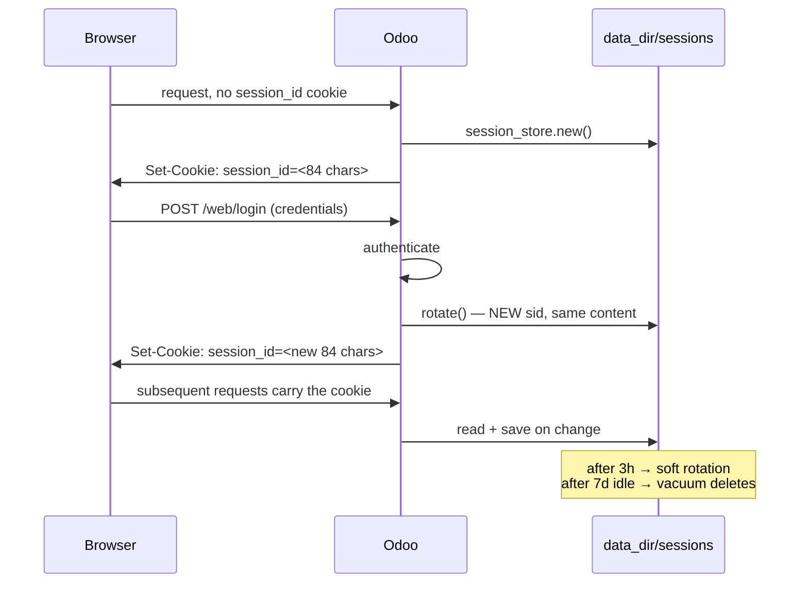
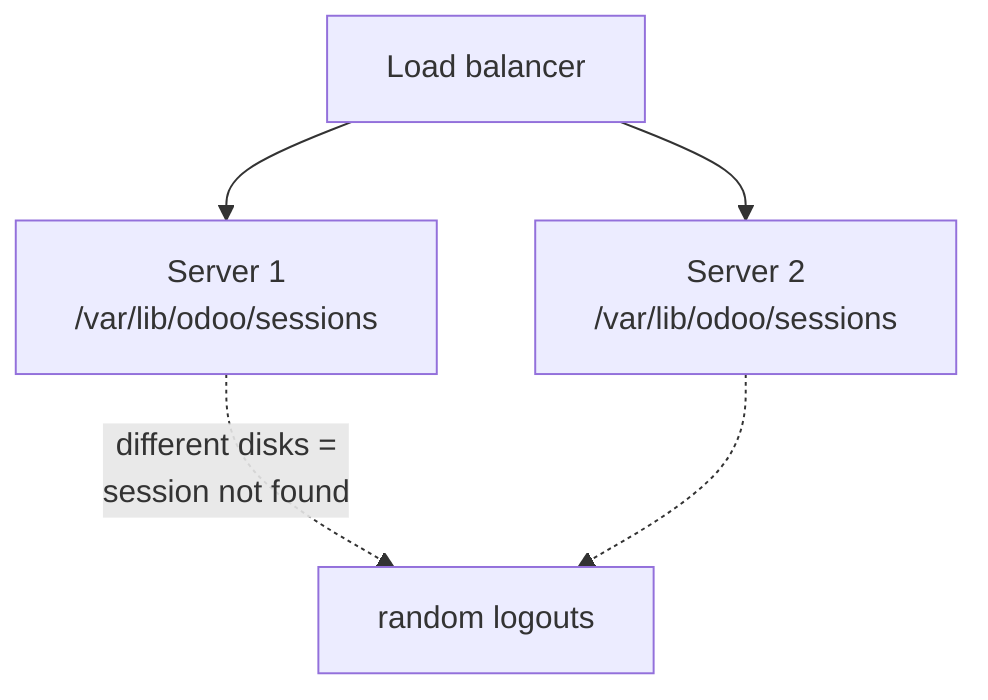

# 09 — Sessions and authentication

[← Controllers and HTTP](08-controllers-and-http.md) · [Index](00-INDEX.md) · [Next: Filestore and attachments →](10-filestore-and-attachments.md)

---

Sessions are the least glamorous part of Odoo and the source of some of the most
baffling production reports — "everyone got logged out", "it works on one server
but not the other", "the filestore filled up". This chapter is short but it is
worth reading before you deploy anything.

Source: `odoo/http.py`.

## 9.1 What a session is

HTTP is stateless; Odoo needs to remember who you are between requests. It does
this the ordinary way — a cookie holding an opaque identifier — with one
consequential design choice:

> **Odoo sessions are stored as files on disk, in the same `data_dir` as the
> filestore. Not in the database, and not in Redis.**

That single fact drives everything else in this chapter.

## 9.2 The cookie

After logging in, the browser holds three cookies. These are real values
captured from the handbook instance:

| Cookie | Length | `httpOnly` | Purpose |
|--------|--------|-----------|---------|
| `session_id` | **84** chars | **true** | the session identifier — the only one that matters |
| `cids` | 1 | false | active company ids |
| `tz` | 13 | false | the browser's timezone, so the server can localise |

`session_id` being `httpOnly` means JavaScript cannot read it, which limits the
damage of an XSS bug. It is set on path `/` with an expiry seven days out.

The 84 characters are not arbitrary. `generate_key` produces a URL-safe base64
key, and the validator is explicit:

```python
_base64_urlsafe_re = re.compile(r'^[A-Za-z0-9_-]{84}$')
```
— `odoo/http.py`

So a session id looks like this — shape and length are accurate, the characters
are deliberately fake (a real one is a live credential and does not belong in
documentation):

```
Ex4mpLe0000000000AAAAAAAAAAAAAAAAAAAAAAAAAAAAAAAAAAAAAAAAAAAAAAAAAAAAAAAAAAAAAAAAAAA
```

## 9.3 Where it physically lives

```
$data_dir/
├── filestore/           ← attachments (Chapter 10)
│   └── <dbname>/
└── sessions/            ← THIS chapter
    └── <first 2 chars of the sid>/
        └── <the full 84-char sid>
```

The store is `FilesystemSessionStore` (`odoo/http.py:945`), and the sharding is
deliberate:

```python
def get_session_filename(self, sid):
    # scatter sessions across 4096 (64^2) directories
    if not self.is_valid_key(sid):
        raise ValueError(f'Invalid session id {sid!r}')
    sha_dir = sid[:2]
    dirname = os.path.join(self.path, sha_dir)
    session_path = os.path.join(dirname, sid)
    return session_path
```

**4096** because the sid alphabet is 64 characters and it shards on two of them.
Filesystems get slow with hundreds of thousands of entries in one directory;
this keeps each shard small.

So the full path has this shape:

```
/var/lib/odoo/sessions/Ex/Ex4mpLe0000000000AAAAAAAAAAAAAAAAAAAAAAAAAAAAAAAAAAAAAAAAAAAAAAAAAAAAAAAAAAAAAAAAAAA
```

Note the shard names include base64 characters like `-`, so you will see
directories called `-R` and `hC` sitting next to each other. That is normal.

At boot Odoo tells you where they are, at debug level:

```
HTTP sessions stored in: /var/lib/odoo/sessions
```

## 9.4 What is in a session file

Plain **JSON**. Here are the actual keys from a real logged-in session on the
handbook instance (390 bytes):

```
['_trace', 'context', 'create_time', 'db', 'debug', 'login', 'session_token', 'uid']
```

| Key | Meaning |
|-----|---------|
| `uid` | the logged-in user id — this *is* the authentication |
| `login` | the login string |
| `db` | which database this session belongs to |
| `session_token` | a hash tying the session to the user's password/state |
| `context` | `lang`, `tz`, `allowed_company_ids` |
| `debug` | developer mode flag — this is why `?debug=1` persists across pages |
| `create_time` | used for rotation and expiry |
| `_trace` | request-tracing metadata |

`session_token` is the important one. It is computed by
`security.compute_session_token(session, env)`, and it is why **changing a
user's password invalidates their existing sessions** — the stored token no
longer matches the recomputed one, so the session is rejected even though the
file still exists.

> **Trap.** A session file is readable by anything that can read the directory,
> and it contains a valid `uid`. Filesystem permissions on `data_dir` are a real
> security boundary. Odoo creates shard directories with mode `0755` and the
> sessions root as `0700`.

## 9.5 The lifecycle



### Rotation

Two constants govern it:

```python
# The default duration (3h) before a session is rotated, changing the
# session id (also on the cookie) but keeping the same content.
SESSION_ROTATION_INTERVAL = 60 * 60 * 3

# After a session is rotated, the session should be kept for a couple of
# seconds to account for network delay between multiple requests which are
# made at the same time and all use the same old cookie.
SESSION_DELETION_TIMER = 120
```

Rotation exists to limit the window in which a stolen cookie is useful. There
are two flavours, and the distinction is genuinely clever:

| Rotation | What changes | Used for |
|----------|--------------|----------|
| **soft** | the second half of the sid; the first `STORED_SESSION_BYTES` are kept | periodic rotation. The CSRF token is derived from the stable prefix, so **forms that were already rendered keep working** |
| **hard** | the entire sid | login and logout — a total break with the old identity |

The comment in the source explains the reasoning exactly:

```python
# With a soft rotation, things like the CSRF token will still work. It's used for rotating
# the session in a way that half the bytes remain to identify the user and the other half
# to authenticate the user. Meanwhile with a hard rotation the entire session id is changed,
# which is useful in cases such as logging the user out.
```

`SESSION_DELETION_TIMER` handles a real race: a page firing five parallel
requests all carry the *old* cookie. Rather than creating five new sessions, the
old one is kept alive for 120 seconds and points at the new sid via a `next_sid`
key.

### Expiry

```python
# The default duration of a user session cookie. Inactive sessions are reaped
# server-side as well with a threshold that can be set via an optional
# config parameter `sessions.max_inactivity_seconds` (default: SESSION_LIFETIME)
SESSION_LIFETIME = 60 * 60 * 24 * 7
```

Seven days, and it is **tunable per database** without a restart:

```python
>>> env["ir.config_parameter"].sudo().set_param("sessions.max_inactivity_seconds", 86400)
>>> env.cr.commit()
```

An invalid value falls back to the default with a warning rather than breaking
logins (`get_session_max_inactivity`).

### The vacuum

```python
def vacuum(self, max_lifetime=SESSION_LIFETIME):
    threshold = time.time() - max_lifetime
    for fname in glob.iglob(os.path.join(root.session_store.path, '*', '*')):
        path = os.path.join(root.session_store.path, fname)
        with contextlib.suppress(OSError):
            if os.path.getmtime(path) < threshold:
                os.unlink(path)
```

A scheduled action deletes session files whose mtime is older than the
threshold. Two things follow:

- **Expiry is mtime-based**, so an active session keeps being refreshed and
  never expires while in use.
- **If the vacuum cron is disabled, session files accumulate forever.** On a busy
  server with machine callers this is an inode-exhaustion incident waiting to
  happen — which brings us to the next section.

## 9.6 `save_session=False` — why every machine endpoint sets it

A request with no cookie gets a brand-new session. **Which means a webhook
called 10,000 times a day creates 10,000 useless session files**, each one
pointing at nothing, all of them waiting for the vacuum.

Hence, on every one of our machine-facing routes:

```python
@http.route('/wa/pubsub/push', type='http', auth='none', methods=['POST'],
            csrf=False, save_session=False, readonly=False)
```

> **Our convention.** `save_session=False` on **every** endpoint whose caller is
> a machine — webhooks, Pub/Sub push, REST APIs. There is no session to
> preserve, so writing one is pure waste plus an operational hazard. Check this
> in review; it is easy to forget and invisible until the disk fills.

Our four portal webhooks, the two properties webhooks, the REST endpoints and
the Pub/Sub receiver all set it. `/wa/media/upload` is `auth="user"` and
genuinely wants the browser's session, so it does not.

## 9.7 Multi-worker and multi-server

This is the operational consequence of file-backed sessions.

**Multiple workers on one machine: fine.** All prefork workers share the same
`data_dir`, so they all see the same session files.

**Multiple machines: broken, unless the storage is shared.**



> **Trap.** Two Odoo servers behind a load balancer with **separate** `data_dir`
> volumes produce the classic "I get logged out at random" bug: whichever server
> handled your login has your session file, and the other one does not. It looks
> intermittent because it depends on which backend you land on.
>
> The fixes, in order of preference: a **shared volume** for `data_dir`, or
> **sticky sessions** on the load balancer. The same constraint applies to the
> filestore ([Chapter 10](10-filestore-and-attachments.md)) — it is the same
> directory, so solving it once solves both.

## 9.8 Sessions behind a proxy

Our stack always has something in front of Odoo — nginx locally, Traefik in
production. That requires `proxy_mode`:

```ini
proxy_mode = True
```

With it, Odoo trusts `X-Forwarded-For` and `X-Forwarded-Proto` from the proxy,
which matters because:

- **`X-Forwarded-Proto`** tells Odoo the *external* request was HTTPS. Without
  it, Odoo thinks the connection is plain HTTP and will not set the `Secure`
  flag on the session cookie, and redirects it generates come out as `http://`.
- **`X-Forwarded-For`** gives you the real client IP in logs.

> **Trap.** `proxy_mode = True` means "trust these headers". Only enable it when
> something you control really is in front, and make sure that proxy
> *overwrites* rather than appends the headers. An Odoo directly exposed to the
> internet with `proxy_mode = True` lets any client spoof its own IP.

Our `odoo.dev.conf` sets `proxy_mode = True` because nginx is in front. The
handbook instance in this chapter's screenshots runs with `proxy_mode = False`
because it is reached directly.

## 9.9 Authentication mechanisms

### Password login

`POST /web/login`. On success the session gets `uid`, `login` and
`session_token`, and is **hard-rotated** so the pre-login sid cannot be reused
(a session-fixation defence).

### The three `auth` levels

Recapping from [Chapter 07](07-security.md) §7.7, because it is a session
question as much as a security one:

| `auth=` | Session created? | `request.env.user` |
|---------|-----------------|--------------------|
| `"user"` | required, must be valid | the real user |
| `"public"` | yes | the public user |
| `"none"` | no user resolved | none |

`auth="none"` does not mean "no session object" — it means no user is
authenticated from it. This is why an `auth="none"` endpoint must do its own
authentication, and why it should pair with `save_session=False`.

### API keys

Odoo supports per-user API keys as a password substitute for XML-RPC/JSON-RPC.
`res.groups` even carries `api_key_duration` to cap their lifetime per group.

> **Our convention.** We do **not** use Odoo user API keys for our integrations.
> Our external surfaces authenticate with their own shared secrets held in
> `ir.config_parameter` — `properties.api_key` (header `X-API-Key`),
> `squareyards.webhook.api.key`, `cleardeals.lead.api.key` — or, for Pub/Sub,
> with a Google-signed OIDC token. That keeps machine credentials rotatable
> without touching user accounts. See [Chapter 08](08-controllers-and-http.md)
> and [Chapter 11](11-data-files-and-crons.md).

### Two-factor authentication

Odoo Community supports TOTP. It affects the login flow only; once a session
exists, nothing downstream is different.

## 9.10 The database selector and `dbfilter`

A session records which `db` it belongs to. On a multi-database server, the
database is resolved from `db_name`, `?db=`, the session, or `dbfilter`.

- `list_db = True` (our dev conf) shows the selector.
- `list_db = False` (production) hides it, so the database list is not public.


> **Trap.** A session is bound to one database. Switching databases in the
> selector necessarily starts a new session. If you are testing against two
> databases, use two browser profiles rather than fighting the cookie.

## 9.11 Debugging session problems

| Symptom | Likely cause | What to check |
|---------|--------------|---------------|
| "Randomly logged out" | multiple servers, unshared `data_dir` | is `sessions/` on a shared volume, or are sessions sticky? |
| Everyone logged out at once | `data_dir` wiped, or the volume remounted | `make wipe` deletes it locally; check deploys that recreate the volume |
| One user logged out repeatedly | password or user state changed, invalidating `session_token` | did something write to that `res.users` row? |
| Logged out after exactly 7 days idle | working as designed | raise `sessions.max_inactivity_seconds` if you want longer |
| Session lost only on some URLs | an endpoint with `save_session=False` that should keep it | check the route decorator |
| Login redirects to `http://` behind HTTPS | `proxy_mode` off, or proxy not sending `X-Forwarded-Proto` | both sides of the proxy config |
| Inodes exhausted / disk full with tiny files | machine endpoints without `save_session=False`, or the vacuum cron disabled | `find $data_dir/sessions -type f \| wc -l`, and Scheduled Actions |
| Developer mode keeps switching off | `debug` lives in the session; a new session resets it | re-append `?debug=1` |

Useful commands:

```bash
# How many sessions exist?
docker exec odoo-dev-app find /var/lib/odoo/sessions -type f | wc -l

# The oldest ones.
docker exec odoo-dev-app sh -c 'ls -lt $(find /var/lib/odoo/sessions -type f) | tail'

# Inspect one (it is JSON) — note this reveals a valid uid, so treat with care.
docker exec odoo-dev-app sh -c 'cat /var/lib/odoo/sessions/VC/VCr8...'
```

In the browser: DevTools → Application → Cookies to see `session_id`, and
Network to confirm it is being sent.

## 9.12 What to take away

1. Sessions are **JSON files in `data_dir/sessions`**, sharded 4096 ways by the
   first two characters of the 84-character sid.
2. `session_token` binds a session to the user's state — password changes
   invalidate sessions without deleting files.
3. Rotation is soft every 3 hours (CSRF-preserving) and hard on login/logout.
4. Expiry is 7 days of inactivity by default, tunable with
   `sessions.max_inactivity_seconds`, enforced by a vacuum cron.
5. **`save_session=False` on every machine endpoint**, or you generate garbage
   files forever.
6. Multiple servers need a shared `data_dir` or sticky sessions. This is the
   real cause of "random logouts".
7. `proxy_mode = True` only when a proxy you control is genuinely in front.

---

[← Controllers and HTTP](08-controllers-and-http.md) · [Index](00-INDEX.md) · [Next: Filestore and attachments →](10-filestore-and-attachments.md)
