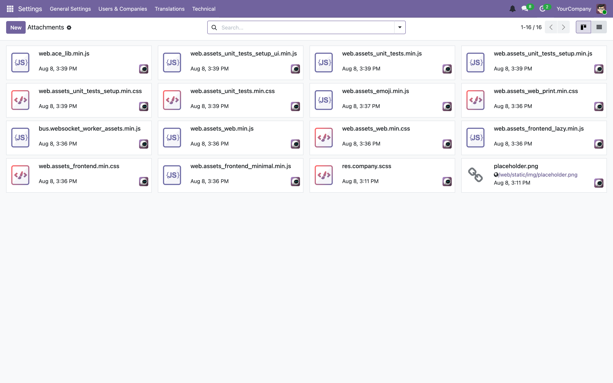

# 10 — The filestore, attachments and binary data

[← Sessions](09-sessions.md) · [Index](00-INDEX.md) · [Next: Data files and crons →](11-data-files-and-crons.md)

---

Odoo stores uploaded files on **disk**, not in PostgreSQL, with a row in
`ir_attachment` pointing at each one. That split has consequences for backups,
for deployment, and for a handful of confusing bugs — most memorably "my
JavaScript change will not appear", which turns out to be an attachment problem.

Source: `odoo/addons/base/models/ir_attachment.py`.

## 10.1 `data_dir`

One directory holds everything stateful that is not in the database:

```
/var/lib/odoo/                 ← data_dir, from odoo.dev.conf
├── addons/                    ← addons downloaded at runtime (rarely used)
├── filestore/
│   ├── handbook/              ← one directory PER DATABASE
│   │   ├── 05/
│   │   ├── 06/ …
│   │   └── checklist/         ← the GC spool (§10.6)
│   └── odoo_handbook/
└── sessions/                  ← Chapter 09
```

That listing is real, from the handbook instance. Note `filestore/<dbname>/` —
each database has its own subtree, which is what makes a per-database
copy meaningful.

> **Trap — the most important operational fact in this chapter.**
> **A database dump is not a backup.** `pg_dump` captures `ir_attachment` rows,
> including `store_fname`, but not the files themselves. Restore a dump without
> the filestore and every attachment is a broken link: the record says a file
> exists, and it does not.
>
> Back up `data_dir` **and** the database, and restore them together. Odoo's own
> UI backup (`/web/database/manager`) produces a zip containing both, which is
> why it is preferable to a bare `pg_dump` for anything you might restore.

## 10.2 `ir.attachment`

Every file is a row. The fields that matter:

| Field | Meaning |
|-------|---------|
| `name` | filename shown to users |
| `res_model` / `res_id` | the record this is attached to |
| `res_field` | set when the attachment *is* a `Binary` field's value (§10.4) |
| `type` | `'binary'` (a real file) or `'url'` (just a link) |
| `url` | for `type='url'` |
| `store_fname` | **the path within the filestore** — the disk pointer |
| `db_datas` | the bytes, when storage is `db` instead of `file` |
| `raw` / `datas` | computed accessors — `raw` is bytes, `datas` is base64 |
| `file_size` | size in bytes |
| `checksum` | **sha1, 40 chars** — drives deduplication |
| `mimetype` | content type |
| `public` | readable without authentication |
| `access_token` | a capability token for sharing (`groups="base.group_user"`) |
| `index_content` | extracted text, for full-text search |

`res_id` is a `Many2oneReference` with `model_field='res_model'` — a polymorphic
foreign key. That is why there is no real FK constraint on it, and why orphaned
attachments are possible.

## 10.3 How a file is written: sha1, sharding and dedup

```python
@api.model
def _get_path(self, bin_data, sha):
    # scatter files across 256 dirs
    # we use '/' in the db (even on windows)
    fname = sha[:2] + '/' + sha
    full_path = self._full_path(fname)
    dirname = os.path.dirname(full_path)
    if not os.path.isdir(dirname):
        os.makedirs(dirname, exist_ok=True)

    # prevent sha-1 collision
    if os.path.isfile(full_path) and not self._same_content(bin_data, full_path):
        raise UserError(_("The attachment collides with an existing file."))
    return fname, full_path
```

So the filename **is** the sha1 of the content, sharded into **256**
directories by the first two hex characters. On the live instance:

```
/var/lib/odoo/filestore/handbook/05/055ffc5cce56e142234ffc466012dff7edc2c7e7
```

> Note the two different shard counts in Odoo. Sessions shard **4096** ways
> (base64 sid, 64² combinations); the filestore shards **256** ways (hex sha1,
> 16² combinations). Both take the first two characters; the alphabets differ.

Three consequences of content-addressing:

**1. Deduplication is automatic and free.** The same PDF uploaded by fifty
people is one file on disk and fifty `ir_attachment` rows, all with the same
`store_fname`. `_file_write` checks `if not os.path.exists(full_path)` and skips
the write entirely.

**2. Files are immutable.** "Editing" an attachment writes a new file under a
new sha and repoints `store_fname`. The old file becomes garbage (§10.6).

**3. A genuine sha1 collision raises** rather than silently corrupting —
`_same_content` is checked before reuse. You will never see this, but the care
is reassuring.

The write path also shows a `flush` pattern worth recognising
([Chapter 04](04-orm-and-database.md)):

```python
self.flush_recordset(['checksum', 'store_fname'])
```

The ORM must push those columns to the database before the non-ORM file
operations rely on them.

## 10.4 Binary fields vs attachments

A `Binary` field can store its bytes in either place:

```python
# Default: attachment=True. The value lives in the filestore as an
# ir.attachment with res_field set to this field's name.
photo = fields.Binary(string="Photo")

# attachment=False: bytes go in a bytea column on the model's own table.
thumbnail = fields.Binary(string="Thumb", attachment=False)
```

> **Our convention.** Leave `attachment=True` (the default). Large `bytea`
> columns bloat the table, slow every query that touches the row, and make dumps
> enormous. `attachment=False` is for small, always-needed blobs only —
> `ir_attachment.db_datas` itself is declared that way, which is the exception
> that has to exist.

Attachments backing a `Binary` field have `res_field` set. Odoo's `_search`
override hides those from ordinary attachment queries, so the Attachments menu
shows user-uploaded documents rather than every avatar in the system.



## 10.5 Storage backend: disk or database

```python
@api.model
def _storage(self):
    return self.env['ir.config_parameter'].sudo().get_param('ir_attachment.location', 'file')
```

`'file'` (default) or `'db'`. You can migrate between them:

```python
>>> env["ir.config_parameter"].sudo().set_param("ir_attachment.location", "db")
>>> env["ir.attachment"].force_storage()      # admin only
>>> env.cr.commit()
```

`force_storage` rewrites every binary attachment through the new backend, using
`_get_storage_domain()` to select the ones on the wrong side.

> **Our convention.** Stay on `'file'`. Database storage exists for
> single-container deployments where a shared volume is impossible; it costs you
> dump size, memory on every read, and query performance. Our stack has a real
> volume.

Confirmed on the handbook instance — 227 of 228 attachments on disk, zero in the
database, one `type='url'`:

```sql
SELECT count(*) FROM ir_attachment WHERE store_fname IS NOT NULL;  -- 227
SELECT count(*) FROM ir_attachment WHERE db_datas   IS NOT NULL;  --   0
```

## 10.6 Garbage collection

Deleting an `ir_attachment` row does **not** delete the file, because another row
may share it (dedup). Instead Odoo uses a spool directory:

```python
@api.model
def _file_delete(self, fname):
    # simply add fname to checklist, it will be garbage-collected later
    self._mark_for_gc(fname)
```

`_mark_for_gc` touches an empty file at
`filestore/<db>/checklist/<shard>/<sha>`. Later, `_gc_file_store` — decorated
`@api.autovacuum`, so it runs with Odoo's vacuum cron — walks the checklist,
asks the database which of those `store_fname`s are still referenced, and unlinks
the rest.

Two details in that method are worth reading as engineering lessons:

```python
# Continue in a new transaction. The LOCK statement below must be the
# first one in the current transaction, otherwise the database snapshot
# used by it may not contain the most recent changes made to the table
# ir_attachment!
cr.commit()

# prevent all concurrent updates on ir_attachment while collecting,
# but only attempt to grab the lock for a little bit, otherwise it'd
# start blocking other transactions. (will be retried later anyway)
cr.execute("SET LOCAL lock_timeout TO '10s'")
try:
    cr.execute("LOCK ir_attachment IN SHARE MODE")
except psycopg2.errors.LockNotAvailable:
    cr.rollback()
    return False
```

- It **commits first** so the lock sees a fresh snapshot — a subtle
  correctness requirement, documented in place.
- It takes the lock with a **10-second timeout and gives up** rather than
  blocking production. A background job that cannot get its lock should defer,
  not stall the system. That is a pattern to copy in our own crons
  ([Chapter 11](11-data-files-and-crons.md)).

> **Trap.** Files are only removed if the GC actually runs. If the vacuum cron
> is disabled, deleted attachments stay on disk forever. Check
> Settings → Technical → Scheduled Actions.
>
> Also: `_mark_for_gc` is called on **write** as well as delete, so a
> frequently-rewritten attachment leaves a trail of dead files until collection.

## 10.7 Serving files

### `/web/content` and `/web/image`

```
/web/content/<int:id>
/web/content/<int:id>?download=true
/web/content/<string:model>/<int:id>/<string:field>
/web/image/<int:id>/<int:width>x<int:height>
```

`/web/image` resizes on the fly and caches the result — use it for anything
displayed rather than downloaded.

Access is granted if the attachment is `public`, **or** the user passes the
record's ACL check, **or** a valid `access_token` is supplied.

> **Trap.** `access_token` is a **capability**: anyone holding the URL can read
> the file, with no login. That is the point — it is how "share this document"
> links work — but it means a token in an email or a log is a leaked file. Never
> log a URL containing an `access_token`, and never make an attachment `public`
> to fix a permissions problem you have not understood.

### Our media upload flow

`/wa/media/upload` ([Chapter 08](08-controllers-and-http.md)) exists because of a
constraint from outside Odoo: Interakt's servers fetch WhatsApp media over a
**public URL**, so a `localhost` link is useless to them. The controller creates
a public attachment and returns a fully-qualified URL, resolved in a documented
order:

```python
"""
URL base resolution (first non-empty wins):
1. ``wa_communication.media_public_base_url`` — a dedicated override.  Set this
   to a public tunnel (e.g. an ngrok / cloudflared URL → ``make wa-tunnel``)
   for **local** testing of image/video/document sends without changing the
   global ``web.base.url`` (which would break login redirects in dev).
2. ``web.base.url`` — the normal production value (real public domain).
"""
```

That two-level fallback is a good pattern generally: a **narrow, purpose-specific
override** in front of the global setting, so local experimentation never has to
mutate a value the rest of the system depends on. Overriding `web.base.url`
locally would have broken login redirects — hence the dedicated parameter and
the `make wa-tunnel` target that sets it ([Chapter 02](02-getting-started.md)).

## 10.8 Asset bundles are attachments — and this explains a common bug

Compiled JS and CSS bundles ([Chapter 06](06-views-and-web-client.md)) are not
files in your module; Odoo concatenates and minifies them and stores the result
as an `ir.attachment`.

On the handbook instance the numbers are stark. Of 29 MB of attachments,
**27 MB are asset bundles**:

```
web.assets_unit_tests.min.js         | 9652 kB
web.assets_unit_tests_setup.min.js   | 6232 kB
web.assets_web.min.js                | 5667 kB
web.assets_frontend_lazy.min.js      | 1717 kB
web.assets_unit_tests_setup.min.css  | 1039 kB
web.assets_web_print.min.css         | 1038 kB
```

They are attached with `res_model = 'ir.ui.view'`, which is why they do not show
up as documents in the UI.

> **Trap — now it makes sense.** When a JavaScript or SCSS change refuses to
> appear no matter how hard you refresh, it is because the browser is being
> served a **cached attachment** built from the old source. The debug menu's
> **Regenerate Assets** deletes those attachments so they are rebuilt on the next
> request. That is the whole mechanism.

## 10.9 Practical recipes

**Find the file behind a record.**

```python
>>> att = env["ir.attachment"].search([("res_model", "=", "leads.new"), ("res_id", "=", 1)])
>>> att.mapped(lambda a: (a.name, a.store_fname, a.file_size))
```

```sql
SELECT name, store_fname, file_size, checksum
FROM ir_attachment
WHERE res_model = 'leads.new' AND res_id = 1;
```

Then on disk:

```bash
docker exec odoo-dev-app ls -la /var/lib/odoo/filestore/cleardeals_19_dev/05/055ffc...
```

**What is using all the space?**

```sql
SELECT coalesce(res_model, '(none)') AS model,
       count(*),
       pg_size_pretty(sum(file_size)::bigint) AS total
FROM ir_attachment
GROUP BY 1 ORDER BY sum(file_size) DESC LIMIT 10;
```

**Rows whose file is missing** — the symptom of a dump restored without the
filestore:

```sql
SELECT id, name, store_fname FROM ir_attachment
WHERE type = 'binary' AND store_fname IS NOT NULL
ORDER BY id DESC LIMIT 20;
```

…then check each path exists. If most are missing, you restored a database
without its `data_dir`.

**Compare disk against the database.**

```bash
# Files on disk (excluding the GC checklist).
docker exec odoo-dev-app sh -c \
  'find /var/lib/odoo/filestore/cleardeals_19_dev -type f -not -path "*/checklist/*" | wc -l'
```

```sql
SELECT count(DISTINCT store_fname) FROM ir_attachment WHERE store_fname IS NOT NULL;
```

Disk should be greater than or equal to the database count; a large excess means
the GC is behind.

**Force garbage collection now** (from `make odoo-shell`):

```python
>>> env["ir.attachment"]._gc_file_store()
>>> env.cr.commit()
```

## 10.10 Deployment and operations

| Concern | What to do |
|---------|------------|
| Backup | `data_dir` **and** the database, consistently. Prefer Odoo's zip backup |
| Restore | both together, or attachments break |
| Multiple app servers | shared volume for `data_dir` (same requirement as sessions, [Chapter 09](09-sessions.md)) |
| Container rebuilds | `data_dir` must be a **volume**, never inside the image layer |
| Disk growth | asset bundles + dead files awaiting GC; check the vacuum cron |
| `make wipe` | deletes `odoo-dev-db-data` **and** `odoo-dev-web-data` — database and filestore. No recovery |

Our `docker-compose.dev.yml` mounts `./odoo-dev-web-data:/var/lib/odoo`, so the
filestore and sessions survive `down`/`up` and are destroyed only by `make wipe`.

## 10.11 What to take away

1. Files live on disk in `data_dir/filestore/<dbname>/`, named by sha1, sharded
   256 ways. **A database dump alone is not a backup.**
2. Content-addressing gives free dedup and makes attachments immutable.
3. Deletion is deferred: a checklist spool plus a GC that runs with the vacuum
   cron, takes a 10s-timeout lock, and gives up rather than blocking.
4. Keep `Binary` fields as attachments; keep storage on `'file'`.
5. `access_token` is a capability — never log it, never reach for `public` to
   fix permissions.
6. **Asset bundles are attachments.** That is why stale JavaScript is a real
   phenomenon and why *Regenerate Assets* fixes it.
7. Multiple servers need a shared `data_dir`, for the same reason as sessions.

---

[← Sessions](09-sessions.md) · [Index](00-INDEX.md) · [Next: Data files and crons →](11-data-files-and-crons.md)
