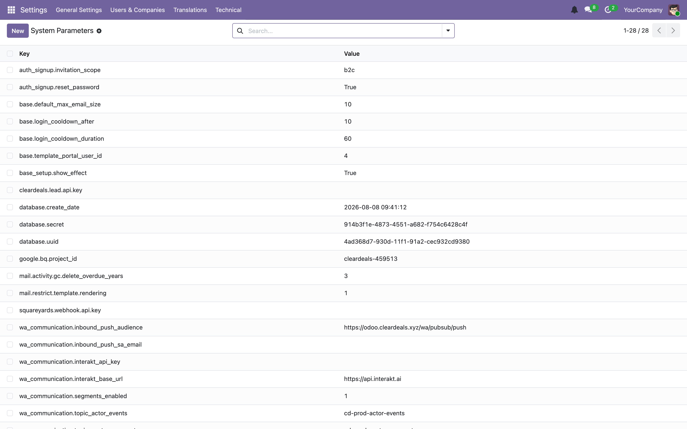
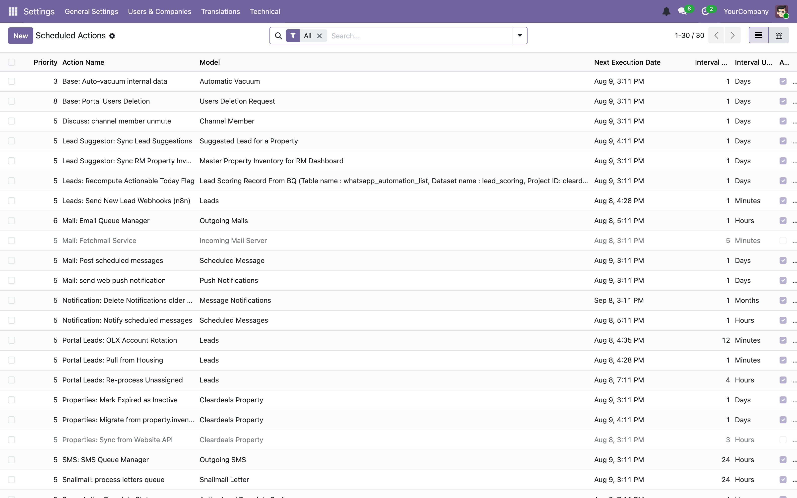
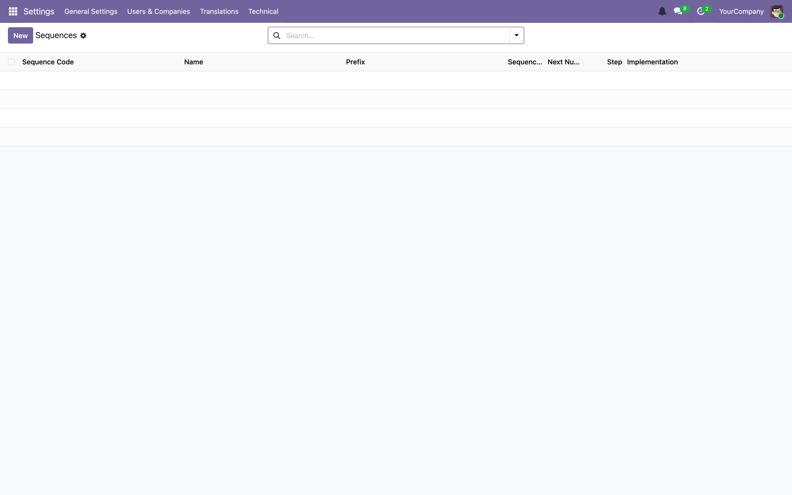

# 11 — Data files, external IDs, crons and configuration

[← Filestore and attachments](10-filestore-and-attachments.md) · [Index](00-INDEX.md) · [Next: Migrations →](12-migrations.md)

---

A module ships more than code. It ships records: groups, ACLs, seed data,
scheduled actions, configuration defaults. This chapter is about getting records
into the database and keeping them there without clobbering what an
administrator has since changed.

## 11.1 Data files are records

Every file in the manifest's `data` list is loaded into the database at install
and at every `-u`. XML `<record>` elements become rows; CSV rows become rows.

```xml
<?xml version="1.0" encoding="utf-8"?>
<odoo>
    <data noupdate="1">
        <record id="lead_source_category_portal" model="lead.source.category">
            <field name="name">Portals</field>
            <field name="code">portals</field>
            <field name="source_type">portal</field>
            <field name="sequence">10</field>
        </record>
    </data>
</odoo>
```
— [`leads/data/lead_source_data.xml`](../../custom_addons/leads/data/lead_source_data.xml)

The loading path is `convert_file` → `convert_xml_import` → `_tag_record` →
`_load_records` (`odoo/tools/convert.py`, `odoo/orm/models.py:5194`). Two
things follow from that:

- **Data records go through the ORM**, so defaults, computes, constraints and
  ACLs all apply. A data file can fail on your own `@api.constrains`.
- **The traceback names the file and line**, which makes these failures much
  easier than they look ([Chapter 05](05-writing-a-module.md) §5.10).

### Field syntax

```xml
<!-- Literal value -->
<field name="name">Portals</field>

<!-- Reference another record by external ID → its id -->
<field name="model_id" ref="model_lead_callback"/>
<field name="user_id" ref="base.user_root"/>

<!-- Evaluate a Python expression -->
<field name="active" eval="True"/>
<field name="interval_number" eval="15"/>
<field name="groups" eval="[(4, ref('group_lead_score_rm'))]"/>

<!-- Find a record by domain -->
<field name="partner_id" search="[('name', '=', 'Acme')]"/>

<!-- Inline HTML -->
<field name="help" type="html">
    <p class="o_view_nocontent_smiling_face">No records yet.</p>
</field>
```

> **Trap.** `<field name="active">False</field>` sets the string `"False"`, which
> is **truthy**. Booleans need `eval`: `<field name="active" eval="False"/>`.
> Same for numbers you intend as integers in expressions.

CSV is just a flat alternative, and the header row does the typing —
`model_id:id` means "resolve this column as an external ID":

```csv
id,name,model_id:id,group_id:id,perm_read,perm_write,perm_create,perm_unlink
access_leads_new_rm,leads.new.rm,model_leads_new,leads.group_lead_score_rm,1,1,1,0
```

> **Our convention.** CSV for `ir.model.access` only — that is what upstream
> does and the file name is conventional. Everything else is XML, where you get
> comments. Our data files lean on comments heavily, and that is a feature.

## 11.2 External IDs and `ir_model_data`

An external ID is a stable name for a row: `module.identifier`.

```
leads.group_lead_score_manager
properties.model_property_base
base.user_root
```

They live in `ir_model_data`, which maps `(module, name)` → `(model, res_id)`.
This is the mechanism that makes data files idempotent: on re-load, Odoo looks up
the external ID, and **updates the existing row** rather than creating a second
one.

In code:

```python
>>> env.ref("leads.group_lead_score_manager")
res.groups(41,)

>>> env.ref("leads.does_not_exist", raise_if_not_found=False)
False
```

In SQL, to answer "what is the external ID of row 42?":

```sql
SELECT module || '.' || name FROM ir_model_data
WHERE model = 'res.groups' AND res_id = 42;
```

Odoo generates some for you. Every model gets `model_<table_name>` in the module
that defines it — hence `ref="model_lead_callback"` works with no declaration.

> **Trap.** Uninstalling a module deletes the records its `ir_model_data` rows
> point at. That is how uninstall cleans up — and it is why *changing which
> module owns a record* is a migration-level operation, not an edit.

## 11.3 `noupdate` — the most consequential attribute in a data file

```xml
<data noupdate="1">
```

| | On install | On every later `-u` |
|---|---|---|
| `noupdate="0"` (default) | create | **overwrite** with the file's values |
| `noupdate="1"` | create | **leave alone** |

Use `noupdate="1"` for anything an administrator is expected to tune. Use the
default for anything the module owns absolutely.

| Record kind | `noupdate` | Why |
|-------------|-----------|-----|
| Views, actions, menus | `0` | the module owns them; you *want* upgrades to apply |
| Groups, ACLs, record rules | `0` | security must match the code |
| Cron schedules | `1` | admins retune intervals and pause jobs |
| Seed/reference data | `1` | rows get edited, renamed, deactivated in use |
| API keys, secrets | `1` | must never be reset by a deploy |

Our configuration file is the model example, and it documents its own reasoning:

```xml
<!--
    Square Yards webhook shared secret. Seeded empty on purpose: the real
    key is provisioned by a manager via Settings > Technical > System
    Parameters at deploy time, and the webhook rejects all requests with
    503 until it is set. noupdate="1" so module upgrades never clobber it.
-->
<record id="squareyards_webhook_api_key" model="ir.config_parameter">
    <field name="key">squareyards.webhook.api.key</field>
    <field name="value"></field>
</record>
```
— [`leads/data/ir_config_parameter_data.xml`](../../custom_addons/leads/data/ir_config_parameter_data.xml)

Three good decisions in one record: seed the key **empty** so the parameter is
discoverable in the UI; **fail closed** until it is set
([Chapter 08](08-controllers-and-http.md)); and `noupdate="1"` so no deploy ever
wipes the real value.

> **Trap — the other direction.** `noupdate="1"` means **you can no longer change
> the record by editing the file**. Your edit will be ignored on every existing
> database while looking perfectly correct in git and working on a fresh install.
>
> This is precisely why we have migration scripts. From a real one:
>
> ```
> The seed record in lead_site_visit_status_data.xml (noupdate="1") cannot
> update existing rows, so this migration applies the change directly.
> ```
>
> — [`leads/migrations/1.4.0/post-01-rename_superseded_status.py`](../../custom_addons/leads/migrations/1.4.0/post-01-rename_superseded_status.py)
>
> **If you need to change an existing `noupdate` record, write a migration**
> ([Chapter 12](12-migrations.md)). Editing the XML is not enough.

You can force one update with `--init` semantics or by flipping
`ir_model_data.noupdate` in SQL, but do not: a migration is explicit, reviewable
and logged.

## 11.4 `ir.config_parameter`

Key-value configuration held in the database. This is our standard mechanism for
anything environment- or deployment-specific.

```python
ICP = self.env["ir.config_parameter"].sudo()
value = ICP.get_param("wa_communication.interakt_api_key", default="")
ICP.set_param("wa_communication.media_public_base_url", url)
```

`sudo()` is genuinely required — ordinary users cannot read this model
([Chapter 07](07-security.md)).

Everything we configure this way:

| Key | Purpose |
|-----|---------|
| `google.bq.project_id` | BigQuery project for lead scoring |
| `squareyards.webhook.api.key` | SquareYards webhook shared secret |
| `cleardeals.lead.api.key` | website/app lead webhook secret |
| `properties.api_key` | `X-API-Key` for the properties REST API |
| `magicbricks.api.key`, `housing.api.id`, `housing.api.key` | portal credentials |
| `olx.socks_proxy` | OLX scraping proxy |
| `wa_communication.interakt_api_key`, `…interakt_base_url` | Interakt API |
| `wa_communication.media_public_base_url` | media URL override ([Chapter 10](10-filestore-and-attachments.md)) |
| `wa_communication.inbound_push_audience`, `…inbound_push_sa_email` | OIDC verification |
| `wa_communication.topic_*` | Pub/Sub topics ([Chapter 14](14-integrations.md)) |
| `wa_communication.confirming_timeout_minutes` | reassignment sweeper threshold |
| `web.base.url` | Odoo's own external URL |
| `sessions.max_inactivity_seconds` | session expiry ([Chapter 09](09-sessions.md)) |
| `ir_attachment.location` | filestore backend ([Chapter 10](10-filestore-and-attachments.md)) |



> **Our convention.**
> - Namespace keys with the module: `wa_communication.thing`, not `thing`.
> - **Always pass a default** to `get_param`, and make the default safe. A
>   missing secret must fail closed, not open.
> - Seed the key in a `noupdate="1"` data file so it is discoverable, even if the
>   value is empty.
> - **Never commit a real secret.** The XML seeds an empty string; the value is
>   set in the UI at deploy time.
> - Read it at the point of use, not at import time — it can change without a
>   restart, and that is one of the main reasons to use it.

## 11.5 Scheduled actions — `ir.cron`

### Defining one

```xml
<record id="ir_cron_recompute_actionable_leads" model="ir.cron">
    <field name="name">Leads: Recompute Actionable Today Flag</field>
    <field name="model_id" ref="model_lead_score"/>
    <field name="state">code</field>
    <field name="code">model._recompute_actionable_flag()</field>
    <field name="user_id" ref="base.user_root"/>
    <field name="interval_number">1</field>
    <field name="interval_type">days</field>
</record>
```
— [`leads/data/lead_score_cron.xml`](../../custom_addons/leads/data/lead_score_cron.xml)

| Field | Meaning |
|-------|---------|
| `name` | shown in the UI |
| `model_id` | the model whose method runs; available in `code` as `model` |
| `state` | `'code'` — the only kind we use |
| `code` | a one-line call. Keep the logic in Python |
| `user_id` | **who it runs as.** `base.user_root` is uid 1 |
| `interval_number` / `interval_type` | `minutes`, `hours`, `days`, `weeks`, `months` |
| `nextcall` | next due time; defaults to now |
| `active` | enabled |
| `priority` | 0 = highest, 10 = lowest (default 5) |
| `lastcall` | last successful run, passed to the job in the context |
| `failure_count` / `first_failure_date` | consecutive failures, reset on success |

> **Our convention.** `<field name="code">model._method_name()</field>` and
> nothing more. Real logic goes in a `@api.model` method in the module, where it
> is versioned, reviewed and testable. Code in a database row is invisible to
> git and to CI.

> **Trap.** `user_id` matters. A cron running as `base.user_root` (uid 1)
> bypasses all record rules, which is usually what you want for a system sweep —
> and means you must **not** additionally sprinkle `sudo()` around, and must be
> careful, because nothing will stop the job touching every row in the table.

All nine of our cron files:

| File | Module |
|------|--------|
| `lead_score_cron.xml`, `new_portal_lead_cron.xml`, `pull_leads_cron.xml`, `webhook_cron.xml`, `olx_account_cron.xml` | `leads` |
| `property_cron.xml` | `properties` |
| `wa_reassignment_cron.xml` | `wa_communication` |
| `ir_cron_data.xml` | `cleardeals_dashboards` |



### How jobs are claimed

Cron workers ([Chapter 03](03-server-and-execution-modes.md)) poll for due jobs
and claim each with a **PostgreSQL row lock**. Several cron workers, and several
servers against one database, therefore will not run the same job concurrently.

Odoo 19 also gives you `ir.cron.trigger` (run a job once, soon, on demand) and
`ir.cron.progress` (a job reports `remaining` / `done`, so long sweeps are
observable and resumable).

> **Trap.** The lock prevents *concurrent* execution, not *repeated* execution. A
> job that raises is rolled back and retried. A job killed by
> `limit_time_real_cron` may have committed part of its work. **Every cron must
> be idempotent.**

### Writing a good cron

Our best example is the WhatsApp reassignment sweeper, whose data file explains
*why the job exists* rather than what it does:

```xml
<!--
    Releases chat handovers whose confirmation never arrived.

    'confirming' is the only wa.reassignment.request state that cannot be
    left by a user action: it exits when the platform sends back an
    assignment_confirmed event.  Any failure to deliver that event strands
    the request permanently — the requester is locked out of asking again
    and the assignee's Approve/Decline do nothing.

    Three separate causes have produced that in practice (a Pub/Sub publish
    lost on worker exit, a swallowed serialisation failure, and Interakt not
    answering), so this sweep exists to bound the damage of the *next* one
    rather than any particular bug.

    Threshold: wa_communication.confirming_timeout_minutes (default 5).
    The normal round-trip is under two seconds.
-->
```
— [`wa_communication/data/wa_reassignment_cron.xml`](../../custom_addons/wa_communication/data/wa_reassignment_cron.xml)

This is the standard to hold. It records the failure mode, the blast radius, the
history that motivated it, the tunable, and the normal-case timing that makes the
threshold reasonable. Someone reading it in a year can decide whether it is still
needed.

The Python side should be idempotent by construction — select only work that has
not been done, and make the selection itself the guard:

```python
@api.model
def _cron_flag_overdue(self):
    """Flag open requests whose time has passed. Idempotent by construction."""
    overdue = self.search([
        ("state", "=", "open"),
        ("due_at", "<", fields.Datetime.now()),
        ("is_overdue", "=", False),      # ← already-done rows are excluded
    ])
    if overdue:
        overdue.write({"is_overdue": True})
        _logger.info("Flagged %s callback request(s) overdue", len(overdue))
```

> **Our convention for crons.**
> - **Idempotent**, with the "not yet done" condition in the domain.
> - **Bounded.** Add a `limit` on anything that could match a large backlog, and
>   let the next run continue. A cron that tries to process 400,000 rows will hit
>   `limit_time_real_cron` and achieve nothing, forever.
> - **Log a count**, at INFO, with lazy `%s` formatting. Silent crons are
>   unmonitorable.
> - **Threshold in `ir.config_parameter`**, not hard-coded, so it can be tuned
>   without a deploy.
> - **Do not swallow concurrency errors** ([Chapter 03](03-server-and-execution-modes.md)).
> - Consider giving up rather than blocking, as Odoo's own filestore GC does with
>   its 10-second `lock_timeout` ([Chapter 10](10-filestore-and-attachments.md)).

### Testing a cron

```python
def test_flag_overdue_is_idempotent(self):
    self.env["lead.callback"]._cron_flag_overdue()
    first = self.callback.is_overdue
    self.env["lead.callback"]._cron_flag_overdue()   # run twice
    self.assertEqual(self.callback.is_overdue, first)
```

Call the method directly. Do not try to make the cron scheduler fire in a test.

### Disabling one

Deactivating a cron shipped with `noupdate="1"` cannot be done by editing the
XML — it needs a migration. `properties` has exactly that, at
`migrations/19.0.1.6.0/post-disable_cron.py`.

## 11.6 Sequences — `ir.sequence`

Odoo's mechanism for human-readable numbering (`INV/2026/0001`).

```xml
<record id="seq_lead_callback" model="ir.sequence">
    <field name="name">Lead Callback Reference</field>
    <field name="code">lead.callback.ref</field>
    <field name="prefix">CB/%(year)s/</field>
    <field name="padding">4</field>
</record>
```

```python
ref = self.env["ir.sequence"].next_by_code("lead.callback.ref")
```

> **We do not currently use `ir.sequence` anywhere in `custom_addons`.** It is
> documented here so you recognise it in upstream code and know it exists if you
> need a customer-facing reference number.

If you do reach for one, two traps:

- **Sequence numbers are consumed, not reserved.** `next_by_code` increments even
  if the surrounding transaction later rolls back, so gaps are normal. Never
  assume contiguity, and never use a sequence as a count.
- **`ir.sequence` is not a uniqueness guarantee.** Pair it with a
  `models.Constraint` if the value must be unique
  ([Chapter 04](04-orm-and-database.md)).



## 11.7 Demo data

Files in the manifest's `demo` list load only when demo data is enabled.

```bash
odoo -d mydb -i my_module --without-demo=all     # no demo data
```

> **Our convention.** Do not ship demo data. Production databases are created
> without it, so demo-only records become a divergence between environments and
> a source of "works on my machine". Use test fixtures
> ([Chapter 13](13-testing.md)) for test data and a seeding script for a local
> playground.

## 11.8 Checklist

When you add a data file:

- [ ] added to the manifest `data` list, in the right ordering band
      ([Chapter 05](05-writing-a-module.md) §5.4)
- [ ] `noupdate` chosen deliberately, and the reason in a comment if it is
      non-obvious
- [ ] booleans and numbers use `eval`, not bare text
- [ ] every `ref` resolvable — the owning module is in `depends`
- [ ] no secret committed; secrets seeded empty and set in the UI
- [ ] config parameter keys namespaced by module

When you add a cron:

- [ ] `code` is a single method call
- [ ] `user_id` deliberate
- [ ] the method is idempotent, with the guard in the domain
- [ ] bounded with a `limit` if a backlog is possible
- [ ] logs a count at INFO
- [ ] threshold in `ir.config_parameter` where one exists
- [ ] `noupdate="1"` on the record
- [ ] a comment saying **why the job exists** and what breaks without it
- [ ] a test that calls the method twice

## 11.9 What to take away

1. Data files are ORM records, keyed by external ID in `ir_model_data`, which is
   what makes reloading them idempotent.
2. **`noupdate="1"` means later edits to the file are ignored.** Changing such a
   record needs a migration.
3. Booleans in XML need `eval`; bare `False` is a truthy string.
4. `ir.config_parameter` for anything deployment-specific: namespaced, defaulted,
   fail-closed, seeded empty, never committed.
5. Crons are row-locked against concurrency but **not** against repetition —
   make them idempotent, bounded, and logged.
6. Keep cron logic in Python, not in the `code` field.
7. Write down *why* a cron exists. The reassignment sweeper comment is the bar.

---

[← Filestore and attachments](10-filestore-and-attachments.md) · [Index](00-INDEX.md) · [Next: Migrations →](12-migrations.md)
