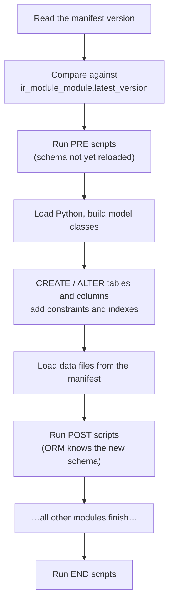

# 12 — Migrations and upgrades

[← Data files and crons](11-data-files-and-crons.md) · [Index](00-INDEX.md) · [Next: Testing →](13-testing.md)

---

Odoo changes the schema for you. Add a field, run `-u`, and the column appears.
What Odoo *cannot* do is decide what the new column should contain for the
150,000 rows that already exist, rename a Selection value everywhere it is
referenced, or fix data that a `noupdate` record can no longer reach. That is
what migration scripts are for.

Source: `odoo/modules/migration.py`.

## 12.1 What `-u` actually does

```bash
odoo -d cleardeals_19_dev -u leads --stop-after-init
```

In order:



Two facts that determine everything else:

> **Trap.** **Migrations only run on an upgrade, never on a fresh install.**
> `migration.py:156` returns immediately unless the module's load state is
> `'to upgrade'`. A fresh install gets the current models and current data files,
> so it must already be correct without any script. This is why so many of our
> scripts contain a "fresh install will use updated seed data" branch.

> **Trap.** **If the manifest version is not bumped, no migration runs.** Odoo
> compares versions to decide. Forget the bump and your script is silently
> skipped — the single most common migration failure, and it produces no error at
> all.

## 12.2 Layout and naming

```
custom_addons/leads/migrations/
├── 1.1.0/
│   └── post-01-backfill_source_id.py
├── 1.2.0/
│   └── post-01-backfill_site_visits.py
├── 1.3.0/
│   └── post-01-backfill_visit_phone_type.py
├── 1.4.0/
│   ├── post-01-rename_superseded_status.py
│   └── post-02-remove_orphan_server_actions.py
└── 1.5.0/
    └── post-verify_olx_account_table.py
```

The directory name is the **version the code is moving to**. A script in `1.4.0/`
runs when upgrading a database that is on something older than 1.4.0 to 1.4.0 or
beyond.

The filename prefix selects the phase, and Odoo sorts files within a phase by
**basename** (`migration.py:182`) — which is exactly why our numbered prefixes
work:

```python
return sorted(
    (f for k in m for f in m[k].get(version, []) if os.path.basename(f).startswith(f"{stage}-")),
    key=os.path.basename,
)
```

> **Our convention.** Number scripts when a directory has more than one:
> `post-01-…`, `post-02-…`. Lexical order is the only ordering guarantee you
> get, and `post-2-` sorts after `post-10-`, so always zero-pad.

### The three phases

| Prefix | When | Use it for |
|--------|------|-----------|
| `pre-` | **before** models are loaded and the schema is updated | anything that must happen while the old schema is still in place, or that must make the *new* schema possible |
| `post-` | **after** the schema is updated and data files loaded | data backfills, recomputes, fixing `noupdate` records — the common case |
| `end-` | after **all** modules have finished | cross-module invariants and cleanups |

Odoo also recognises a special `0.0.0/` directory, which runs on **every**
version change (`migration.py:172` reorders it first for `pre` and last for
`post`). We do not use it; avoid it unless you genuinely want something to run on
every single upgrade forever.

### Which phase? A decision tree

```
Does the work need the NEW columns to exist?
├── Yes → post-
└── No
    ├── Does it need the OLD schema (dropping, renaming, reading a column
    │   that is about to disappear)?                         → pre-
    ├── Must it make a new constraint/index possible
    │   (deduplicate before a UNIQUE index is built)?        → pre-
    └── Does it depend on another module having finished?     → end-
```

The most instructive real example of a `pre-` script is the WhatsApp phone
deduplication, and its docstring explains the phase choice explicitly:

```python
"""Deduplicate + canonicalize wa.conversation phone numbers.

Historically conversations were created without an enforced unique index on
``phone_number`` (the index failed to build because duplicates already existed),
and rows were stored in mixed formats — some bare 10-digit, some 12-digit
``91…``.
...
This **pre**-migration runs before the model schema is (re)loaded, so once it
collapses every number to a single canonical 12-digit row, the new
``UNIQUE(phone_number)`` index created during model loading succeeds.
"""
```
— [`wa_communication/migrations/1.1.2/pre-migrate.py`](../../custom_addons/wa_communication/migrations/1.1.2/pre-migrate.py)

That is the canonical reason to need `pre-`: **you are adding a constraint that
the existing data violates.** Add it in `post-` and the schema step has already
failed.

## 12.3 The `migrate` function

```python
def migrate(cr, version):
    ...
```

- **`cr`** is a raw database cursor. **There is no `env`** — the ORM may not be
  in a usable state, especially in `pre-`.
- **`version`** is the *installed* version, the one being upgraded **from**.

Odoo accepts a few parameter spellings (`cr`/`_cr`, `version`/`_version`), but
use `migrate(cr, version)`.

> **Trap.** `version` can be falsy. `installed_version = pkg.load_version or ''`
> — so do not assume it parses.

### Getting an ORM if you really need one

```python
from odoo import api, SUPERUSER_ID


def migrate(cr, version):
    env = api.Environment(cr, SUPERUSER_ID, {})
    env["leads.new"].search([])._compute_next_follow_up_date()
```

Only in `post-`, and only when you need ORM behaviour — a recompute, a constraint,
a method. For plain data reshaping, raw SQL is faster and safer.

> **Our convention.** Prefer raw SQL for backfills and reshaping; use the ORM
> only when you specifically need computes, constraints or business methods to
> run. Every one of our current scripts uses raw SQL.

## 12.4 Idempotency, and how ours achieve it

A migration may run more than once — a failed upgrade retried, a script promoted
across environments, a hotfix reapplied. **Write every script so a second run is
a no-op.**

Our house pattern, from
[`post-01-rename_superseded_status.py`](../../custom_addons/leads/migrations/1.4.0/post-01-rename_superseded_status.py):

```python
def _table_exists(cr, table_name):
    cr.execute(
        """
        SELECT 1
          FROM information_schema.tables
         WHERE table_schema = 'public'
           AND table_name    = %s
        """,
        (table_name,),
    )
    return bool(cr.fetchone())


def migrate(cr, version):
    # ── Step 0 — Pre-flight ──────────────────────────────────────────────────
    if not _table_exists(cr, "lead_site_visit_status"):
        _logger.warning(
            "[leads 1.4.0] [step 0] lead_site_visit_status table not found — "
            "skipping migration (fresh install will use updated seed data)."
        )
        return

    # ── Step 1 — Rename ──────────────────────────────────────────────────────
    cr.execute(
        """
        UPDATE lead_site_visit_status
           SET name = 'Rescheduled',
               write_date = NOW() AT TIME ZONE 'UTC'
         WHERE code  = 'superseded'
           AND name != 'Rescheduled'
        """
    )
    renamed = cr.rowcount
    _logger.info(
        "[leads 1.4.0] [step 1] Renamed %d status record(s) from 'Superseded' to 'Rescheduled'.",
        renamed,
    )
```

Five techniques in that one script, all worth copying:

1. **A pre-flight existence check** that returns cleanly rather than raising, with
   a message explaining why the absence is fine.
2. **`AND name != 'Rescheduled'`** — the UPDATE is conditional on the *current*
   value, so re-running matches zero rows. Idempotency by predicate, not by a
   flag.
3. **`write_date` maintained** so Odoo's own change tracking stays honest.
4. **`cr.rowcount` logged** at each step, so the deployment log says what actually
   happened.
5. **Numbered steps in both the comments and the log prefix**, so a log line maps
   to a line of code.

The header comment is equally deliberate:

```
# PURPOSE
# -------
# Rename the system-internal "Superseded" site-visit status to "Rescheduled"
# ...
# MIGRATION PLAN
# ──────────────
# Step 0  — Pre-flight: verify lead_site_visit_status table exists.
# Step 1  — Rename "Superseded" → "Rescheduled" for code='superseded'.
# Step 2  — Mark active=False so it is hidden from all user dropdowns.
# Step 3  — VERIFICATION: log final state.
#
# IDEMPOTENCY
# ───────────
# Both UPDATEs are conditional on the current value, so re-running is safe.
```

> **Our convention.** Every migration script carries a header with **PURPOSE**,
> **MIGRATION PLAN** (numbered steps) and **IDEMPOTENCY** (why re-running is
> safe). This is not ceremony — a migration runs once, unattended, against
> production data you cannot get back. The header is what a reviewer reads to
> decide whether to let it near that data.

### Idempotency techniques

| Situation | Technique |
|-----------|-----------|
| Update a value | condition the `WHERE` on the current value |
| Add a column by hand | `ALTER TABLE … ADD COLUMN IF NOT EXISTS` |
| Drop something | `DROP … IF EXISTS` |
| Backfill | `WHERE new_column IS NULL` |
| Insert a row | `INSERT … ON CONFLICT DO NOTHING`, or check first |
| Anything table-dependent | pre-flight against `information_schema` |

## 12.5 The common recipes

### Backfill a new column

```python
def migrate(cr, version):
    # The ORM has created source_id (NULL for every existing row).
    cr.execute("""
        UPDATE leads_new l
           SET source_id = s.id
          FROM lead_source s
         WHERE l.source_id IS NULL
           AND s.name = l.legacy_source_text
    """)
    _logger.info("[leads 1.1.0] Backfilled source_id on %d lead(s).", cr.rowcount)
```

`WHERE … IS NULL` makes it idempotent and lets it resume if interrupted.

### Rename a field

Do this in `pre-`, because the ORM will otherwise see an unknown old column and a
new empty one:

```python
def migrate(cr, version):
    cr.execute("""
        ALTER TABLE leads_new RENAME COLUMN old_name TO new_name
    """)
```

Guard it:

```python
cr.execute("""
    SELECT 1 FROM information_schema.columns
     WHERE table_name = 'leads_new' AND column_name = 'old_name'
""")
if cr.fetchone():
    cr.execute("ALTER TABLE leads_new RENAME COLUMN old_name TO new_name")
```

> **Trap.** Renaming a **field** is not just a column. External IDs
> (`ir_model_fields`), views referencing it, record-rule domains, and
> `ir.model.data` entries all mention the old name. The column rename preserves
> the data; you still have to update views and domains in the same release.

### Change a `noupdate` record

This is the most frequent reason we write a migration at all — see
[Chapter 11](11-data-files-and-crons.md). The `properties` cron-disable script is
a compact, complete example:

```python
"""
Disable the legacy 3-hourly polling cron on already-installed databases.

``data/property_cron.xml`` is ``noupdate="1"``, so adding ``active=False`` to the
cron record there only affects fresh installs — on an upgrade the existing
``ir.cron`` row keeps its current (active) value.  This idempotent post-migration
deactivates it directly.

Property ingestion now happens via the inbound webhooks
(/api/v1/properties/webhook/{create,update}); the cron remains in place but
inactive so it can still be triggered manually for backfill / reconciliation.
"""


def migrate(cr, version):
    cr.execute(
        """
        UPDATE ir_cron
           SET active = FALSE
         WHERE id IN (
             SELECT res_id
               FROM ir_model_data
              WHERE module = 'properties'
                AND name = 'ir_cron_sync_properties_from_api'
         )
           AND active = TRUE
        """,
    )
    if cr.rowcount:
        _logger.info(
            "properties 19.0.1.6.0: disabled legacy polling cron "
            "(ir_cron_sync_properties_from_api).",
        )
```

Note **how it finds the record**: by joining `ir_model_data` on
`(module, name)`, i.e. by external ID, not by a hard-coded row id. Ids differ
between databases; external IDs do not. Always resolve through `ir_model_data`.

Also note the docstring records **why** the cron is being disabled and why it is
kept rather than deleted. That is what makes the change reviewable a year later.

### Recompute a stored computed field

Changing a compute's logic does **not** recompute existing rows
([Chapter 04](04-orm-and-database.md)). Force it:

```python
from odoo import api, SUPERUSER_ID


def migrate(cr, version):
    env = api.Environment(cr, SUPERUSER_ID, {})
    records = env["leads.new"].search([])
    records._compute_next_follow_up_date()
    _logger.info("Recomputed follow-up date on %d lead(s).", len(records))
```

For a large table, batch it — a single recompute over hundreds of thousands of
rows will exhaust memory or time.

### Deduplicate before adding a UNIQUE constraint

The `wa_communication` `pre-` script is the reference. Its strategy paragraph is
worth reading as a template for any merge migration:

```
Strategy: compute a canonical key (``91`` + 10 digits) for every conversation,
pick one survivor per key (prefer an assigned chat, else the lowest id), repoint
child rows (``wa_message``, ``wa_reassignment_request``) onto the survivor, sum
unread counters, delete the losers, write the canonical phone, and recompute the
last-message snapshot from the merged history.
```

The ordering is the lesson: **canonicalise → choose a survivor → repoint children
→ merge aggregates → delete losers → write the canonical value → refresh derived
data.** Delete the losers before repointing the children and you lose data.

It also uses a temp table scoped to the transaction, which is a good habit for
multi-step SQL:

```sql
CREATE TEMP TABLE _conv_canon ON COMMIT DROP AS ...
```

### A verification-only migration

Not every script has to change something. This one exists purely to put an audit
line in the deployment log:

```python
def migrate(cr, version):
    """
    Guard migration for the leads 1.5.0 release (OLX Account Integration).
    ...
    Idempotency:
        Safe to re-run. The SELECT is read-only and has no side effects.
    """
    _logger.info("=== %s %s: starting ===", __name__, version)
    ...
    cr.execute("SELECT COUNT(*) FROM lead_olx_account")
    row_count = cr.fetchone()[0]
    _logger.info("%s %s: lead_olx_account table present with %d rows.",
                 __name__, version, row_count)
```
— [`leads/migrations/1.5.0/post-verify_olx_account_table.py`](../../custom_addons/leads/migrations/1.5.0/post-verify_olx_account_table.py)

> **Our convention.** A verification migration is a legitimate deliverable when a
> release introduces a model or table that the ORM creates for you. It costs
> nothing, and it turns "did the table get created?" from a question into a log
> line.

## 12.6 Versioning and the two styles in this repo

`convert_version` (`migration.py:159`) is the function that reconciles the two
formats:

```python
def convert_version(version: str) -> str:
    if version == "0.0.0":
        return version
    if version.count(".") > 2:
        return version  # the version number already contains the server version
    return "%s.%s" % (release.major_version, version)
```

So `1.4.0` (two dots) is expanded to `19.0.1.4.0`, while `19.0.1.6.0` (four dots)
is taken as-is. Both work, and the directory name must match the style used in
the manifest.

The comparison then differs subtly (`migration.py:201`):

```python
if majorless_version:
    # We should not re-execute major-less scripts when upgrading to new Odoo version
    # a module in `9.0.2.0` should not re-execute a `2.0` script when upgrading to `10.0.2.0`.
    # In which case we must compare just the module version
    return parsed_installed_version[2:] < parse_version(full_version)[2:] <= current_version[2:]

return parsed_installed_version < parse_version(full_version) <= current_version
```

That is a real, documented behavioural difference: **majorless scripts compare
only the module portion**, so they are not re-run when the Odoo major changes.

| Module | Manifest version | Migration dirs |
|--------|------------------|----------------|
| `properties` | `19.0.1.7.0` | `19.0.1.6.0/` etc. |
| `leads` | `1.7.2` | `1.4.0/` etc. |
| `wa_communication` | `1.3.8` | `1.3.0/` etc. |

> **Our convention.** New modules use the full `19.0.x.y.z` form
> ([Chapter 05](05-writing-a-module.md)). Do **not** retro-convert `leads` or
> `wa_communication` — the installed version is already recorded in
> `ir_module_module` on live databases, and changing the style would change how
> `compare()` evaluates every existing migration directory. Keep incrementing
> each module in the style it already uses.

## 12.7 Testing a migration

Never let a migration meet production first.

### 1. Locally, against realistic data

```bash
# Start from a database on the OLD version, then:
make update MODULE=leads
make logs-odoo        # read your own step logs
```

Then **run it again** and confirm the second run reports zero changes. That is
the idempotency test, and it takes ten seconds.

### 2. Against a copy of production

We have a dedicated skill for this: `odoo-prod-migration-check`
(`.claude/skills/odoo-prod-migration-check/`). It streams a **read-only** snapshot
of the production database over SSH to your machine and runs the upgrade against
it locally. Production is only ever read; nothing is written to the prod VM or
database.

This is the step that catches what local testing cannot: real data volume, real
duplicates, real NULLs, real rows created by versions of the code you never ran.

> **Our convention.** Any migration that writes to a table with production data
> gets rehearsed against a prod snapshot before it is pushed. The
> `wa_communication` dedup migration is exactly the class of script that must
> never be run for the first time on live data.

### 3. Check the deploy log afterwards

Because our scripts log counts per step, the deployment log is the verification:

```
[leads 1.4.0] [step 0] Pre-flight OK — lead_site_visit_status exists.
[leads 1.4.0] [step 1] Renamed 1 status record(s) from 'Superseded' to 'Rescheduled'.
[leads 1.4.0] [step 2] Deactivated 1 status record(s) with code='superseded'.
[leads 1.4.0] [step 3] Final state: code='superseded' → name='Rescheduled', active=False.
[leads 1.4.0] Migration complete.
```

If the counts are not what you predicted, investigate before moving on.

## 12.8 Rollback

There is no automatic rollback. Odoo runs the upgrade in a transaction, so a
script that **raises** rolls back — but a script that succeeds and was *wrong* has
committed.

Plan accordingly:

- **Prefer additive changes.** Add a column, backfill it, switch the code to it,
  and drop the old one in a *later* release. Dropping and backfilling in one step
  leaves nothing to fall back to.
- **Never delete data in the same release that stops using it.** Deactivate,
  rename, or mark it — then remove it a release later, once you are confident.
  Note that `post-01-rename_superseded_status.py` deactivates rather than deletes,
  and the `properties` cron script disables rather than removes.
- **Know your restore path** before you push: a database backup plus the
  filestore, restored together ([Chapter 10](10-filestore-and-attachments.md)).
- **Make the code tolerate both shapes** for one release where you can.

## 12.9 Checklist

Before a migration is merged:

- [ ] the manifest `version` is bumped, in the module's existing style
- [ ] the directory name matches that style and that version
- [ ] the correct phase — `pre-` for schema/constraint enablement, `post-` for
      data, `end-` for cross-module
- [ ] numbered prefix if the directory has more than one script, zero-padded
- [ ] header with PURPOSE, MIGRATION PLAN and IDEMPOTENCY
- [ ] `migrate(cr, version)` signature; no assumption that `version` parses
- [ ] pre-flight existence checks, returning cleanly with a log line
- [ ] every statement idempotent — conditional `WHERE`, `IF EXISTS`, `IS NULL`
- [ ] records located via `ir_model_data` external IDs, never hard-coded row ids
- [ ] all SQL parameterised (`%s`, never string interpolation)
- [ ] `cr.rowcount` logged per step, lazy `%s` formatting
- [ ] large tables batched
- [ ] stored computes explicitly recomputed if their logic changed
- [ ] views, domains and record rules updated for any renamed field
- [ ] run twice locally; second run reports no changes
- [ ] rehearsed against a production snapshot if it writes to production data
- [ ] additive where possible; nothing irreversible deleted this release

## 12.10 What to take away

1. Migrations run **only on upgrade**, and **only if the version is bumped**.
   Both failures are silent.
2. `pre-` for the old schema and for making a new constraint possible; `post-`
   for data; `end-` for cross-module.
3. `migrate(cr, version)` gets a raw cursor and the version you are coming
   *from*. No `env` unless you build one.
4. Idempotency comes from conditional predicates, not from flags.
5. Find records by external ID through `ir_model_data`; ids differ per database.
6. Log a count per step. The deployment log is your verification.
7. Rehearse against a production snapshot. Prefer additive changes, because
   there is no rollback.

---

[← Data files and crons](11-data-files-and-crons.md) · [Index](00-INDEX.md) · [Next: Testing →](13-testing.md)
