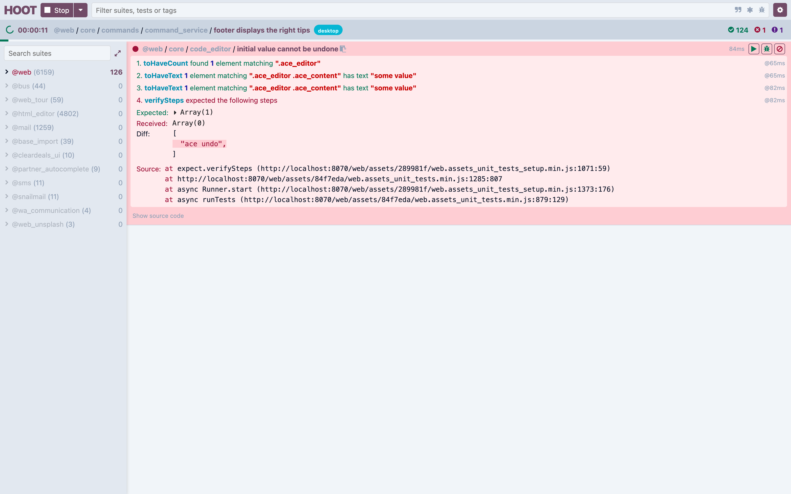
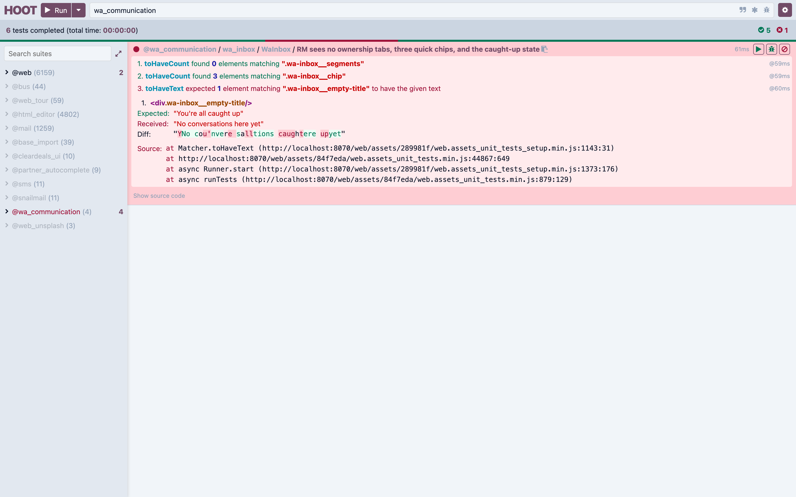
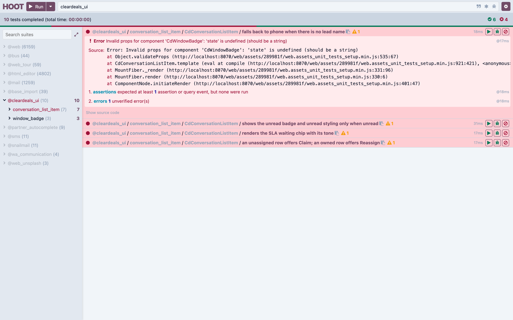

# 13 — Testing

[← Migrations](12-migrations.md) · [Index](00-INDEX.md) · [Next: Integrations →](14-integrations.md)

---

The goal, stated plainly in our own testing skill:

> every behavioural change is gated by a test, so a breaking change fails CI
> instead of reaching production.

This chapter covers how Odoo's test framework works, our conventions and shared
fixtures, the specific traps that have already bitten us, and how to run
everything. It also documents two real gaps in our current CI that you should
know about.

There is a companion skill, `writing-odoo-tests`, which is the operative
procedure. This chapter explains the reasoning behind it.

## 13.1 How Odoo runs tests

Tests are ordinary `unittest` classes in a module's `tests/` package, discovered
when the module is installed or updated with testing enabled:

```bash
odoo -d mydb -i leads --test-enable --test-tags /leads --stop-after-init
```

- `--test-enable` turns testing on.
- `--test-tags` selects what runs. `/leads` means "the tag `leads`".
- Tests run **inside** the install/upgrade, against the real database.

`tests/__init__.py` must import each test module, exactly like `models/`:

```python
from . import test_lead_callback
```

> **Trap.** A test file not imported in `tests/__init__.py` never runs. No error.
> This is the same import-chain rule as models ([Chapter 05](05-writing-a-module.md)),
> and it fails the same silent way.

## 13.2 Base classes

| Class | Transaction behaviour | Speed | Use for |
|-------|----------------------|-------|---------|
| `TransactionCase` | one transaction per **test method**, rolled back after each | fast | almost everything |
| `SingleTransactionCase` | one transaction for the **whole class** | fast | rarely — tests become order-dependent |
| `HttpCase` | starts a real HTTP server; each request is its own transaction | **slow** | controllers, routes, browser tests |
| `BaseCase` | the shared base | — | building your own |

```python
from odoo.tests import TransactionCase, tagged


@tagged("post_install", "-at_install", "leads")
class TestLeadCallback(TransactionCase):

    @classmethod
    def setUpClass(cls):
        super().setUpClass()
        # Runs ONCE for the class. Good for expensive shared setup.

    def setUp(self):
        super().setUp()
        # Runs before EACH test method.

    def test_something(self):
        ...
```

> **Our convention.** Default to `TransactionCase`. Use `HttpCase` only when you
> are testing the HTTP layer itself — it is much slower, and most controller
> logic can be extracted into a testable function instead.

## 13.3 Tags

```python
@tagged("post_install", "-at_install", "leads")
```

| Tag | Meaning |
|-----|---------|
| `standard` | added automatically; what plain `--test-tags` selects |
| `at_install` | run during install, before other modules finish. **Default** |
| `-at_install` | disable that |
| `post_install` | run after all modules are loaded |

### How `--test-tags` actually selects

The spec grammar is in `odoo/tests/tag_selector.py:19`:

```
[-][tag][/module][:class][.method][[params]]
```

So `--test-tags /leads` parses as **tag empty, module `leads`**. An empty
included tag defaults to `standard`, and the module is matched against the
addon directory name (`tag_selector.py:86`, with `test_module` set from
`cls.__module__.split('.')[2]` in `tests/common.py:320`):

```python
elif not file_path and module and module != test_module:
    return False
```

> **A correction worth making explicitly.** `/leads` selects **by module**, not
> by a tag named `leads`. A third `@tagged` argument repeating the module name is
> therefore **redundant** — and upstream treats that usage as deprecated
> (`tag_selector.py:70`):
>
> ```python
> test_tags = test.test_tags | {test_module}  # module as test_tags deprecated, keep for retrocompatibility,
> ```
>
> Our `writing-odoo-tests` skill currently says the module tag is mandatory and
> that tests without it "never run in CI". **That is not correct**, and the
> codebase demonstrates it: 73 of our 96 test classes carry only
> `('post_install', '-at_install')`, and they run in CI perfectly well because
> `/leads` matches on the module.

Current distribution across `custom_addons/*/tests/`:

| Tag combination | Classes |
|-----------------|---------|
| `('post_install', '-at_install')` | 73 |
| `('post_install', '-at_install', 'wa_communication')` | 21 |
| `('post_install', '-at_install', 'cleardeals_notification')` | 1 |
| `('post_install', '-at_install', 'leads')` | 1 |

> **Our convention.** `@tagged('post_install', '-at_install')` is sufficient and
> is what the majority of the suite uses. Adding the module name does no harm and
> gives you a hand-written tag to select on, but do not believe it is required.
> **What genuinely matters is that the module appears in CI's `-i` and
> `--test-tags` lists** (§13.15) — that is the real "my tests never ran" failure,
> and it is a manifest/workflow problem, not a decorator problem.

Narrowing to one test while iterating — note this works on any of our classes,
tagged with the module name or not:

```bash
--test-tags /wa_communication:TestSendMessage.test_body_required
```

## 13.4 Shared fixtures — the pattern to copy

`wa_communication/tests/common.py` is the model. Its own docstring states the
purpose:

> Every wa_communication test should build on one of the bases here so the suite
> stays consistent and a breaking change in one model surfaces the same way
> everywhere.

It provides two bases and a factory mixin:

```python
class WaTransactionCase(_WaFactoryMixin, TransactionCase):
    """Base for model / business-logic tests in wa_communication."""

class WaHttpCase(_WaFactoryMixin, HttpCase):
    """Base for controller / HTTP push tests in wa_communication."""
```

### Uniqueness

```python
class _WaFactoryMixin:
    # A per-class monotonic counter guarantees unique logins / phone numbers
    # even when many records are created inside a single test method.
    _seq = 0

    @classmethod
    def _uniq(cls, prefix: str = '') -> str:
        """Return a process-unique token, e.g. ``'phone_1717490000_3'``."""
        cls._seq += 1
        return '%s%d_%d' % (prefix, int(time.time()), cls._seq)

    @classmethod
    def _uniq_phone(cls) -> str:
        """Return a unique 12-digit E.164-without-plus WA phone number."""
        cls._seq += 1
        # 91 + 10 digits; pad the counter so it stays 10 digits wide.
        return '91%010d' % (9000000000 + cls._seq)
```

> **Trap.** `setUpClass` runs once per class, so a hard-coded login or phone
> number collides across tests in the same class — and against a UNIQUE
> constraint that produces a confusing `IntegrityError` in an unrelated test.
> **Always generate unique values.**

### Factories that fill the boring fields

```python
def make_message(self, conv, **vals):
    """Create a ``wa.message`` on ``conv`` with sensible defaults.

    Defaults to an inbound buyer text so callers testing serialisation /
    stats only override the fields under test.
    """
    base = {
        'conversation_id': conv.id,
        'direction': vals.pop('direction', 'inbound'),
        'initiator': vals.pop('initiator', 'buyer'),
        'kind': vals.pop('kind', 'text_reply'),
        'status': vals.pop('status', 'delivered'),
        'occurred_at': vals.pop('occurred_at', '2026-01-01 10:00:00'),
    }
    base.update(vals)
    return self.env['wa.message'].sudo().create(base)
```

> **Our convention.** A factory fills every required field with a sane default so
> **a test only states what it actually cares about**. That is what makes the
> tests readable: `self.make_message(conv, status='failed')` says "a failed
> message" and nothing else. Note `occurred_at` is a fixed date, not `now()` —
> deterministic fixtures do not flake.

The `make_conversation` docstring shows the other half of good factory design —
making the *common* case work and documenting how to get the awkward one:

```python
"""Create a ``wa.conversation``.

Defaults ``assigned_user_id`` to the *current* user so RM ``send_message``
passes the ownership gate out of the box.  Pass ``assigned_user_id=False``
for an unassigned conversation, or another user's id to test gating.
"""
```

> **Our convention.** When a module has more than a handful of tests, give it a
> `tests/common.py` in this shape. Do not re-derive setup in every file.

## 13.5 Mocking Pub/Sub — and why the postcommit flush is mandatory

This is the most important fixture we have, and the reason is a genuine framework
subtlety.

Outbound publishing is deferred to `cr.postcommit`
([Chapter 14](14-integrations.md)) so a rolled-back transaction never emits a
spurious WhatsApp send. But **a `TransactionCase` never commits** — so those
callbacks would never run, and a test could never observe the payload.

`mock_pubsub` solves both problems at once:

```python
@contextlib.contextmanager
def mock_pubsub(self):
    """Capture ``publish_async`` calls and flush deferred post-commit work."""
    captured = []

    def _fake_publish(model_self, topic, payload):
        captured.append(_Published(topic, payload))

    from unittest.mock import patch
    pubsub_cls = type(self.env[PUBSUB_MODEL])
    with patch.object(pubsub_cls, 'publish_async', _fake_publish):
        yield captured
        # Flush deferred publishes scheduled via cr.postcommit.add(...).
        self.env.cr.postcommit.run()
```

Usage:

```python
with self.mock_pubsub() as published:
    conv.send_message(body='hi', kind='freetext')
self.assertEqual(published[-1].payload['request_type'], 'send')
```

Two details worth understanding:

- It patches on **`type(self.env[PUBSUB_MODEL])`**, the registry class, not on an
  instance or the module. Odoo builds model classes at registry load, so that is
  the object every caller actually resolves.
- `self.env.cr.postcommit.run()` inside the context manager, **before** the
  `with` block exits, is what makes the deferred publish observable.

> **Trap.** Assert the *effect* of `bus.bus._sendone` (a state change, a system
> message), not the call. Bus pushes are wrapped in `try/except` in our code
> because a bus hiccup must not lose the database row — see
> `cleardeals_notification.notify()` — so a test asserting the bus call is
> testing best-effort behaviour.

## 13.6 Mocking external HTTP

Patch **where the name is looked up**, which for us means the module that
imported it:

```python
from unittest.mock import MagicMock, patch

@patch("odoo.addons.wa_communication.models.interakt_client.requests.get")
def test_template_fetch_handles_401(self, mock_get):
    mock_get.return_value = MagicMock(status_code=401, text="denied")
    with self.assertRaises(UserError):
        self.env["wa.interakt.client"].fetch_templates()
```

> **Our convention.** Test the error branches, not just the happy path — 401,
> any ≥400, a non-JSON body, and `requests.RequestException`. Those are the
> states a third-party API actually spends its time in. Pure parsing helpers
> (`_parse_buttons`, `_extract_variables`) can be imported and called directly
> with no database at all — do that where you can, it is far faster.

## 13.7 The HttpCase patch-target trap

This one cost us real debugging time and is worth stating precisely.

A controller that does:

```python
from odoo.addons.cleardeals_pubsub.controllers.push_utils import verify_push_token
```

binds `verify_push_token` **into its own module namespace**. Therefore:

```python
# WRONG — patches the definition, not the binding the controller uses.
patch("odoo.addons.cleardeals_pubsub.controllers.push_utils.verify_push_token")

# RIGHT — patches the name where it is looked up.
patch("odoo.addons.wa_communication.controllers.push_controller.verify_push_token")
```

> **Trap.** Getting this wrong does not fail loudly. The real,
> network-calling function runs, every request 500s, and the test failure points
> at the wrong thing entirely. **This exact bug existed in
> `test_push_controller.py`.**

Also, for `HttpCase` tests of `auth='none'` routes that write: the route must
declare `readonly=False` ([Chapter 08](08-controllers-and-http.md)). Under
`HttpCase` the implicit readonly→readwrite retry does not save you, and the test
fails outright.

## 13.8 Testing SQL constraints

```python
import psycopg2
from odoo.tools import mute_logger

def test_phone_number_is_unique(self):
    phone = self._uniq_phone()
    self.make_conversation(phone_number=phone)
    self.env.flush_all()

    with mute_logger('odoo.sql_db'), self.assertRaises(psycopg2.IntegrityError):
        self.make_conversation(phone_number=phone)
        self.env.flush_all()
```

This is not hypothetical — it is the pattern already used in
[`cleardeals_dashboards/tests/test_lead_scoring_crud.py`](../../custom_addons/cleardeals_dashboards/tests/test_lead_scoring_crud.py):

```python
from odoo.tools import mute_logger
...
with mute_logger('odoo.sql_db'), self.assertRaises(IntegrityError):
```

Three requirements, all of which trip people up:

1. **`flush_all()`.** A UNIQUE or NOT NULL violation fires when the write reaches
   PostgreSQL, not at `create()`. Without the flush, nothing raises
   ([Chapter 04](04-orm-and-database.md)).
2. **`mute_logger('odoo.sql_db')`** keeps the expected error out of the test
   output.
3. **Do not wrap it in `self.env.cr.savepoint()`** — that can swallow the error
   and the test passes for the wrong reason.

> **Trap.** And remember [Chapter 04](04-orm-and-database.md) §4.8: if the model
> still uses the removed `_sql_constraints` list, there **is no constraint** — the
> test would legitimately fail. Migrate the declaration to `models.Constraint`
> first, then add the test.

## 13.9 Testing access and record rules

Covered in [Chapter 07](07-security.md) §7.8. The essentials:

```python
from odoo.tests import new_test_user

user = new_test_user(
    self.env,
    login=self._uniq("rm_"),
    groups="base.group_user,wa_communication.group_wa_manager",
)

with self.assertRaises(AccessError):
    record.with_user(user).read(["name"])
```

- `with_user()`, never `sudo()` — `sudo()` bypasses what you are testing.
- Assert both directions: the allowed user succeeds, the denied user raises.
- Remember `search()` **filters** where `read()` **raises**.

## 13.10 Append-only models

`wa.message` rejects `write` on structural fields with `ValidationError` and
`unlink` with `UserError`. Test the rejection **and** the documented escape
hatches:

```python
def test_body_is_immutable(self):
    with self.assertRaises(ValidationError):
        self.msg.write({"body": "edited"})

def test_escape_hatch_allows_write(self):
    self.msg.with_context(_wa_message_allow_write=True).write({"body": "fixed"})
    self.assertEqual(self.msg.body, "fixed")
```

Deletion happens only via database cascade when the parent conversation is
unlinked — test that too, because it is the one path that legitimately removes a
row.

## 13.11 Datetimes and non-stored computes

Odoo stores **naive UTC** ([Chapter 04](04-orm-and-database.md)). Build
expectations the same way:

```python
from datetime import datetime, timedelta

conv.window_expires_at = datetime.utcnow() + timedelta(hours=2)
conv.invalidate_recordset()          # ← required before reading a non-stored compute
self.assertEqual(conv.window_state, "open")
```

> **Trap.** A **non-stored** computed field is cached within the transaction.
> After writing one of its dependencies via SQL or in a way the ORM did not
> track, call `invalidate_recordset()` — otherwise you read the stale cached
> value and the test asserts nothing.

## 13.12 `Form` — testing onchange accurately

`onchange` only runs for a form ([Chapter 04](04-orm-and-database.md)). To test
it, simulate one:

```python
from odoo.tests import Form

def test_status_change_sets_follow_up(self):
    with Form(self.env["leads.new"]) as form:
        form.name = "Test Buyer"
        form.current_status = "site_visit_scheduled"
        # onchange has fired here, exactly as it would in the UI
        self.assertTrue(form.next_follow_up_date)
    lead = form.save()
```

`Form` also validates the view — it fails if you set a field that is invisible or
readonly in the form, which catches a class of bug plain `create()` cannot.

## 13.13 Running the tests

### The wrapper

```bash
./run_tests.sh                     # all default modules
./run_tests.sh leads               # one
./run_tests.sh leads properties    # several
```

```bash
KEEP_DB=1 ./run_tests.sh leads     # leave Postgres up to inspect afterwards
REBUILD=1 ./run_tests.sh           # force a fresh image build
LOG_LEVEL=debug ./run_tests.sh     # noisier
```

It builds `my-odoo-image`, creates a private Docker bridge network
(`odoo_test_net`) and a throwaway Postgres container, so **nothing clashes with
your dev stack** — the HTTP and gevent ports stay inside the container network
and are never published.

Its default module list:

```
leads, lead_suggestor, cleardeals_dashboards, properties,
cleardeals_pubsub, cleardeals_notification, wa_communication
```

It also carries a Windows/Git-Bash workaround worth knowing about, because the
failure it prevents is baffling:

```bash
# Git Bash auto-rewrites arguments that look like Unix paths, turning an Odoo
# test tag such as "/leads" into "C:/Program Files/Git/leads" ("Invalid tag",
# 0 tests) and mangling volume/build paths.
export MSYS2_ARG_CONV_EXCL='*'
export MSYS_NO_PATHCONV=1
```

### Manual, for fast iteration

```bash
docker run -d --name wa_test_pg \
  -e POSTGRES_USER=odoo -e POSTGRES_PASSWORD=odoo -e POSTGRES_DB=odoo_test_db \
  -p 5435:5432 postgres:17

docker run --rm --network host -v "$PWD/custom_addons:/mnt/extra-addons" my-odoo-image \
  odoo -d odoo_test_db --db_host=localhost --db_port=5435 \
  --db_user=odoo --db_password=odoo --http-port=8099 \
  --addons-path=/mnt/extra-addons,/usr/lib/python3/dist-packages/odoo/addons \
  -u wa_communication --test-enable --test-tags /wa_communication \
  --stop-after-init --log-level=test
```

Note the deliberately odd ports (5435, 8099) so this never collides with the dev
stack on 5434/8069. Use `-i` for a fresh database and `-u` for an existing one —
and you **need** `-u` after changing a model or constraint, so the schema change
applies.

If it fails with `MissingDependency`, rebuild the image:
`docker build -t my-odoo-image .`

### CI

`.github/workflows/test.yml` runs on push and pull request to `development_19`
and `19.0`: a `postgres:17` service, `docker build`, then Odoo with
`--test-enable --test-tags /leads,/lead_suggestor,…`.

## 13.14 JavaScript tests — Hoot

OWL components are tested in a real browser with **Hoot**.

- Tests live in `static/tests/**/*.test.js`.
- They are added to the `web.assets_unit_tests` bundle in the manifest.
- The runner is at `/web/tests`, filterable: `/web/tests?filter=wa_communication`.

Unfiltered, the runner shows every suite on the instance — our own
`@cleardeals_ui` and `@wa_communication` sit alongside upstream's:



Filtered to one module, which is how you should actually use it:





A test from our suite, showing the shape — service mocking in `beforeEach`, RPC
stubbing, then mount and assert:

```javascript
describe("WaInbox", () => {
    beforeEach(() => {
        // The composer's quick replies and read-marking are irrelevant here.
        onRpc("get_for_composer", () => []);
        onRpc("mark_as_read", () => true);
        // Stub the services that would otherwise do bus/RPC work on start.
        mockService("cd_notification", { setActiveSuppressKey() {}, clearActiveSuppressKey() {} });
        mockService("bus_service", { addChannel() {}, subscribe() {}, start() {} });
    });

    test("Manager sees the ownership tabs with live counts", async () => {
        patchWithCleanup(user, { hasGroup: () => true });
        onRpc("get_inbox", () => inboxPayload({ total: 5, is_manager: true, ... }));

        await mountWithCleanup(WaInbox);
        await ready();

        expect(".wa-inbox__segments").toHaveCount(1);
    });
});
```

> **Our convention.** Select on stable class hooks (`.wa-inbox__chip`,
> `.cd-metric-card__value`), never on text or DOM position. This is the reason
> for the BEM-ish `cd-`/`wa-` class naming in
> [Chapter 06](06-views-and-web-client.md).

## 13.15 Two current gaps you should know about

These are real, present in the repository as of writing, and documented here
rather than hidden.

### Gap 1 — no CI job runs the JavaScript tests at all

```bash
grep -rniE "hoot|assets_unit_tests|web/tests|browser_js" .github/workflows run_tests.sh
# → no matches
```

Neither `test.yml` nor `run_tests.sh` executes the Hoot suites. The consequence
was immediate and concrete: **there is a failing OWL test in
`wa_communication` right now.** Opening `/web/tests?filter=wa_communication`
gives 5 passed, 1 failed —
[`wa_inbox.test.js:75`](../../custom_addons/wa_communication/static/tests/wa_inbox.test.js)
expects the empty state to read `"You're all caught up"`, while the component
renders `"No conversations here yet"` because that branch in
[`wa_inbox.xml`](../../custom_addons/wa_communication/static/src/inbox/wa_inbox.xml)
only fires when `state.filters.needs_reply` is set, and the test never sets it.

Nobody saw it because nothing runs it.

> **Until this is fixed:** run `/web/tests?filter=<your module>` in the browser
> yourself before opening a pull request that touches OWL code. It takes fifteen
> seconds.

### Gap 2 — `cleardeals_ui` Python tests never run in CI

`test.yml` installs and tags:

```
-i leads,lead_suggestor,cleardeals_dashboards,properties,cleardeals_pubsub,cleardeals_notification,wa_communication
--test-tags /leads,/lead_suggestor,/cleardeals_dashboards,/properties,/cleardeals_pubsub,/cleardeals_notification,/wa_communication
```

`cleardeals_ui` is **not in either list**. It is installed transitively as a
dependency of `wa_communication`, so its code loads — but its tag is never
selected, so any Python tests it has are silently skipped. Same for
`run_tests.sh`'s `DEFAULT_MODULES`.

> **Our convention.** A test CI never runs protects nothing. When you add tests
> to a module, add the module to **both** `.github/workflows/test.yml` (the `-i`
> list *and* the `--test-tags` list) and `run_tests.sh` (`DEFAULT_MODULES` *and*
> `DEFAULT_TAGS`). Four places, all four required.

## 13.16 What to test

Work from the seams, as the skill puts it: list the module's **public contract
surfaces** and test each one, because those are what integrations break on.

| Surface | Why it matters |
|---------|----------------|
| `@api.model` methods called from OWL via `orm.call` | a remotely callable API ([Chapter 08](08-controllers-and-http.md)) |
| `action_*` methods | bound to buttons |
| `_process_*` / `_handle_*` event handlers | driven by inbound Pub/Sub |
| `_cron_*` methods | run unattended; test idempotency by calling twice |
| Controller routes | the external contract |
| Constraints and guards | `ValidationError`, `UserError`, `AccessError` |
| Record rules | per-role visibility |
| Serialisers | the shape the front end depends on |

For each: inputs, side effects (writes, bus pushes, Pub/Sub publishes), guards,
and return shape. Each of those is a test.

> **Our convention.** Prefer many small, fast `TransactionCase` tests over a few
> large ones. A test that asserts one thing tells you what broke.

## 13.17 Checklist

- [ ] new file imported in `tests/__init__.py`
- [ ] `@tagged('post_install', '-at_install')` present (module name optional)
- [ ] descriptive test method names
- [ ] built on the module's `tests/common.py` if one exists
- [ ] all records created with unique logins / phones
- [ ] fixed, deterministic datetimes — no `now()` in fixtures
- [ ] Pub/Sub mocked with `mock_pubsub`, deferred publishes flushed
- [ ] external HTTP mocked at the **lookup site**
- [ ] error branches asserted, not just the happy path
- [ ] SQL constraints tested with `flush_all()` + `mute_logger`, no savepoint
- [ ] security tested with `with_user()`, both directions
- [ ] non-stored computes read after `invalidate_recordset()`
- [ ] cron methods called twice to prove idempotency
- [ ] suite green in Docker — `0 failed, 0 error(s)`
- [ ] no new deprecation warnings
- [ ] module present in `test.yml` **and** `run_tests.sh`, both lists each
- [ ] if OWL code changed: `/web/tests?filter=<module>` checked by hand

## 13.18 What to take away

1. `TransactionCase` by default; `HttpCase` only for the HTTP layer.
2. `--test-tags /leads` selects **by module**, not by a tag named `leads`. The
   module-name tag is optional. What actually gets tests skipped is the module
   missing from CI's lists.
3. Generate unique logins and phone numbers; `setUpClass` runs once.
4. `mock_pubsub` exists because postcommit callbacks never fire in a
   `TransactionCase`. Use it, and understand why.
5. Patch external names **where they are looked up**, not where they are defined.
6. SQL constraints need `flush_all()` to fire, and no savepoint.
7. `with_user()` for security tests; `search()` filters, `read()` raises.
8. **Nothing runs the JS tests in CI, and one is currently failing.** Check
   `/web/tests` by hand until that changes.

---

[← Migrations](12-migrations.md) · [Index](00-INDEX.md) · [Next: Integrations →](14-integrations.md)
