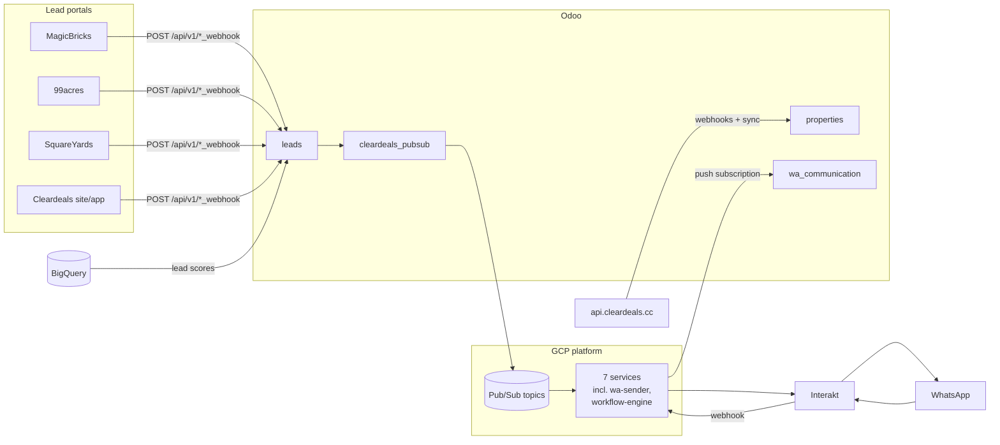
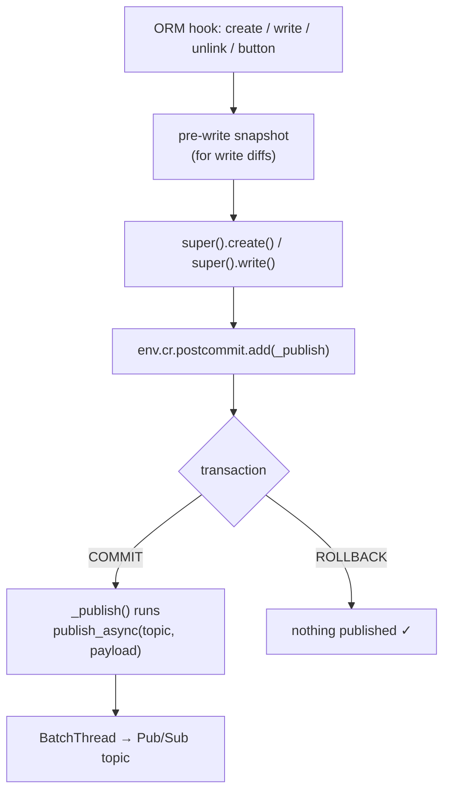
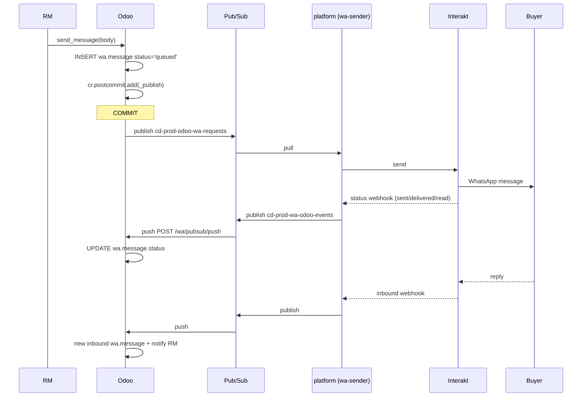

# 14 — Integrations: Pub/Sub, webhooks and the WhatsApp platform

[← Testing](13-testing.md) · [Index](00-INDEX.md) · [Next: Conventions →](15-conventions.md)

---

Odoo is not the whole system. It sits inside a larger architecture: a GCP
platform that talks to WhatsApp, four lead portals that push us enquiries, a
website API that owns property data, and BigQuery for lead scoring. This chapter
is about the boundaries — and about the one pattern you must not get wrong.

There is a companion skill, `cleardeals-pubsub-events`, which is the operative
procedure for adding an event. This chapter explains the architecture and the
reasoning.

## 14.1 The shape of the whole thing



Two directions, and they use different mechanisms:

| Direction | Mechanism |
|-----------|-----------|
| Odoo → outside | **Pub/Sub publish** (`cleardeals_pubsub`) |
| outside → Odoo | **HTTP** — either a Pub/Sub push subscription or a plain webhook |

## 14.2 `cleardeals_pubsub`

A deliberately thin module: `base` + `web`, one model, one controller helper.

```
custom_addons/cleardeals_pubsub/
├── models/pubsub_publisher.py       ← cleardeals.pubsub, publish_async
├── controllers/push_utils.py        ← verify_push_token (OIDC)
├── docs/IMPROVEMENTS.md             ← known gaps
└── tests/
```

> **Our convention.** `cleardeals_pubsub` is **transport only**. No business
> logic, no knowledge of leads or WhatsApp. If you find yourself adding a
> lead-shaped concept to it, it belongs in the calling module instead.

### `publish_async`

```python
def publish_async(
    self,
    topic_id: str,
    payload: dict,
    attributes: Optional[dict] = None,
) -> None:
    """Publish a message without blocking for the server acknowledgement.

    **Safe to call from ORM hooks** (``write``, ``create``, computed
    fields) and HTTP request handlers.  The google-cloud-pubsub library
    batches and sends the RPC in its own ``BatchThread``; Odoo's request
    thread is never blocked.  Delivery errors are caught by the future
    callback and logged at ERROR level.
    """
```
— [`pubsub_publisher.py`](../../custom_addons/cleardeals_pubsub/models/pubsub_publisher.py)

The short topic name is expanded to
`projects/{PUBSUB_PROJECT_ID}/topics/{name}` at call time, so the code carries no
project ids. Non-JSON-serialisable payload values are coerced to `str` rather
than raising — convenient, but it means a `datetime` silently becomes a string,
so serialise deliberately.

The module also degrades gracefully: if `google-cloud-pubsub` is not installed,
`publish_async` logs at debug and does nothing. That keeps tests and minimal
environments working, and it is why the manifest declares
`external_dependencies` — so a *real* deployment fails at install rather than
silently not publishing.

## 14.3 The one pattern you must not get wrong

> **Never call `publish_async` directly inside a model method.**

Always defer it to `cr.postcommit`:



The reason is simple and the failure mode is severe: **a published event cannot
be un-published.** If you publish inside `write()` and the transaction later
rolls back, you have told the platform that something happened which did not.
Downstream, that means a WhatsApp message to a real customer about a lead that
does not exist.

The skill states the invariant in exactly those terms:

> **Key invariant**: the `postcommit` callback runs only after the Odoo
> transaction commits successfully. A DB rollback means no event is ever
> published. This is mandatory — never call `publish_async` directly inside a
> model method.

### The canonical implementation

```python
_TOPIC_ACTOR    = 'wa_communication.topic_actor_events'
_TOPIC_VISIT    = 'wa_communication.topic_visit_events'
_TOPIC_PROPERTY = 'wa_communication.topic_property_events'
_TOPIC_CUSTOMER = 'wa_communication.topic_customer_events'


class WaLeadEventPublisher(models.Model):
    _inherit = 'leads.new'

    @api.model_create_multi
    def create(self, vals_list):
        records = super().create(vals_list)
        for rec in records:
            rec._wa_schedule_publish(
                _TOPIC_ACTOR,
                rec._wa_lead_payload('actor.created'),
            )
        return records

    def write(self, vals):
        # Always snapshot BEFORE super() for any field you need to diff
        pre = {rec.id: {'field': rec.field} for rec in self} if 'field' in vals else {}
        result = super().write(vals)
        ...
```
— [`wa_lead_event_publisher.py`](../../custom_addons/wa_communication/models/wa_lead_event_publisher.py)

Three things to copy:

1. **Topic names are `ir.config_parameter` keys**, not literal topic strings. The
   actual topic is resolved at publish time
   ([Chapter 11](11-data-files-and-crons.md)), so it changes per environment
   without a code change.
2. **Snapshot before `super()`.** After `super().write()` the old values are gone.
   This is the general `write`-override shape from
   [Chapter 04](04-orm-and-database.md).
3. **This module extends `leads.new` from above.** `leads` has no idea WhatsApp
   exists — the dependency points the right way
   ([Chapter 01](01-what-is-odoo.md)).

## 14.4 A known, deferred gap — read this before you rely on delivery

The `publish_async` docstring carries an explicit warning, and it is important
enough to reproduce in full:

```
.. warning::

   **Known gap — in-flight messages are lost if the worker exits.**

   This call performs no network I/O.  It appends to an in-memory batch
   that a *daemon* thread flushes up to 50 ms later.  Until that flush
   the message exists only in this process's heap: not in Postgres, not
   in Pub/Sub, not on disk.  Any worker exit in that window — OOM kill,
   ``limit_memory_soft`` recycle, deploy, restart — drops it silently.
   The future callback cannot fire, so **nothing is logged anywhere**.

   Confirmed message loss twice in staging (2026-07-18, 2026-08-01).
   Deferred, not fixed.  Full analysis and the proposed fixes (atexit
   flush + transactional outbox) are in ``../docs/IMPROVEMENTS.md``.
```

What this means in practice:

- The `wa.message` row is committed with `status='queued'`, and the publish that
  would move it forward can vanish. The database and the platform disagree, with
  nothing in any log.
- The window is small (≤50 ms) but the triggers are routine: a deploy, a
  `limit_memory_soft` worker recycle ([Chapter 03](03-server-and-execution-modes.md)).

> **This is documented, deferred, and not scheduled.** Do not start fixing it
> without agreement — the analysis and the two proposed fixes (an `atexit` flush,
> and a transactional outbox) are in
> [`cleardeals_pubsub/docs/IMPROVEMENTS.md`](../../custom_addons/cleardeals_pubsub/docs/IMPROVEMENTS.md).
> What you *should* do is know it exists, so that when an event goes missing you
> look here rather than spending a day on the platform side.

It is also the reason the WhatsApp reassignment sweeper exists
([Chapter 11](11-data-files-and-crons.md)) — that cron's comment names "a Pub/Sub
publish lost on worker exit" as one of three observed causes of stuck handovers.
**Defensive crons are the current mitigation.** When you design a flow that
depends on a published event, assume the event can be lost and give the flow a
timeout.

## 14.5 Inbound: the Pub/Sub push subscription

The platform delivers events to `POST /wa/pubsub/push`, covered in detail in
[Chapter 08](08-controllers-and-http.md). The essentials:

- Google-signed **OIDC JWT** in `Authorization: Bearer`, verified by
  `verify_push_token` against `wa_communication.inbound_push_audience` and
  optionally `…inbound_push_sa_email`.
- **Always HTTP 200 once the envelope parses**, so a poison message is not
  redelivered forever. Only auth failures return 401.
- Failures recorded in `wa.event.log`.
- Postgres concurrency errors **re-raised**, not swallowed.
- `readonly=False` declared explicitly.

Events route to handlers by type:

| Event | Effect in Odoo |
|-------|----------------|
| inbound WA message | create/update `wa.conversation` + `wa.message` |
| delivery/read status | update `wa.message.status` |
| bridge ACK / assignment confirmation | advance `wa.reassignment.request` |
| unknown | logged to `wa.event.log` |

## 14.6 The full WhatsApp round trip



Note that `wa.message` starts at `queued` and is advanced by a **later, separate
request**. That asynchrony is why a lost publish leaves a row stranded, and why
statuses are a `Selection` with fourteen values rather than a boolean.

## 14.7 Configuration

Every integration parameter is an `ir.config_parameter`
([Chapter 11](11-data-files-and-crons.md)), documented in the
`wa_communication` manifest description:

```
wa_communication.inbound_push_audience         — OIDC aud claim
wa_communication.inbound_push_sa_email         — optional SA email
wa_communication.topic_odoo_wa_requests        — outbound WA sends
wa_communication.topic_actor_events            — lead/RM events
wa_communication.topic_visit_events            — site-visit events
wa_communication.topic_property_events         — property events
wa_communication.topic_customer_events         — customer events
wa_communication.topic_workflow_control        — workflow pause/resume toggle
```

Environment variables, set in the compose file rather than the database:

| Variable | Purpose |
|----------|---------|
| `PUBSUB_PROJECT_ID` | GCP project; builds the full topic path |
| `PUBSUB_EMULATOR_HOST` | point at the local emulator instead of GCP |
| `GCP_ENV` | topic prefix — `production` → `prod`, so `cd-prod-*` |
| `GOOGLE_APPLICATION_CREDENTIALS` | ADC path |

> **Trap.** `GCP_ENV` matters more than it looks. `wa_workflow.py` builds
> `cd-{prefix}-{alias}` from it. Without it the workflow pause/resume toggle
> publishes to `cd-local-*` and vanishes with no error.

## 14.8 Local development

### The emulator

```yaml
- PUBSUB_EMULATOR_HOST=host.docker.internal:8085
- PUBSUB_PROJECT_ID=cleardeals-wa-local
```

The emulator runs in the WhatsApp platform repo's own compose stack; Odoo reaches
it via `host.docker.internal`, so no network coordination is needed.

> **Trap.** Setting `PUBSUB_EMULATOR_HOST` also makes `/wa/pubsub/push` **skip
> OIDC verification entirely** (documented in the push controller's docstring).
> That is intentional so the emulator can push without real JWTs — and it means
> the variable must never be set anywhere that is reachable from outside your
> machine.

### ⚠️ The default dev configuration talks to production

Repeating the warning from [Chapter 02](02-getting-started.md) because this is
the chapter where it bites:

`docker-compose.dev.yml` ships pointed at **`cleardeals-wa-prod`** with
`GCP_ENV=production` and your own GCP credentials mounted. The file says so in
capitals:

```
# ⚠️  This local Odoo talks to the LIVE cd-prod-* topics, not the emulator.
# Publishing a lead event from here reaches real customers on WhatsApp.
```

> **Before you touch lead or WhatsApp code locally, switch to the emulator.**
> Creating a lead is enough to publish `actor.created` to a live topic.

### Media over a tunnel

Interakt fetches media over a public URL, so `localhost` is unreachable to them.
`make wa-tunnel` opens a cloudflared quick tunnel and points
`wa_communication.media_public_base_url` at it, deliberately **without** touching
`web.base.url` ([Chapter 10](10-filestore-and-attachments.md)).

cloudflared rather than ngrok, for a specific reason recorded in the Makefile:
the free ngrok tier allows only one online tunnel, which is already used for the
webhook-gateway — sharing it makes media requests land on the wrong service and
return a FastAPI 404.

## 14.9 Inbound webhooks

Four lead intake endpoints plus property sync
([Chapter 08](08-controllers-and-http.md)):

| Endpoint | Source |
|----------|--------|
| `/api/v1/magicbricks_webhook` | MagicBricks |
| `/api/v1/99acres_webhook` | 99acres |
| `/api/v1/squareyards_webhook` | SquareYards |
| `/api/v1/cleardeals_lead` | our website/app |
| `/api/v1/properties/webhook/{create,update}` | website property API |

All are `type="http"`, `auth="public"`, `csrf=False`, `save_session=False`, and
authenticate with a shared secret from `ir.config_parameter`.

Two conventions that come from operating these:

> **Our convention — accept generously, validate loudly.** A portal sending a
> malformed payload should still land the lead, with the problem recorded, rather
> than be rejected at the door. **Losing a real inbound enquiry is worse than
> storing a record someone has to correct.** This is the same reasoning as the
> `automated_lead_creation` context exemption on the phone constraint
> ([Chapter 04](04-orm-and-database.md)) — and it is exactly why that exemption
> exists.

> **Our convention — fail closed on auth, open on data.** A missing API key
> rejects everything with 503 and a warning log
> ([Chapter 08](08-controllers-and-http.md)); a missing *field* gets recorded and
> processed. Those are opposite defaults and both are correct.

Cron-based reconciliation backs the webhooks up — `webhook_cron.xml`,
`pull_leads_cron.xml`, `olx_account_cron.xml`. That is the right architecture for
at-least-once delivery you do not control: a push path for latency, a pull path
for correctness.

## 14.10 Other integrations

| Integration | How | Config |
|-------------|-----|--------|
| **Interakt** | REST from `interakt_client.py` | `wa_communication.interakt_api_key`, `…interakt_base_url` |
| **BigQuery** | lead scores imported by wizard/cron | `google.bq.project_id` |
| **Website property API** | 3-hourly cron, now webhook-driven | — |
| **OLX** | scraping through a proxy | `olx.socks_proxy` |
| **MagicBricks / Housing** | REST pulls | `magicbricks.api.key`, `housing.api.id`, `housing.api.key` |

Note the `properties` polling cron was **disabled by migration** in favour of
webhooks, but deliberately kept inactive rather than deleted so it can still be
triggered manually for backfill ([Chapter 12](12-migrations.md)). That is a good
pattern for replacing a pull with a push.

## 14.11 Observability across the boundary

A `trace_id` is minted by the platform at ingress and travels on every Pub/Sub
message attribute. Odoo binds it for the duration of a push request so **every**
log line carries it:

```python
"""Correlation-id (``trace_id``) plumbing for Odoo-side WhatsApp logs.

The WA platform mints a ``trace_id`` at ingress and carries it on every Pub/Sub
message attribute ... The push controller binds it for the duration of each
``/wa/pubsub/push`` request so that **every** ``_logger`` line emitted while
handling that event is prefixed with ``[trace=<id>]`` — letting you follow one
message from the platform straight into Odoo's server log, and cross-reference
it against the ``wa.event.log`` row that stores the same id.

Native stdlib logging only — no third-party dependency.
"""
```
— [`wa_communication/utils/trace.py`](../../custom_addons/wa_communication/utils/trace.py)

The implementation is worth reading as a piece of design: a single
`contextvars.ContextVar` plus a `logging.Filter`, no dependencies, and a **no-op
when nothing is bound** so it is safe to attach process-wide.

```python
@contextlib.contextmanager
def trace_context(trace_id: str | None):
    """Bind ``trace_id`` for the duration of the ``with`` block, then restore.

    A falsy ``trace_id`` binds nothing (the block runs untraced), so callers can
    pass ``attributes.get('trace_id')`` unconditionally.
    """
```

That last sentence is the detail that makes it pleasant to use: the caller never
has to check.

Using it is covered in [Chapter 16](16-debugging-and-ops.md).

## 14.12 Adding a new event

The procedure, per the `cleardeals-pubsub-events` skill:

1. Decide the topic — reuse an existing one where the event fits its category.
2. Add the config parameter if the topic is new, seeded in a `noupdate="1"` data
   file ([Chapter 11](11-data-files-and-crons.md)).
3. Extend the model **from the module that owns the integration**, not the module
   that owns the data.
4. Snapshot before `super()`, publish via `cr.postcommit`.
5. Build a JSON-serialisable payload; serialise datetimes explicitly.
6. Test with `mock_pubsub` and assert the payload
   ([Chapter 13](13-testing.md)).
7. Verify end-to-end against the **emulator** before production.

Checklist:

- [ ] `publish_async` is called only from a `cr.postcommit` callback
- [ ] pre-write snapshot taken before `super()`
- [ ] topic resolved through `ir.config_parameter`, not hard-coded
- [ ] payload fully JSON-serialisable; no accidental `str(datetime)`
- [ ] `@api.model_create_multi` on any `create` override
- [ ] extended from the correct side of the dependency graph
- [ ] a test asserting the published topic and payload
- [ ] the flow tolerates the event being lost (§14.4) — a timeout or sweeper
      exists if it matters
- [ ] exercised against the emulator, not production

## 14.13 What to take away

1. Outbound is Pub/Sub, inbound is HTTP. Different mechanisms, different failure
   modes.
2. **`publish_async` only ever from `cr.postcommit`.** A published event cannot
   be recalled.
3. Snapshot old values before `super()`.
4. Topics come from `ir.config_parameter`; environment comes from `GCP_ENV`.
5. **In-flight publishes can be lost on worker exit, silently.** Known,
   documented, deferred. Design flows with timeouts; do not start fixing it
   unasked.
6. The dev compose file talks to **production**. Switch to the emulator first.
7. Accept generously, validate loudly — but fail closed on authentication.
8. `trace_id` follows one customer interaction across both systems.

---

[← Testing](13-testing.md) · [Index](00-INDEX.md) · [Next: Conventions →](15-conventions.md)
