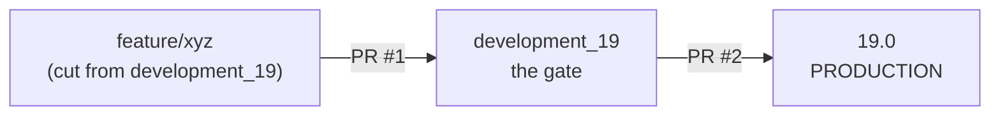

# 15 — Coding conventions and the way we work

[← Integrations](14-integrations.md) · [Index](00-INDEX.md) · [Next: Debugging and ops →](16-debugging-and-ops.md)

---

Two things in this chapter: the house style, and the workflow around it. The
style rules are mostly mechanical and mostly enforced. The workflow section
matters more, because it is where the judgement lives.

## 15.1 Python style — the mechanical rules

These come from `.github/prompts/copilot-instructions.md` and `ruff.toml`. Each
one is a real rule with a real ruff code, so a violation is a lint failure rather
than an opinion.

### Logging — never f-strings

```python
# ❌ BAD (G004)
_logger.info(f"Processing {record.id}")

# ✅ GOOD
_logger.info("Processing %s", record.id)
```

Not stylistic. Lazy `%s` formatting means the string is only built if the level is
enabled, and the arguments stay available as structured data to log handlers. Every
`_logger` call in this handbook's quoted code follows it.

### Trailing commas — mandatory

```python
# ❌ BAD (COM812)
child = self.Category.create({
    "name": "Child",
    "parent_id": parent.id
})

# ✅ GOOD
child = self.Category.create({
    "name": "Child",
    "parent_id": parent.id,
})
```

A one-line diff instead of two when the next field is added, and correct
behaviour from auto-formatters.

### No blind exceptions

```python
# ❌ BAD (BLE001)
except Exception:

# ✅ GOOD
except (ValidationError, AccessError):
```

With the deliberate exceptions covered in
[Chapter 08](08-controllers-and-http.md): a webhook that must acknowledge, or a
best-effort bus push. Both carry a `# noqa: BLE001` **and a comment saying why**:

```python
except Exception:  # noqa: BLE001 — a bus hiccup must not lose the row
```

> **Our convention.** A `# noqa` without an explanation is not acceptable. The
> comment is the point — it converts a suppressed warning into a recorded
> decision.

### Imports at the top, only

```python
# ❌ BAD (PLC0415) — no imports inside functions or methods
def my_method(self):
    import base64
```

Order: standard library, third-party, Odoo, local. `known-first-party = ["odoo"]`
and `known-local-folder = ["odoo.addons"]` in `ruff.toml` encode it for isort.

> **Trap.** `**/__init__.py` is exempted from `F401` in `ruff.toml`, because the
> imports there look unused but are load-bearing
> ([Chapter 05](05-writing-a-module.md)).

### No assignment immediately before return

```python
# ❌ BAD (RET504)
def get_pdf():
    pdf_content = b"%PDF-1.4..."
    return pdf_content

# ✅ GOOD
def get_pdf():
    return b"%PDF-1.4..."
```

The exception is a genuinely complex expression where naming it aids reading.

### Names

```python
# ❌ BAD (E741) — ambiguous single letters
lambda l: l.is_required

# ✅ GOOD
lambda line: line.is_required
```

`for lead in leads`, `for rec in self`, `for line in lines`.

### Modern type hints, no encoding header

```python
# ✅ Python 3.10+ builtins
def func() -> dict[str, list[int]]: ...

# ❌ Not this
def func() -> Dict[str, List[int]]: ...

# ❌ Never (UP009)
# -*- coding: utf-8 -*-
```

`ruff.toml` sets `target-version = "py310"`.

### Line length — a discrepancy to know about

`copilot-instructions.md` says **100 characters maximum**. `ruff.toml`
**ignores `E501`**, so ruff does not enforce line length at all.

> **Our convention.** Treat 100 as the target, because it is what the codebase
> reads like and what reviewers expect. But do not be surprised when a long line
> passes lint — nothing is checking. Do not reformat someone else's long lines as
> a drive-by; the diff noise is worse than the line.

### The `ruff.toml` itself

The file's first line is important context:

```
# automatically generated file by the runbot nightly ruff checks, do not modify
```

It is **Odoo upstream's** config, not ours. Around 30 rule families are selected
(`BLE`, `COM`, `G`, `I`, `RET`, `SIM`, `TRY`, `UP`, …) with a documented ignore
list. Do not edit it to make your code pass.

Run it:

```bash
ruff check custom_addons/leads
ruff check --fix custom_addons/leads
```

## 15.2 Odoo-specific conventions

Consolidated from earlier chapters, as a single reference.

| Area | Rule | Chapter |
|------|------|---------|
| Models | one model per file, named after the model | [05](05-writing-a-module.md) |
| Models | `_description` always | [04](04-orm-and-database.md) |
| Fields | `ondelete` deliberate on every `Many2one` | [04](04-orm-and-database.md) |
| Fields | `index=True` on anything filtered or sorted | [04](04-orm-and-database.md) |
| Fields | name the M2M `relation` table explicitly | [04](04-orm-and-database.md) |
| Constraints | `models.Constraint`, never `_sql_constraints` | [04](04-orm-and-database.md) |
| Constraints | SQL where expressible; `@api.constrains` otherwise | [04](04-orm-and-database.md) |
| Computes | iterate `self`; assign on every branch | [04](04-orm-and-database.md) |
| Computes | a clock-dependent stored compute needs a cron | [04](04-orm-and-database.md) |
| `create` | `@api.model_create_multi`, list of dicts | [04](04-orm-and-database.md) |
| `write` | snapshot old values before `super()` | [04](04-orm-and-database.md) |
| `onchange` | convenience defaults only, never validation | [04](04-orm-and-database.md) |
| `sudo()` | narrowest scope, always commented | [07](07-security.md) |
| Security | an ACL line per model, wizards included | [07](07-security.md) |
| Security | `groups=` for enforcement, not `readonly` | [07](07-security.md) |
| Manifest | `data` list in the numbered ordering bands | [05](05-writing-a-module.md) |
| Manifest | `license` present; version bumped with migrations | [05](05-writing-a-module.md) |
| Controllers | `methods=`, `save_session=False`, explicit `readonly` | [08](08-controllers-and-http.md) |
| Controllers | clamp client limits; `hmac.compare_digest` for secrets | [08](08-controllers-and-http.md) |
| Methods | leading `_` unless deliberately a public API | [08](08-controllers-and-http.md) |
| Data | `noupdate` chosen deliberately; `eval` for booleans | [11](11-data-files-and-crons.md) |
| Config | namespaced keys, safe defaults, never commit secrets | [11](11-data-files-and-crons.md) |
| Crons | idempotent, bounded, logged; logic in Python | [11](11-data-files-and-crons.md) |
| Migrations | PURPOSE / PLAN / IDEMPOTENCY header; external IDs | [12](12-migrations.md) |
| Pub/Sub | publish only from `cr.postcommit` | [14](14-integrations.md) |
| OWL | `/** @odoo-module */`, typed `static props`, `cd-`/`wa-` classes | [06](06-views-and-web-client.md) |
| Tests | unique fixtures, deterministic dates, error branches | [13](13-testing.md) |

## 15.3 Clean code — what "good" looks like here

The `odoo-clean-code` skill is the standard, with reference files on naming,
functions, error handling and code smells. The distilled version:

**Intention-revealing names.** `overdue` not `recs`. `_check_phone_number` not
`_validate`. Recordset variables named for what they contain.

**Small, single-responsibility methods.** The test is whether you can name it
without "and". `_phone_validation_error` was extracted from
`_check_phone_number` precisely so the rule could be reused and tested without a
record ([Chapter 04](04-orm-and-database.md)) — that is the shape to aim for.

**Deliberate error handling.** The right exception class carries meaning:

| Exception | Use for |
|-----------|---------|
| `ValidationError` | data is invalid (constraints) |
| `UserError` | the user cannot do this right now |
| `AccessError` | permission denied |
| `MissingError` | the record is gone |

And the message is a product surface. Compare a bare "invalid phone" with what
we actually ship:

```python
return (
    "A phone number is required. Enter the buyer's 10-digit mobile "
    "number so the team can call or WhatsApp them."
)
```

> **Our convention.** An error message names the problem, says what to do, and
> where useful quotes the rejected value back. The commit that added phone
> validation went further and shipped a follow-up specifically to *"name the 'two
> numbers in one field' mistake explicitly"* — because the generic message was
> not telling RMs what they had actually done wrong.

**Self-documenting structure over comments** — but comments for the *why*. The
best comments in this codebase explain decisions, not mechanics:
`wa_reassignment_cron.xml` recording the three historical causes
([Chapter 11](11-data-files-and-crons.md)), the `readonly=False` justification
([Chapter 08](08-controllers-and-http.md)), the OR-across-groups explanation
([Chapter 07](07-security.md)).

## 15.4 Docstrings

The `odoo-doc-writer` skill defines the documentation layers. In practice:

**Module docstring** — what this file is for and any architectural constraint.
The bar is set by `wa_dashboard.py`, which states the contract *and* shows the
JavaScript call site:

```python
"""WA Dashboard — server-side analytics methods for the WA Dashboard client action.

All public methods accept plain arguments and return JSON-serialisable dicts.
There is no database table — this is a pure analytics utility model.

Example call from the OWL dashboard component::

    const metrics = await this.orm.call(
        'wa.dashboard', 'get_metrics', [],
        { date_from: '2026-05-01', date_to: '2026-05-02', workflow_slug: '' }
    );
"""
```

**Method docstring** — what, why, and the non-obvious. `_check_phone_number`
([Chapter 04](04-orm-and-database.md)) is the exemplar: it explains the scope
decision, the business trade-off, and the framework behaviour that makes the
migration safe. Three paragraphs that save the next reader an hour.

**Class docstring** — for models, the field groups and their rules.
`property_base.py` documents four groups (API-sourced, computed,
manager-editable, system) and who is allowed to write each.

> **Our convention.** Docstring the *why*. Anyone can read that a method writes a
> field; nobody can reconstruct why it is scoped the way it is.

## 15.5 Git and pull requests

### Commit messages

Conventional-commits with a scope, and a subject that says the effect:

```
fix(leads): validate the phone number before a lead can be saved
feat(wa): release stuck chat handovers, and stop swallowing the click
fix(wa push): stop swallowing Postgres concurrency errors
docs(pubsub): record the in-flight message-loss gap and improvement path
fix(wa media): clamp upload filename to Interakt's 100-char cap
```

Types in use: `feat`, `fix`, `docs`, `refactor`. Scopes are the module or a
sub-area (`wa push`, `wa inbox`, `wa media`, `leads`, `pubsub`).

The bodies are substantial and worth imitating. From the phone-validation commit:

```
RMs could save a lead from the form with no phone number, or with something
undialable. _standardize_phone only logged a warning and stored whatever
digits it was handed, and nothing else checked.

Adds an @api.constrains('phone') requiring a real Indian mobile: 10 digits
after an optional +91, starting 6-9, however the RM spaces or punctuates it.
...
Scoped to manual entry on purpose. Every automated creator (portal webhooks,
CSV import, SquareYards/OLX pulls, WhatsApp triage, the recommend wizard)
passes automated_lead_creation and stays exempt; ...
```

> **Our convention.** The subject says what changed for a user. The body states
> the old behaviour, the new behaviour, and **the reasoning behind any scoping
> decision**. This is the same information the docstring carries, aimed at
> someone reading `git log` instead of the file.

### Branches — the flow is mandatory, in this order



| Branch | Role |
|--------|------|
| **`19.0`** | **production.** Deploys automatically (see [Chapter 16](16-debugging-and-ops.md)) |
| **`development_19`** | **the gate.** Everything reaches `19.0` through here, never around it |
| `feature/*`, `fix/*` | your work, named after the work |

The rules, in order:

1. **Cut every branch from `development_19`** — not from `19.0`, not from another
   feature branch.
2. **Open your PR against `development_19` first.** That is the only target.
3. **Only once it is merged there** does a second PR go `development_19` → `19.0`.

> **Never PR a feature branch straight to `19.0`.** `19.0` is production and
> deploys on a green test run. The gate exists so that integration problems
> surface on `development_19`, where they are cheap, instead of on the branch
> that ships.

CI (`.github/workflows/test.yml`) runs on push and PR to both branches, so both
hops are test-gated.

> **Trap — do not stack a branch on another feature branch.** If you cut
> `feature/b` from `feature/a`, then PRing `feature/b` into `development_19`
> drags all of `feature/a` in with it, and the diff is unreviewable. If you truly
> depend on unmerged work, say so in the PR and wait for the dependency to land —
> or cherry-pick your own commits onto a branch freshly cut from
> `development_19`.

> **Keep `development_19` fast-forwardable to `19.0`.** After a
> `development_19` → `19.0` PR merges, `19.0` gains a merge commit that
> `development_19` does not have. No *code* is missing, but the two diverge
> topologically, and branches then get cut from a tip that is not what shipped.
> Re-sync after every release:
>
> ```bash
> git switch development_19 && git merge --ff-only origin/19.0 && git push origin development_19
> ```
>
> If `--ff-only` refuses, something landed on `development_19` out of order —
> stop and work out what before forcing anything.

> **Rebase or merge `development_19` into a long-lived branch regularly.** A
> branch sitting 60+ commits behind the gate is painful to land and the conflicts
> are where bugs get introduced.

### The PR template — inherited, not ours

> **Trap.** `.github/PULL_REQUEST_TEMPLATE.md` and `CONTRIBUTING.md` in this
> repository are **upstream Odoo's**. The template asks you to confirm you
> "signed the CLA and read the PR guidelines at www.odoo.com/submit-pr", and
> `CONTRIBUTING.md` links to the Odoo wiki. Neither describes our process.
>
> They are an artefact of the repo being a fork. Ignore them, and do not treat
> the CLA line as something you need to do. If we ever want a real template, this
> is the file to replace.

### What a PR should contain

- One coherent change.
- A body in the shape of our commit bodies: old behaviour, new behaviour,
  reasoning for the scoping.
- Tests for the behaviour changed ([Chapter 13](13-testing.md)).
- A version bump and migration if the schema changed
  ([Chapter 12](12-migrations.md)).
- The pre-flight checklist from [Chapter 05](05-writing-a-module.md) actually
  walked, not assumed.

## 15.6 The skills catalogue

Skills are structured instructions an AI assistant loads for a task. Knowing
which exist tells you where the accumulated knowledge lives, even if you never
invoke one yourself — several were written after an incident and encode exactly
what went wrong.

### `.github/skills/`

| Skill | Invoke when |
|-------|-------------|
| **odoo-feature-planner** | a feature is described, however vaguely — plan it fully before writing code |
| **odoo-ux-designer** | designing a feature end to end: data model, field names, automation, UI |
| **odoo-clean-code** | writing new code well, or checking quality. The *standard* |
| **odoo-refactor** | improving existing code without changing behaviour. The safe *how-to* |
| **odoo-migration-writer** | "I renamed a field", "I added a model", "write a migration" |
| **odoo-pre-push-review** | before pushing — manifests, migrations, ACLs, views, controllers |
| **odoo-doc-writer** | documenting code, APIs, migrations, tests or modules |
| **cleardeals-owl-components** | building or maintaining an OWL component. 18 reference files |
| **cleardeals-pubsub-events** | publishing a new event, adding a topic, debugging a missing event |

### `.claude/skills/`

| Skill | Invoke when |
|-------|-------------|
| **odoo-clean-code** | as above |
| **odoo-refactor** | as above |
| **odoo-prod-migration-check** | rehearsing a deployment against a read-only production snapshot ([Chapter 12](12-migrations.md)) |

### Personal

| Skill | Invoke when |
|-------|-------------|
| **writing-odoo-tests** | adding or extending tests ([Chapter 13](13-testing.md)) |
| **odoo-code-review** | source-verified review of models, fields, constraints, onchange |

> **The pairing that matters.** `odoo-clean-code` is the *standard* — what good
> looks like. `odoo-refactor` is the *procedure* — how to move existing code
> toward it without changing behaviour. Reach for the first when writing, the
> second when improving.

> **Trap.** Skills can drift from the code, exactly like documentation. While
> writing [Chapter 13](13-testing.md) I found a claim in `writing-odoo-tests`
> that is not correct: it says the module name must be the third `@tagged`
> argument or "your test never runs in CI". `--test-tags /leads` actually matches
> on **module**, not on a tag of that name (`odoo/tests/tag_selector.py:86`), and
> upstream marks the module-as-tag behaviour deprecated. 73 of our 96 test
> classes have no module tag and run fine. **That skill needs correcting.** Treat
> skills as authoritative on procedure and verifiable on fact — the same standard
> as this handbook.

## 15.7 Review checklist

What a reviewer is actually looking for, in rough priority order:

**Correctness**
- [ ] stored computes have every real dependency in `@api.depends`
- [ ] constraints use `models.Constraint`; `onchange` is not doing validation
- [ ] `create` overrides are `@api.model_create_multi`
- [ ] `write` overrides snapshot before `super()`
- [ ] no ORM/SQL mixing without `flush`/`invalidate`

**Security**
- [ ] ACL per model including wizards; rules for both tiers
- [ ] no unexplained `[(1,'=',1)]`
- [ ] every `sudo()` narrow and commented
- [ ] no client-supplied id into `sudo().browse()` unvalidated
- [ ] limits clamped; secrets compared with `hmac.compare_digest`

**Deployment**
- [ ] version bumped, migration written and idempotent
- [ ] new files in the manifest `data` list, right band
- [ ] `noupdate` correct
- [ ] no new boot WARNING or ERROR

**Tests**
- [ ] behaviour changed ⇒ test changed
- [ ] error branches covered
- [ ] module in CI's lists
- [ ] OWL change ⇒ `/web/tests?filter=<module>` checked by hand

**Style**
- [ ] no f-strings in logging, trailing commas, no blind except, imports at top
- [ ] `# noqa` carries a reason
- [ ] docstrings explain *why*

## 15.8 What to take away

1. Lazy `%s` logging, trailing commas, no blind except, imports at top level.
   These are lint failures, not preferences.
2. A `# noqa` without a reason is not acceptable.
3. 100 characters is the target; ruff ignores `E501`, so nothing enforces it.
4. `ruff.toml` is upstream's generated file — do not edit it to pass.
5. Error messages are a product surface. Name the problem, say what to do.
6. Commit bodies record old behaviour, new behaviour, and the reasoning for the
   scope.
7. The PR template and `CONTRIBUTING.md` are upstream Odoo's and do not apply.
8. **Cut from `development_19`, PR to `development_19`, and only then PR to
   `19.0`.** Never straight to production, never stacked on another feature branch.
9. Skills hold the accumulated procedure — and can drift. Verify facts.

---

[← Integrations](14-integrations.md) · [Index](00-INDEX.md) · [Next: Debugging and ops →](16-debugging-and-ops.md)
